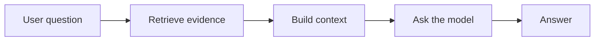
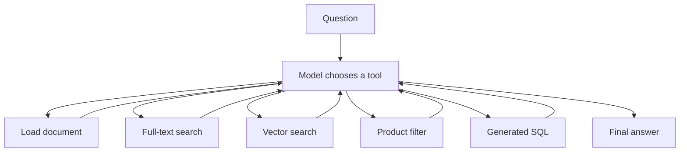

# 6 Types of RAG, Clearly Explained

Retrieval-augmented generation is usually introduced as vector search. That is only one option.

The useful question is simpler: what information does the model need, and what is the safest way to fetch it?

This lesson builds six retrieval strategies against one small shop dataset. The code progresses from reading complete files to letting an agent choose among several retrieval tools. By the end, you should be able to choose a strategy based on the shape of the question instead of reaching for a vector database by default.

## Opening Script

RAG is often explained as embeddings, chunks, and a vector database. That can be useful, but it starts in the middle. Retrieval-augmented generation is simply the process of fetching relevant information and adding it to the model's context before it answers. In this lesson, I will show you six ways to do that, from loading a complete document through keyword, vector, hybrid, SQL, and agentic retrieval. We will use one runnable example so you can see where each approach works, where it breaks, and how to test it without an API key. All of the code and resources are included in this repository. So, let's get into it.

## The Basic RAG Loop

Without retrieval, a model answers from the information already present in its request and its learned parameters. RAG adds an explicit lookup before generation.



In pseudocode:

```python
evidence = retrieve(question)
answer = model.generate(question=question, context=evidence)
```

The generation step barely changes across these examples. The retrieval step changes each time.

The sample system is a fictional shoe shop called ShopMax. It has:

- two Markdown documents containing its FAQ and refund policy
- a PostgreSQL table containing structured product data
- a full-text index for exact language
- pgvector columns for semantic similarity
- an OpenAI model for answering, routing, and structured extraction

The data is deliberately small. It lets us inspect the mechanics without hiding them behind a framework.

## The Six Strategies

| Type | Retrieval mechanism | Good fit | Main limitation |
| --- | --- | --- | --- |
| 1. Document loading | Read one or more complete files | Small policies, runbooks, and FAQs | Context grows with the files |
| 2. Full-text search | Match and rank words in PostgreSQL | Names, codes, brands, and exact terms | Related meanings may use different words |
| 3. Vector search | Rank embedding similarity | Natural-language and similarity questions | Exact filters are indirect |
| 4. Hybrid search | Fuse keyword and vector rankings | Queries needing exact terms and meaning | More moving parts to tune and evaluate |
| 5. SQL RAG | Query typed columns | Prices, dates, counts, filters, and aggregates | The schema must represent the requested fact |
| 6. Agentic RAG | Let a model choose retrieval tools | Multi-part questions across data shapes | More latency, cost, and failure modes |

These are choices, not maturity levels. Type 1 can be the right production design for a small, stable policy. Type 6 can be wasteful for a single predictable query.

## Type 1: Load the Documents

The simplest implementation reads complete files and puts their text into the prompt.

```python
def load_all_documents() -> str:
    documents = []
    for path in sorted(DATA_DIR.glob("*.md")):
        documents.append(path.read_text())
    return "\n\n".join(documents)
```

This works when the source set is small enough to inspect and send with each request. There is no retrieval index to build or synchronize. The file is the source of truth.

The example also shows indexed loading. A short catalog describes each file. The model selects a valid filename through a JSON schema, then the application loads only that file.

Use complete document loading when:

- readers need the whole policy, not isolated chunks
- the corpus is small and changes infrequently
- simple source control is more valuable than a retrieval service

Move on when irrelevant text starts crowding the context, requests become expensive, or the file catalog becomes hard to route reliably.

Code: [`code/src/01_document_loading.py`](./code/src/01_document_loading.py)

## Type 2: Full-Text Search

PostgreSQL full-text search turns text into normalized terms and ranks rows that match a query. It is useful when exact language carries meaning.

```sql
SELECT name, description,
       ts_rank(search_tsv, websearch_to_tsquery('english', %s)) AS rank
FROM products
WHERE search_tsv @@ websearch_to_tsquery('english', %s)
ORDER BY rank DESC
LIMIT %s;
```

A query such as `blue Nike running shoes` can match terms spread across the brand, color, category, and description columns. Values are passed as parameters rather than interpolated into SQL.

Full-text search is a good fit for:

- product names and brands
- error codes and identifiers
- terms that must appear in the source
- systems that already use PostgreSQL

It can miss a useful result when the question and source express the same idea with different words. A description containing `cushioned` may not rank for `comfortable` unless the text configuration or query expansion bridges that gap.

Code: [`code/src/02_full_text_search.py`](./code/src/02_full_text_search.py)

## Type 3: Vector Search

An embedding model maps text to a vector. The database ranks stored vectors by their distance from the question vector.

```python
query_embedding = embed(question)

SELECT name, description,
       1 - (embedding <=> %s::vector) AS similarity
FROM products
ORDER BY embedding <=> %s::vector
LIMIT %s;
```

This is useful when the wording differs but the meaning is related. `comfortable shoes for long runs` can retrieve a description about a `plush cushioned midsole designed for marathon training` without requiring the same words.

Vector search is not a reliable substitute for typed filters. A similarity ranking does not enforce `price < 100`, `brand = Nike`, or `created_at > last_month`. Those facts belong in normal database predicates.

Use vector search when:

- users describe ideas in varied language
- similarity is the retrieval goal
- the source text cannot be represented as a few exact filters

Test it with representative questions and labelled expected results. A plausible-looking top result is not proof that retrieval is good enough.

Code: [`code/src/03_vector_search.py`](./code/src/03_vector_search.py)

## Type 4: Hybrid Search

Hybrid search runs keyword and vector retrieval, then combines their rankings. The sample uses Reciprocal Rank Fusion, or RRF.

```text
score(item) = 1 / (k + keyword_rank) + 1 / (k + vector_rank)
```

An item that ranks well in both lists receives a stronger combined score. An item found by only one method can still survive the full outer join.

This helps with questions that contain both exact and semantic intent. A brand name should match exactly, while a phrase such as `good for wet trails` may need semantic retrieval.

Hybrid search adds operational questions:

- How many candidates should each retriever return?
- How should tied or missing ranks be handled?
- Does fusion improve the evaluation set, or only make the system more complex?
- Should structured filters run before or after ranking?

Use it when evaluation shows that keyword and vector retrieval recover different useful evidence. Do not add it only because the architecture looks more complete.

Code: [`code/src/04_hybrid_search.py`](./code/src/04_hybrid_search.py)

## Type 5: SQL RAG

If the answer lives in columns, query the columns.

The tutorial contains two variants.

### Parameterized SQL

The model extracts a typed filter object. Application code maps allowed fields and sort orders into a fixed SQL shape.

```text
"Nike running shoes under $100"
              |
              v
{brand: "Nike", category: "running", max_price: 100}
              |
              v
WHERE brand ILIKE %s AND category ILIKE %s AND price <= %s
```

This keeps the model away from executable SQL. It is the stronger default for known product filters because the application owns the query structure and can cap the result count.

Code: [`code/src/05a_sql_rag_parameterized.py`](./code/src/05a_sql_rag_parameterized.py)

### Dynamic SQL

The second variant asks the model to generate a complete `SELECT` query. That supports less predictable aggregations, but prompt instructions are not a security boundary.

A real system should use controls outside the model, such as:

- a read-only database role with access only to approved views
- a statement timeout and row limit
- one allowed statement per request
- SQL parsing or an explicit query policy
- logging and review for rejected or unusual queries

The sample is for studying the tradeoff. Do not connect model-generated SQL to a privileged production database.

Code: [`code/src/05b_sql_rag_dynamic.py`](./code/src/05b_sql_rag_dynamic.py)

SQL RAG breaks when the schema does not contain the concept. A query cannot filter on `comfortable in wet weather` unless that fact exists in a column or searchable description.

## Type 6: Agentic RAG

The final example exposes retrieval methods as tools:

- `load_document`
- `full_text_search`
- `vector_search`
- `product_filter`
- `sql_query`

The model receives a question, selects one or more tools, reads their results, and produces an answer.



This is useful for compound questions such as:

```text
Show me running shoes under $150, and tell me whether I can return them after trying them outside.
```

The product request belongs in structured filters. The return question belongs in the policy document. The agent can call both tools and combine their evidence.

The cost is less predictable control flow. You now need to evaluate tool choice, arguments, tool failures, loop limits, evidence quality, and the final answer. The sample stops after eight tool rounds. Keep the deterministic tools small and test them independently.

Code: [`code/src/06_agentic_rag.py`](./code/src/06_agentic_rag.py)

## Choose Based on the Data Shape

Start with the question you need to answer.

| Question shape | Start with |
| --- | --- |
| "What does this short policy say?" | Complete document loading |
| "Find product ABC-123" | Full-text or exact database lookup |
| "Find something similar to this description" | Vector search |
| "Match this brand and this loosely described need" | Hybrid search |
| "Show orders over £100 from last week" | Parameterized SQL |
| "Answer a question spanning products and policies" | Agentic routing over narrow tools |

Then measure retrieval before adding complexity. A small evaluation fixture can contain:

```text
question
expected source IDs
required facts
forbidden facts
```

Useful checks include whether the expected source appears in the top results, whether the answer cites only retrieved facts, and whether an unsupported question produces an honest refusal.

## Code Layout

```text
code/
  data/                         # Markdown source fixtures
  sql/schema.sql                # PostgreSQL, full-text, and vector schema
  src/config.py                 # Shared model and database configuration
  src/seed.py                   # Product and document ingestion
  src/01_document_loading.py
  src/02_full_text_search.py
  src/03_vector_search.py
  src/04_hybrid_search.py
  src/05a_sql_rag_parameterized.py
  src/05b_sql_rag_dynamic.py
  src/06_agentic_rag.py
  tests/test_strategies.py      # Credential-free deterministic checks
```

All live scripts import their chat model, embedding model, OpenAI client, and database connection from `src/config.py`. Change models through environment variables rather than editing every example.

## Test Without Credentials

The default test path uses only Python's standard library. It does not call OpenAI, start Docker, or connect to PostgreSQL.

From the tutorial root:

```bash
cd code
python3 -m unittest discover -s tests -v
```

Expected result:

```text
Ran 8 tests

OK
```

The tests cover all six strategies with fixtures and fakes. They check document order, parameterized full-text search, vector retrieval, rank fusion, bounded SQL filters, and the agent tool loop.

## Run the Live Examples

Prerequisites:

- Python 3.12 or newer
- [uv](https://docs.astral.sh/uv/getting-started/installation/)
- Docker with Compose
- an OpenAI API key

From the tutorial root:

```bash
cd code
uv venv
uv pip install --python .venv/bin/python -e .
cp .env.example .env
```

Edit `.env` and replace the placeholder API key. Then start and seed PostgreSQL:

```bash
docker compose up -d
.venv/bin/python src/seed.py
```

Run the examples in order:

```bash
.venv/bin/python src/01_document_loading.py
.venv/bin/python src/02_full_text_search.py
.venv/bin/python src/03_vector_search.py
.venv/bin/python src/04_hybrid_search.py
.venv/bin/python src/05a_sql_rag_parameterized.py
.venv/bin/python src/05b_sql_rag_dynamic.py
.venv/bin/python src/06_agentic_rag.py
```

Each script prints the question, retrieved data or chosen tool, and final answer. Exact model output varies. Inspect the evidence and query path rather than comparing prose word for word.

Reset the tutorial:

```bash
docker compose down --volumes
rm -rf .venv
rm -f .env
```

This removes the local database volume, virtual environment, and copied environment file. The tracked fixtures remain unchanged.

## Current Model Guidance

Model guidance was checked on 4 August 2026.

The sample defaults are defined once in [`code/src/config.py`](./code/src/config.py):

```text
OPENAI_CHAT_MODEL=gpt-5
OPENAI_EMBEDDING_MODEL=text-embedding-3-small
```

Model availability changes. Before recording or running the paid examples, check the [OpenAI model catalog](https://platform.openai.com/docs/models) and your account's model access. The code uses the [Responses API](https://platform.openai.com/docs/api-reference/responses) for generation and tool calls. The embedding column is configured for the default output size of `text-embedding-3-small`; changing embedding dimensions also requires a schema migration and re-seeding the stored vectors.

## What This Sample Leaves Out

The examples make each retrieval mechanism visible. A production system still needs decisions about:

- authorization before retrieval
- source freshness and deletion
- tenant isolation
- prompt injection in retrieved content
- citations and provenance
- timeouts, retries, and budgets
- retrieval and answer evaluations
- monitoring for empty or low-quality results

RAG does not make an answer true by itself. It gives the model evidence. Your system still has to choose, validate, and present that evidence carefully.

## References

- [Architecture notes](./resources/architecture.md)
- [Recording walkthrough](./resources/walkthrough.md)
- [Slides](./resources/slides/slides.html)
- [OpenAI developer quickstart](https://platform.openai.com/docs/quickstart)
- [OpenAI models](https://platform.openai.com/docs/models)
- [OpenAI embeddings guide](https://platform.openai.com/docs/guides/embeddings)
- [PostgreSQL full-text search](https://www.postgresql.org/docs/current/textsearch.html)
- [pgvector](https://github.com/pgvector/pgvector)

## Summary

- RAG means retrieving evidence and adding it to the model's context.
- Choose retrieval from the shape of the data and question.
- Use files for small complete sources, full-text for exact language, vectors for meaning, hybrid for both, and SQL for typed facts.
- Add agentic routing only when questions genuinely cross retrieval methods.
- Test retrieval independently from paid model calls.
- The honest limitation is that good retrieval still needs access controls, evaluation, and evidence-aware answers.
