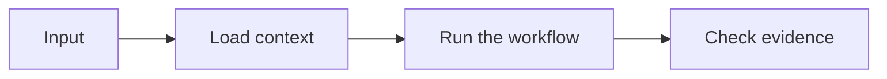

# Lesson Title

This is the one main teaching document.

Everything required to understand the lesson should live here.

Use resources only for references, prompts, checklists, images, slides, and other supporting material.

## Title Options

Optional.

Use this section only when the lesson is still being packaged for YouTube.

1. Clear search title
2. Workflow title
3. Problem title

## Opening Script

Use this only when the lesson doubles as a recording doc.

Write the full opening as one block.

Confirm the topic.

Name the confusion, weak default, or useful result.

Say what the viewer will understand or build.

Give the route through the lesson.

End with:

```text
So, let's get into it.
```

## Before We Build

Explain what the viewer will build, inspect, or understand.

Keep this practical.

Name the files, commands, app, repo, or diagram they will see.

## The Basic Idea

Start with the simplest explanation.

Define the concept in plain language.

Explain why it matters.

If the topic is usually explained badly, say what the weak default gets wrong.

## How It Works

Show the mechanism.

Use a diagram, table, command, or code block when it makes the idea easier to understand.



## Demo

Use this section only when there is something concrete to run or show.

Include:

- file to open
- command to run
- expected result
- likely failure point
- what the failure teaches

When runnable code is included, document one exact setup path:

- install command
- run command and expected result
- test or verification command
- reset or cleanup command

Remove this section when the tutorial has no runnable demo.

## Tradeoffs

Explain where this works.

Explain where it does not.

Do not pretend the workflow is cleaner than it is.

## References

Optional.

Link only to supporting material.

- Prompts: `resources/prompts.md`
- Slides: `resources/slides/`
- Code: `code/`

Link only the items that contain real material. Do not advertise empty folders.

## Summary

- The one thing to remember:
- The honest limitation:
- What to try next:
