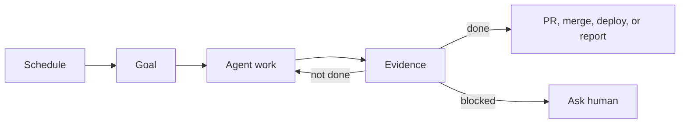

# Agent Goals and Loops Explained Simply

## Title Options

1. Agent Goals and Loops Explained Simply
2. Stop Confusing Agent Prompts, Goals, and Loops
3. How To Use Codex Goals and Claude Code Loops
4. Practical Agent Workflows For Developers
5. The Agent Goals I Use Every Week

## Opening Script

This is a practical guide to agent goals, loops, and scheduled agent tasks.

The confusing part is that people use one word, "loop", to describe several different things.

Sometimes they mean a prompt that runs once.

Sometimes they mean a goal that keeps going until a result is true.

Sometimes they mean a task that checks something every few minutes.

Sometimes they mean a scheduled automation that runs every Monday morning.

Those things are related, but they are not the same primitive.

By the end of this lesson, you will know the difference.

You will know when to use Codex `/goal`.

You will know when to use Claude Code `/goal`, `/loop`, or `/schedule`.

And you will have practical examples you can copy into your own workflow.

The point is simple.

Agents become useful when the job has a clear finish line, safe boundaries, and evidence you can inspect.

So, let's get into it.

## The Basic Model

Start with this:

| Primitive | Meaning | Use It For |
| --- | --- | --- |
| Prompt | Ask once | One answer or one action. |
| Goal | Keep working until done | Longer work with a finish condition. |
| Loop | Check or retry repeatedly | CI, PR comments, logs, issue state. |
| Schedule | Start later or repeatedly | Daily or weekly maintenance. |
| System | Combine the pieces | Useful workflows with boundaries. |

Compressed:

```text
Prompt asks once.
Goal defines done.
Loop checks changing state.
Schedule decides when work starts.
System combines those pieces into useful work.
```

## Tool Map

| Primitive | Job | Codex | Claude Code |
| --- | --- | --- | --- |
| Prompt | One turn | Prompt | Prompt |
| Goal | Persistent objective | `/goal` | `/goal` |
| Loop | Repeated check | Automation | `/loop` |
| Schedule | Run later or repeatedly | Automation | `/schedule` |
| Boundary | Limit risk | Sandbox and approvals | Permissions and hooks |

Codex has `/goal`.

For repeated or later work in Codex, create an automation.

Claude Code has `/goal` for outcome-driven work.

Claude Code has `/loop` and `/schedule` for repeated prompts and scheduled tasks inside a session.

## Why Goals Are Useful

A prompt says:

```text
Do this next thing.
```

A goal says:

```text
Keep working until this outcome is true.
```

That matters because real work is not a single step.

The agent may need to inspect the repo, run tests, fix errors, read review comments,
rebase a branch, or check the live app.

With a goal, the agent can keep going until the finish condition is true or it hits a clear stop rule.

Good goals need six parts.

| Part | Question | Example |
| --- | --- | --- |
| Outcome | What should be true? | All open PRs are merged or blocked. |
| Evidence | How do we know? | CI, PR state, live site, labels, logs. |
| Boundary | What can it touch? | Docs only, one repo, one branch, one deploy. |
| Risk | What is forbidden? | Auth, billing, secrets, IAM, data deletion. |
| Retry rule | What happens after failure? | Fix the smallest confirmed cause. |
| Stop rule | When does it ask for help? | Missing secret, unclear policy, repeated failure. |

Opinion [high]: Most bad goals are hard to audit, not merely too ambitious.
Flip fact: This changes if the agent has a reliable verifier and a safe sandbox.

## Cost And Objections

The objection is usually:

```text
Is this just burning tokens while the agent loops forever?
```

Sometimes, yes.

Bad goals are expensive because the agent has no finish line.

Good goals control cost with:

| Control | Example |
| --- | --- |
| Done condition | `Live site loads and smoke test passes.` |
| Attempt limit | `Stop after 3 failed deploy attempts.` |
| Scope limit | `Only work on open PRs in this repo.` |
| Risk limit | `Do not change secrets, IAM, billing, or data deletion.` |
| Evidence | `Report CI, logs, PRs, labels, and live URL.` |

The value is not magic autonomy.

The value is letting the agent handle bounded follow-through.

## Goal Examples I Use

These are the most useful goal shapes.

They are intentionally short.

The full copyable prompts are in [resources/prompts.md](./resources/prompts.md).

### Merge Open PRs

Use this when the repo has a queue of PRs that need rebase work, CI fixes, or review feedback addressed.

```text
/goal Merge all open PRs that are safe to merge.

Done means:
- every open PR is merged, closed, or blocked with evidence
- rebase conflicts are resolved where safe
- actionable review feedback is addressed
- CI is green before merge

Stop if:
- merge authority is unclear
- feedback conflicts
- a PR touches auth, billing, permissions, security, or data deletion
```

This is useful because the agent is shepherding work through review, not just writing code.

### Triage GitHub Issues

Use this when GitHub Issues has drifted away from reality.

```text
/goal Triage all open GitHub issues.

Done means:
- every open issue has correct labels
- duplicates are closed with a comment
- already completed issues are closed with evidence
- stale state is corrected, such as "in review" after the PR merged

Stop if:
- the issue needs product judgement
- the correct label depends on maintainer context
- closing the issue would be speculative
```

This is useful because the backlog becomes trustworthy again.

### Deploy To Production On GCP

Use this when the deploy path is known and the repo already deploys from `master`.

```text
/goal Deploy this app to production on GCP.

Done means:
- the deploy change is on master
- Cloud Build completed successfully
- the live site loads
- the core flow works
- production logs show no new errors

Stop if:
- Cloud Build fails twice for the same reason
- deploy needs secrets, IAM, billing, DNS, or manual approval
- the live app has errors after rollback is needed
```

This is useful because deployment is a follow-through job.

The agent can push, wait, inspect Cloud Build, open the site, check logs, and report evidence.

### Documentation Drift

Use this when docs need to match the repo.

```text
/goal Review the codebase and update stale documentation.

Done means:
- docs match current implementation
- checked commands still work where practical
- docs-only PR is opened or ready

Stop if:
- behavior is unclear
- docs require product judgement
- verification needs missing secrets
```

This is useful because it is low risk and easy to review.

### Long Running Ticket Build

Use this when the work spans several tickets.

```text
/goal Build the selected tickets end to end.

Done means:
- each selected ticket is implemented
- relevant tests pass
- browser verification passes where UI changed
- final report links tickets, files, checks, and PR

Stop if:
- acceptance criteria conflict
- scope expands beyond selected tickets
- a product decision is needed
```

This is useful when the next action depends on what the agent just learned.

## Loop Examples

Loops are useful when state changes after the first run.

| Loop | Why It Works |
| --- | --- |
| Check CI every 5 minutes | CI finishes later. |
| Watch PR comments | Review feedback arrives later. |
| Triage issues every Monday | Backlogs drift over time. |
| Check docs daily | Code changes make docs stale. |
| Scan logs after deploy | Production errors appear after release. |

### Weekly Issue Triage

Codex:

```text
Create a Codex automation that runs every Monday morning.

Review the GitHub issue backlog.
Ensure every ticket has correct labels.
Close duplicate or already completed issues with a comment.
Update tickets in the wrong state.
Report anything needing human judgement.
```

Claude Code:

```text
/schedule every Monday morning, triage the GitHub issue backlog.
Fix labels, close duplicates with comments, correct stale states, and report
anything that needs maintainer judgement.
```

### Daily Documentation Drift

Codex:

```text
Create a daily Codex automation that checks for documentation drift.

If docs and code are out of sync, open a docs-only PR.
If docs contain errors, fix them in the same PR.
Stop if the correct behavior is unclear.
```

Claude Code:

```text
/schedule every day, check for documentation drift.
Open a docs-only PR for safe fixes. Stop if the correct behavior is unclear.
```

### PR Babysitter

Use this when you are waiting on CI or review comments.

```text
/loop every 20 minutes check PR #123.

Stop when:
- CI is green
- there are no unresolved requested changes

Stop early if:
- the same failure appears twice
- a review comment needs product judgement
- 60 minutes pass
```

## Combining Goals And Loops

The useful systems are usually simple.



### System 1: Weekly Backlog Cleanup

```text
Schedule:
Every Monday morning.

Goal:
Triage all GitHub issues.

Done:
Every issue is correctly labelled, closed with evidence, or blocked on a
specific human decision.
```

### System 2: Daily Docs Maintenance

```text
Schedule:
Every weekday morning.

Goal:
Fix documentation drift.

Done:
Docs match code, a docs-only PR exists, or the agent reports why no safe fix
was possible.
```

### System 3: Deploy And Verify

```text
Goal:
Deploy the app to production on GCP.

Loop:
Check Cloud Build, live site, and logs until deploy is verified or blocked.

Done:
Live site works and logs show no new errors.
```

### System 4: PR Queue Cleanup

```text
Goal:
Merge all safe open PRs.

Loop:
Wait for CI, review comments, and mergeability changes.

Done:
Every PR is merged, closed, updated, or blocked with evidence.
```

## What To Avoid

| Bad Instruction | Problem |
| --- | --- |
| `/goal Improve my repo.` | No finish line. |
| `/goal Fix everything you find.` | Unsafe scope. |
| `/loop Keep trying until it works.` | No budget. |
| `Every night, make the code better.` | No proof. |
| `Merge when done.` | Removes review boundaries. |

Better:

```text
/goal Fix one confirmed bug from issue #123 and open a PR with tests.
```

```text
/loop every 3 minutes check CI for PR #123. Stop after 30 minutes or when CI is green.
```

```text
Create a Codex automation that checks docs daily and opens docs-only PRs.
```

## References

- Prompt pack: [resources/prompts.md](./resources/prompts.md)
- Codex goals cookbook: <https://developers.openai.com/cookbook/examples/codex/using_goals_in_codex>
- Claude Code goals: <https://code.claude.com/docs/en/goal>
- Claude Code scheduled tasks and `/loop`: <https://code.claude.com/docs/en/scheduled-tasks>

## Summary

- The one thing to remember: goals define done.
- The honest limitation: autonomy needs boundaries, evidence, and stop rules.
- What to try next: run the issue triage goal or docs drift automation on one repo.
