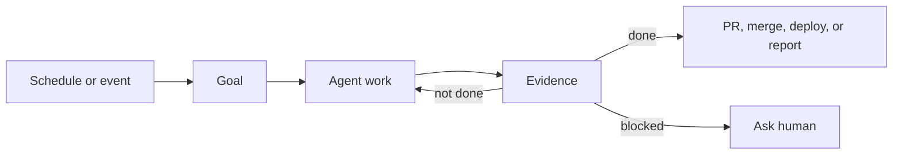

# Agent Goals and Loops Explained Simply

Agent workflows get confusing because people use the same words for different things.

A prompt, a goal, a loop, a schedule, and an automation are related, but they are not the same primitive.

This page explains the model, then gives compact examples you can copy into Codex or Claude Code.

One important naming note: `loop` is mostly a Claude Code feature name here.

The more general idea is simpler: run the agent on an interval.

## Contents

- [The model](#the-model)
- [Goal examples](#goal-examples)
- [Interval and schedule examples](#interval-and-schedule-examples)
- [Combining goals with intervals and schedules](#combining-goals-with-intervals-and-schedules)

## The Model

| Job | Meaning | Codex | Claude Code |
| --- | --- | --- | --- |
| Do a thing once | Ask once. | Prompt | Prompt |
| Work toward a goal | Keep working until done. | `/goal` | `/goal` |
| Run on an interval | Run the agent every few minutes. | Automation | `/loop` |
| Run on a fixed schedule | Run the agent at a set time. | Automation | `/schedule` |
| Build a system | Combine the pieces. | Goal plus automation | Goal plus interval or schedule |

Examples:

- Do once: `Explain this failing test.`
- Goal: `/goal Merge all safe open PRs.`
- Interval: `/loop every 5 minutes check CI for PR #123.`
- Fixed schedule: `Every Monday at 9am, triage GitHub issues.`
- System: set a goal, then run the agent on an interval or schedule until it is done.

Codex uses automations for interval runs and fixed schedules.

Claude Code uses `/loop` for interval polling and `/schedule` for fixed scheduled tasks.

## Why Goals Matter

A prompt says, "Do this next thing."

A goal says, "Keep working until this outcome is true."

That matters because real work is rarely one step.

The agent may need to inspect the repo, run tests, fix errors, read review comments,
rebase a branch, check a live app, and report evidence.

With a goal, the agent keeps going until the finish condition is true or a stop rule is hit.

## Good Goal Shape

| Part | Question | Example |
| --- | --- | --- |
| Outcome | What should be true? | All safe PRs are merged. |
| Evidence | How do we know? | CI, PR state, live site, labels, logs. |
| Boundary | What can it touch? | One repo, one branch, docs only, one deploy. |
| Risk | What is forbidden? | Auth, billing, secrets, IAM, data deletion. |
| Retry rule | What happens after failure? | Fix the smallest confirmed cause. |
| Stop rule | When does it ask for help? | Missing secret, unclear policy, repeated failure. |

Simple audit test:

If a reviewer cannot tell whether the goal succeeded, rewrite the goal.

## Cost Control

The common objection is fair: a vague goal can burn tokens while the agent wanders.

Good goals control cost with visible limits.

| Control | Example |
| --- | --- |
| Done condition | `Live site loads and smoke test passes.` |
| Attempt limit | `Stop after 3 failed deploy attempts.` |
| Scope limit | `Only work on open PRs in this repo.` |
| Risk limit | `Do not change secrets, IAM, billing, or data deletion.` |
| Evidence | `Report CI, logs, PRs, labels, and live URL.` |

The value is not unlimited autonomy.

The value is bounded follow-through.

## Goal Examples

These are goal shapes I use frequently.

The full copyable prompts are in [resources/prompts.md](./resources/prompts.md).

### Merge Open PRs

Use when open PRs need conflicts fixed, CI shepherded, or review feedback addressed.

```text
/goal Review all open PRs and fix any review feedback. Merge any PRs that are
safe to merge now. Resolve rebase conflicts where safe. Check CI, branch
protection, review comments, and merge conflicts. You are done when every open
PR is merged, closed, updated, or blocked with evidence. Stop if merge
authority is unclear, review feedback conflicts, or a PR touches auth, billing,
permissions, security, or data deletion.
```

This is useful because the agent shepherds work through review.

It is not just writing code.

### Triage GitHub Issues

Use when GitHub Issues has drifted away from reality.

```text
/goal Triage all open GitHub issues. Ensure every open issue has the correct
labels. Close duplicate issues with a comment. Close issues that are already
completed with evidence. Correct stale state, such as issues marked in review
after the PR has merged. You are done when every issue is labelled, closed, or
blocked on a clear question. Stop if the issue needs product judgement,
maintainer context, or speculative closure.
```

This is useful because the backlog becomes trustworthy again.

### Deploy To Production On GCP

Use when the deploy path is known and the repo deploys from `master` through Cloud Build.

```text
/goal Deploy this app to production on GCP. Pushing to master deploys the app
with Cloud Build. You are done when the deploy is on master, Cloud Build
succeeds, the live site loads, the core flow works, and production logs show no
new errors. Stop if GCP access is missing, Cloud Build fails twice for the same
reason, the deploy needs secrets, IAM, billing, DNS, or manual approval, or the
live app needs rollback.
```

This is useful because deployment is follow-through work.

The agent can push, wait, inspect Cloud Build, open the site, check logs, and report evidence.

### Documentation Drift

Use when docs need to match the repo.

```text
/goal Review the codebase and update stale documentation. Compare the README,
docs, package scripts, examples, and current implementation. You are done when
docs match the implementation, checked commands still work where practical, and
a docs-only PR is opened or ready. Stop if behavior is unclear, docs need
product judgement, or verification needs missing secrets.
```

This is useful because it is low risk and easy to review.

### Long Running Ticket Build

Use when the work spans several selected tickets.

```text
/goal Build the selected tickets end to end. Work only on the selected tickets.
You are done when each ticket is implemented, relevant tests pass, UI changes
are verified in the browser, and the final report links the tickets, changed
files, checks, and PR. Stop if acceptance criteria conflict, scope expands
beyond the selected tickets, or a product decision is needed.
```

This is useful when the next action depends on what the agent just learned.

## Interval And Schedule Examples

Use an interval when the useful action is polling.

Use a fixed schedule when the useful action should start at a known time.

| Pattern | Use When | Example |
| --- | --- | --- |
| Interval run | CI finishes later. | `/loop every 5 minutes check CI for PR #123.` |
| Interval run | Review feedback arrives later. | `/loop every 20 minutes check PR #123.` |
| Interval run | Production state changes after release. | Check Cloud Build, live site, and logs. |
| Fixed schedule | Backlogs drift over time. | Run every Monday at 9am. |
| Fixed schedule | Code changes make docs stale. | Run every weekday morning. |

### Weekly Issue Triage

Codex:

```text
Create a Codex automation that runs every Monday morning.

Review the GitHub issue backlog.
Ensure every ticket has correct labels.
Close duplicate or already completed issues with a comment.
Update tickets in the wrong state.
Report anything needing human judgement.
```

Claude Code:

```text
/schedule every Monday morning, triage the GitHub issue backlog.
Fix labels, close duplicates with comments, correct stale states, and report
anything that needs maintainer judgement.
```

### Daily Documentation Drift

Codex:

```text
Create a daily Codex automation that checks for documentation drift.

If docs and code are out of sync, open a docs-only PR.
If docs contain errors, fix them in the same PR.
Stop if the correct behavior is unclear.
```

Claude Code:

```text
/schedule every day, check for documentation drift.
Open a docs-only PR for safe fixes. Stop if the correct behavior is unclear.
```

### PR Babysitter

```text
/loop every 20 minutes check PR #123.

Stop when:
- CI is green
- there are no unresolved requested changes

Stop early if:
- the same failure appears twice
- a review comment needs product judgement
- 60 minutes pass
```

## Combining Goals With Intervals And Schedules

Useful systems usually have three parts:

1. A schedule or event starts the work.
2. A goal defines the finish line.
3. An interval run repeats a check until the goal is done or blocked.



| System | Schedule Or Event | Goal | Done |
| --- | --- | --- | --- |
| Backlog cleanup | Monday morning | Triage GitHub issues | Every issue is labelled, closed, or blocked. |
| Docs maintenance | Every weekday | Fix docs drift | Docs PR exists or no safe fix is possible. |
| Deploy verifier | Deploy starts | Deploy to GCP | Live site works and logs are clean. |
| PR queue cleanup | Manual start or daily | Merge safe PRs | Every PR is merged, closed, updated, or blocked. |

## What To Avoid

| Bad Instruction | Problem |
| --- | --- |
| `/goal Improve my repo.` | No finish line. |
| `/goal Fix everything you find.` | Unsafe scope. |
| `/loop Keep trying until it works.` | No budget. |
| `Every night, make the code better.` | No proof. |
| `Merge when done.` | Removes review boundaries. |

Better:

- `/goal Fix one confirmed bug from issue #123 and open a PR with tests.`
- `/loop every 3 minutes check CI for PR #123. Stop after 30 minutes or when CI is green.`
- `Create a Codex automation that checks docs daily and opens docs-only PRs.`

## References

- Prompt pack: [resources/prompts.md](./resources/prompts.md)
- Codex goals cookbook: <https://developers.openai.com/cookbook/examples/codex/using_goals_in_codex>
- Claude Code goals: <https://code.claude.com/docs/en/goal>
- Claude Code scheduled tasks and `/loop`: <https://code.claude.com/docs/en/scheduled-tasks>

## Summary

- The one thing to remember: goals define done.
- The honest limitation: autonomy needs boundaries, evidence, and stop rules.
- What to try next: run the issue triage goal or docs drift automation on one repo.
