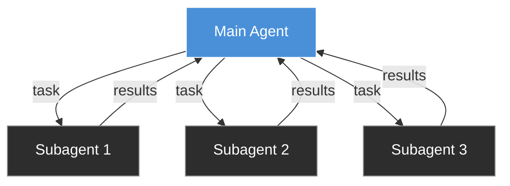
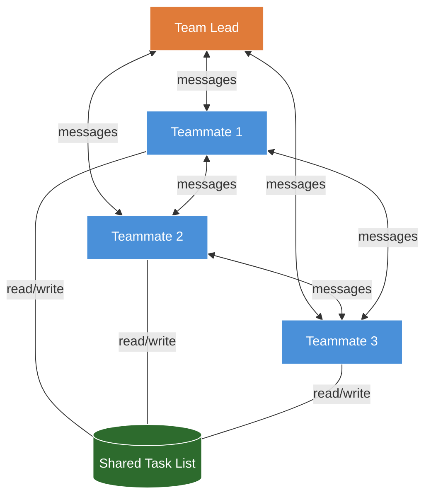
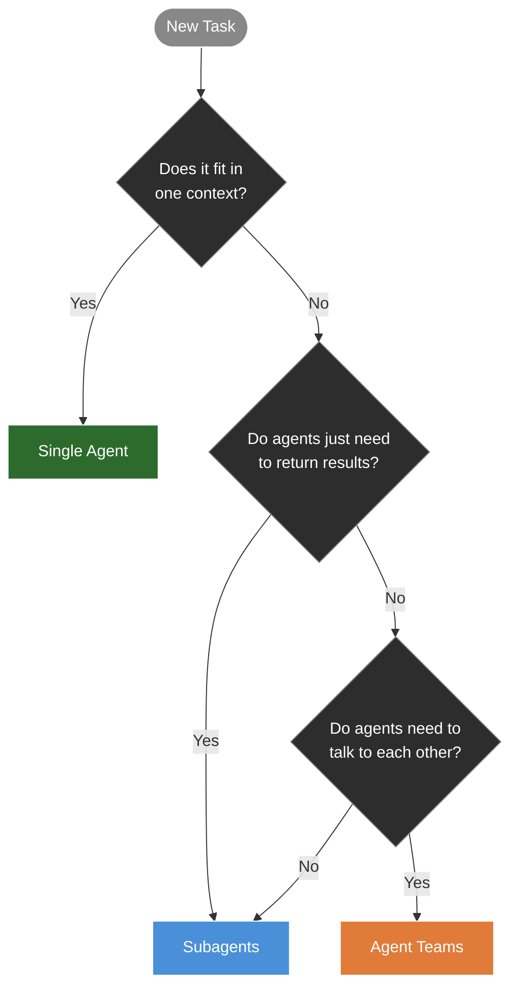
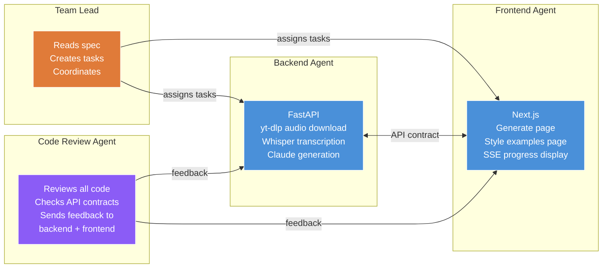
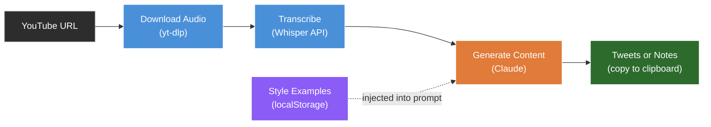

# Claude Code Agent Teams

> Documentation status: checked against Anthropic's [Agent Teams guide](https://code.claude.com/docs/en/agent-teams) on 2026-08-04. Agent Teams is experimental, disabled by default, and may change.

## What are agent teams?

Agent teams let you run multiple Claude Code instances that work together on the same project. One instance acts as the team lead. It spawns teammates, creates tasks, and coordinates the work. Each teammate is an independent Claude Code session with its own context window.

The teammates can message each other directly. That's the key thing that makes this different.

## Why is this interesting?

A few examples of what you can do:

- One Claude Code instance writes code while another one reviews it. The reviewer sends feedback directly to the writer, who fixes the issues without you relaying anything.
- Three instances work on different parts of your app at the same time. One builds the backend, one builds the frontend, one handles tests.
- Five instances investigate a bug from different angles and argue with each other about the root cause.

The common thread: agents that need to coordinate with each other, not just return results to you.

## How subagents work

If you've used Claude Code, you've probably used subagents. You ask Claude to do something and it spawns a helper to handle part of the work. The helper does the job and reports back.



Subagents can only talk back to the parent. They can't talk to each other. If the frontend agent needs the API response shape from the backend agent, it reports back to you, you relay it. You're the middleman.

## How agent teams work

Agent teams remove the middleman. Teammates message each other directly and share a task list.



The backend agent can tell the frontend agent the response shape directly. The reviewer can send notes straight to the builder. No one is relaying messages.

## Subagents vs agent teams

| | Subagents | Agent teams |
|---|---|---|
| **Context** | Own window, results return to parent | Own window, fully independent |
| **Communication** | Report back to parent only | Message each other directly |
| **Coordination** | Parent manages everything | Shared task list, self-coordination |
| **Best for** | Focused tasks where you just need the result | Work that needs discussion and iteration |
| **Token use** | Lower because results return to the parent | Higher because each teammate has its own context window |

Use subagents when agents just need to return results. Use agent teams when agents need to talk to each other.

## When to use what



- **Single agent:** The task fits in one context. Examples include fixing a bug, writing a function, or refactoring one area.
- **Subagents:** You need parallel work but agents do not need to coordinate. Examples include research, generating tests, or focused tasks where only the result matters.
- **Agent teams:** The work spans separate areas and agents benefit from sharing findings. Examples include frontend, backend, and test work with a clear contract.

## How to set it up

As of 2026-08-04, Anthropic documents Agent Teams as experimental and disabled by default. Check the [official guide](https://code.claude.com/docs/en/agent-teams) before using the configuration below because setup and controls can change.

### 1. Enable agent teams

Add this to your `.claude/settings.json`:

```json
{
  "env": {
    "CLAUDE_CODE_EXPERIMENTAL_AGENT_TEAMS": "1"
  }
}
```

### 2. Choose a display mode

The current default is `in-process`, which keeps teammates inside the main terminal and needs no extra terminal software. Set `auto` when you want Claude Code to use split panes inside tmux or a configured iTerm2 session, with an in-process fallback.

Install tmux only if you want split panes:

```bash
# macOS
brew install tmux

# Ubuntu/Debian
sudo apt install tmux

# Check it installed
tmux -V
```

### 3. Set the display mode when needed

To force split panes, add this to your `.claude/settings.json`:

```json
{
  "teammateMode": "tmux"
}
```

### 4. Start a session

For split panes, start a tmux session and launch Claude Code inside it:

```bash
tmux new -s demo
claude
```

When you create a team in this mode, Claude Code can place each teammate in a separate pane. The default in-process mode does not need this setup.

### Useful shortcuts

- **Up and Down arrows**: select a teammate in the in-process agent panel
- **Enter**: view the selected teammate and send a message
- **x**: stop the selected teammate
- **Ctrl+T**: toggle the shared task list

## How to think about scale

Each teammate is a separate Claude Code instance with its own context window. Token use grows with the number of active teammates and how long they run. Start with the smallest team that gives you a useful coordination path. Add a teammate only when the work can be partitioned cleanly or direct communication improves the result.

## Demo: building an app with three agents

We build a content repurposer. You paste a YouTube URL, pick a mode (tweets or longer-form notes), and it drafts social content using your saved writing examples as prompt context. Three agents build separate parts in parallel.



How it works:

1. Write a spec describing the app: architecture, endpoints, data model, and components
2. Tell Claude to "use agent teams to build this"
3. Claude reads the spec, breaks it into tasks, spawns the three agents
4. The backend agent builds the API. The frontend agent builds the UI. They coordinate on the API contract directly.
5. When both are done, the code review agent reads everything, checks for issues, and sends specific feedback to each agent
6. The backend and frontend agents act on that feedback and make fixes

The code review agent does not fix things itself. It reports issues back to the team lead, who assigns fixes to the owning agent. The backend agent fixes backend bugs. The frontend agent fixes frontend bugs. Clear file ownership reduces conflicting edits.

This is the direct feedback path Agent Teams adds. The reviewer talks to the builders, and the builders act on the feedback without the lead relaying every message.

## A useful starting pattern

You do not need three agents building a full-stack app to test the coordination model. Start with one writer and one second-pass reviewer.

The reviewer reads the diff and sends specific notes to the writer. Example findings might be an unhandled empty-array case or an error message that gives the user no recovery path. These are illustrative findings, not results from this demo.

The reviewer doesn't fix anything. It sends the notes to the agent that owns the code, and that agent makes the changes. That closed-loop feedback is the thing that makes teams worth using over subagents. You get a second pair of eyes without relaying anything yourself.

Start here before you try a three-agent build. One writer, one reviewer. See how the feedback loop works. Then scale up.

## Things to watch out for

- **Token use.** Each active teammate has its own context window. Keep the team small and check whether the coordination is adding value.
- **Same-file edits.** Teammates are not isolated in separate worktrees. Break the work so each teammate owns different files, or expect to reconcile conflicts.
- **Reviewer behaviour.** A review agent may implement a fix instead of reporting it. If the workflow requires code ownership, tell the reviewer to report findings only and verify its tool permissions match that role.
- **Still experimental.** As checked on 2026-08-04, Anthropic documents limitations around in-process session resumption, task status, shutdown, nested teams, and one team per lead session. Recheck the [official guide](https://code.claude.com/docs/en/agent-teams) before recording or relying on these details.

## The app pipeline


