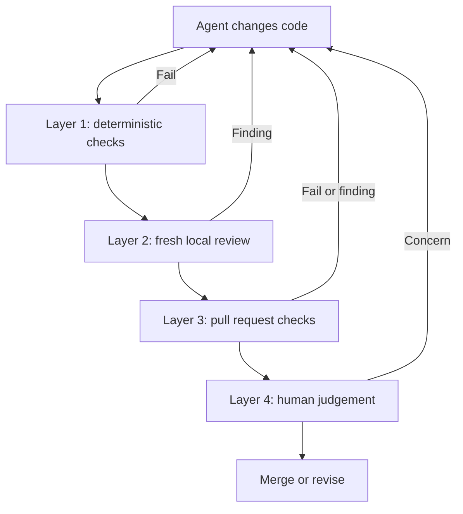

# How I Review AI-Generated Code

AI coding agents can produce changes faster than most developers can review them. That makes review more important, not less important.

The weak default is to ask the same agent that wrote the code whether the work looks good. That agent still has the assumptions and context from the implementation. A useful review starts fresh, checks the actual diff, and separates mechanical checks from engineering judgement.

This lesson shows a four-layer workflow. It also includes templates you can copy into a project and a safe command that proves those templates are wired together correctly.

## Opening Script

Most developers are using AI agents to write code. But how do we know if the code they produce is any good? The hard part is not generating another diff. The hard part is proving that the change is correct, safe, and worth shipping. In this video, I am going to walk through four layers of code review, from deterministic checks on your machine to focused human judgement. I will also show you the templates in this repo and one reproducible way to install and verify them. All of the resources are linked for free in the description below. So, let's get into it.

## The Simple Model

Review is a sequence of filters. Cheap, deterministic checks run first. Context-heavy judgement comes later.



The layers do different jobs. Adding more AI review tools does not remove the need for tests or human ownership.

| Layer | Main question | Good checks |
| --- | --- | --- |
| 1. Deterministic | Does the change satisfy rules a machine can prove? | Formatting, linting, types, tests, static security checks |
| 2. Fresh local review | What looks wrong in the diff before it leaves the machine? | Correctness, regressions, scope, missing tests, project rules |
| 3. Pull request review | Does the branch still pass in a clean environment? | CI, required checks, optional automated review |
| 4. Human review | Is this the right change to ship? | Intent, product behaviour, architecture, risk, operational impact |

## Layer 1: Automate What Can Be Proved

Start with the repository's real commands. A review agent should not guess whether the test suite passes.

For example:

```bash
ruff check .
pytest
```

Replace those commands with the formatter, linter, type checker, tests, and security tools your project already uses. Keep the list small enough to run consistently.

This tutorial includes two Claude Code hook templates:

- [`resources/hooks/settings.json`](./resources/hooks/settings.json) is a settings template. Its `PostToolUse` hook gives quick Ruff feedback after Python edits. Its `Stop` hook calls the shell script below.
- [`resources/hooks/stop-checks.sh`](./resources/hooks/stop-checks.sh) is an executable template. It checks changed Ruby and Python files when the matching tools are available in the target project. It also looks for common debugging statements.

These files are examples, not universal project configuration. Read them before copying. Remove checks for languages you do not use. Add the exact test command your repository requires.

The `PostToolUse` command in the settings template is feedback, not a gate. The stop script is the gate. That distinction matters because the feedback command deliberately does not block an edit.

## Layer 2: Review Locally in Fresh Context

Before pushing, run the changed behaviour, inspect the diff, and ask a fresh reviewer to look for concrete problems.

```bash
git status --short
git diff --check
git diff
```

Give the reviewer four things:

1. The intended behaviour.
2. The acceptance criteria.
3. The diff or commit to review.
4. The repository's review rules and verification evidence.

The reviewer should report discrete, actionable findings. A long list of style preferences is not useful proof.

This tutorial includes three review references:

- [`resources/examples/REVIEW.md`](./resources/examples/REVIEW.md) is a project-specific rules template. Copy it, then replace its Python and API examples with rules from your project.
- [`resources/examples/agents-md-review.md`](./resources/examples/agents-md-review.md) is a Markdown snippet to adapt inside an existing `AGENTS.md` or equivalent instruction file. It is not a complete agent configuration.
- [`resources/examples/codex-review-prompt.md`](./resources/examples/codex-review-prompt.md) explains useful properties of a focused review prompt. It is reference material, not a command to execute.

A practical local review request looks like this:

```text
Review the current diff without editing it.

Intent:
<what the change should do>

Acceptance criteria:
<the concrete conditions for success>

Verification already run:
<commands and results>

Focus on correctness, security, regressions, missing tests, and unintended scope.
Only report actionable findings introduced by this change.
Include a file and line for each finding.
```

Fix valid findings, rerun the focused checks, and ask for another fresh review. A review is complete when the reviewer has no remaining actionable findings, not when an agent says the code is generally good.

## Layer 3: Repeat the Proof on the Pull Request

Local checks use your working environment. Pull request checks should repeat the important proof in a clean environment.

At minimum, protect the branch with the checks that decide whether the change is safe to merge. Automated AI review can be another signal, but it should not replace required tests.

The exact service is a project choice. The stable workflow is:

1. Push one reviewable change.
2. Wait for all required checks.
3. Read each automated finding against the code and acceptance criteria.
4. Fix valid findings and reply to findings you do not accept with evidence.
5. Rerun checks after every code change.

## Layer 4: Keep Human Ownership

The final review asks questions that tools cannot settle from syntax and patterns alone:

- Does this solve the intended problem?
- Is the behaviour right for the user?
- Is the risk acceptable?
- Does the change fit the system's architecture?
- Can the team operate, debug, and reverse it?

Human review is not a ceremonial approval after the tools pass. It is the decision about whether the proof is sufficient for this change.

## Install the Templates in a Temporary Project

The safest first run is in a disposable directory. It proves the source paths and destination paths without changing a real project.

Run these commands from the root of this repository:

```bash
cd tutorials/ai-code-review
python3 code/verify_templates.py
```

Expected output:

```text
Template verification passed.
```

The verifier parses both JSON templates, checks the shell syntax, copies the deterministic hook and review rules into a temporary Git repository, and proves that the installed hook allows a passing check and blocks a failing check. It uses a local fake Ruff command, so it does not call a model, install tools, or change your current project.

## Copy the Templates into Your Project

Once the safe verification passes, choose a target project. In the commands below:

- `/path/to/youtube-tutorials` is your checkout of this repository.
- `/path/to/your-project` is the project receiving the templates.
- All `cp` destinations are relative to the target project root.

```bash
cd /path/to/your-project

TUTORIAL_DIR=/path/to/youtube-tutorials/tutorials/ai-code-review

if [ -e .claude/settings.local.json ] || [ -e .claude/hooks/stop-checks.sh ] || [ -e REVIEW.md ]; then
  printf '%s\n' 'A destination file already exists. Compare and merge the templates manually.'
else
  mkdir -p .claude/hooks
  cp "$TUTORIAL_DIR/resources/hooks/settings.json" .claude/settings.local.json
  cp "$TUTORIAL_DIR/resources/hooks/stop-checks.sh" .claude/hooks/stop-checks.sh
  chmod +x .claude/hooks/stop-checks.sh
  cp "$TUTORIAL_DIR/resources/examples/REVIEW.md" ./REVIEW.md
fi
```

The preflight check prevents this example from overwriting project configuration. If a destination exists, compare it with the source template and merge only the relevant hook or review rules. Keep the project's existing settings and instructions.

Inspect the installed files before using them:

```bash
sed -n '1,220p' .claude/settings.local.json
sed -n '1,260p' .claude/hooks/stop-checks.sh
sed -n '1,220p' REVIEW.md
bash -n .claude/hooks/stop-checks.sh
```

Then adapt the commands and review rules to the target project. Do not leave Ruby, Python, database, or API rules in place if they do not describe that project.

Only use the cleanup below when the preflight found no destination files and the copy block created all three files. Review them first if you changed them after installation.

```bash
rm .claude/settings.local.json
rm .claude/hooks/stop-checks.sh
rm REVIEW.md
```

The cleanup leaves the `.claude/` directories in place because they may contain other project files.

## Optional Agent-Based Stop Hook

[`resources/hooks/stop-hook.json`](./resources/hooks/stop-hook.json) is an alternative settings template for an agent-based stop review. It is not installed by the workflow above, and it should not be combined with `settings.json` by copying one file over the other.

[Claude Code documents agent hooks as experimental](https://code.claude.com/docs/en/hooks#agent-based-hooks). They can add useful context, but they also add model availability, cost, latency, and non-deterministic results. Start with deterministic checks. Add an agent review only when its findings justify the extra moving parts.

## Common Failure Modes

### The hook cannot find the script

The settings template expects this destination:

```text
.claude/hooks/stop-checks.sh
```

Copying the script anywhere else breaks that link unless you also update `settings.local.json`.

### A required tool is missing

The shell template expects project tools such as Ruff, RuboCop, Bundler, or Brakeman only when relevant changed files or project files trigger them. Install the tools used by your project, or remove those checks from the copied template.

### The review repeats the implementation story

Ask for a review in fresh context. Give it the intent and evidence, but do not ask it to defend the implementation choices made by the coding agent.

### Automated review produces noise

Make the rules project-specific. Require actionable findings tied to changed lines. Remove generic rules that do not match the codebase.

### All checks pass but the feature is wrong

Return to Layer 4. Tests and automated review only prove the conditions they were given. Recheck the user behaviour and acceptance criteria.

## Resources

- [Four-layer architecture reference](./resources/architecture.md)
- [Review rules template](./resources/examples/REVIEW.md)
- [Reusable review prompts](./resources/prompts.md)
- [Agent instruction snippet](./resources/examples/agents-md-review.md)
- [Review prompt reference](./resources/examples/codex-review-prompt.md)
- [Review examples and limitations](./resources/examples/real-world-reviews.md)
- [Slides](./resources/slides/slides.html)

## Summary

- The one thing to remember: review AI-generated code with layered proof, not one model opinion.
- The honest limitation: no review tool can decide every product, architecture, or operational tradeoff for you.
- What to try next: run the safe verifier, copy the deterministic templates into a test project, and replace the example rules with your project's real checks.
