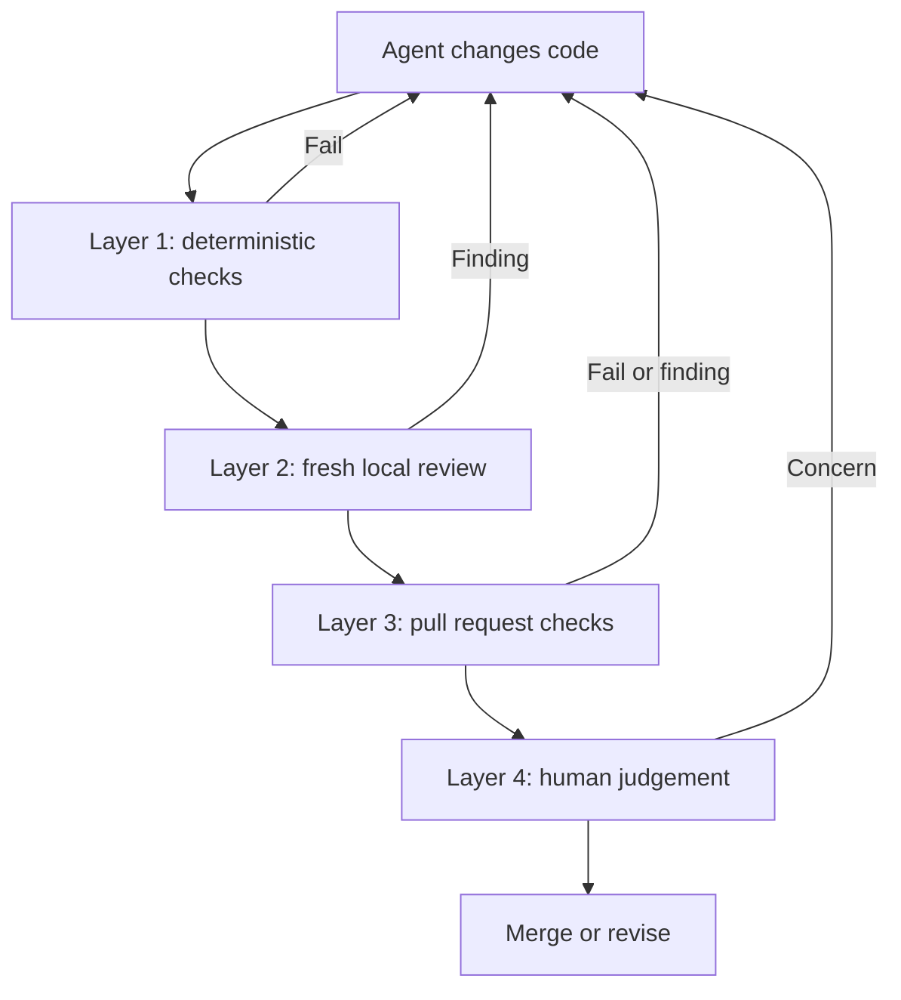
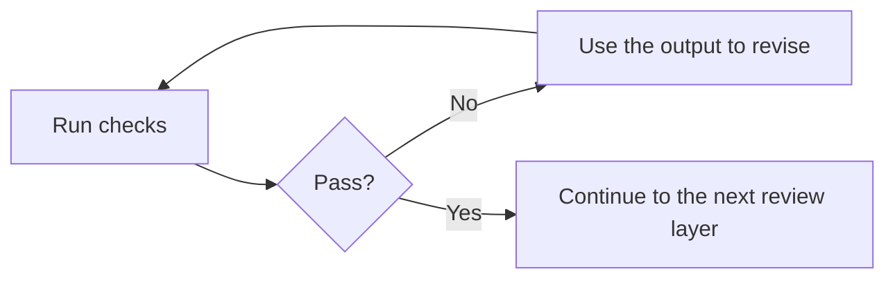

# Architecture: Four Layers of AI Code Review

This is a compact visual reference for the workflow taught in [`../LESSON.md`](../LESSON.md). Read the lesson for the setup commands, tradeoffs, and failure modes.

## The Pipeline

## What Each Layer Does

| Layer | Main question | Examples |
| --- | --- | --- |
| Deterministic checks | Does the change satisfy rules a machine can prove? | Formatting, linting, types, tests, static security checks |
| Fresh local review | What looks wrong in the diff before push? | Correctness, regressions, scope, missing tests, project rules |
| Pull request checks | Does the branch pass in a clean environment? | CI, required checks, optional automated review |
| Human judgement | Is this the right change to ship? | Intent, product behaviour, architecture, risk, operations |

## Feedback Loop

Each layer has a boundary. Tests cannot decide product intent. A model review cannot prove that a command passed. Human approval should not replace repeatable checks.

Start with deterministic checks and one fresh local review. Add services only when they solve a specific gap in that workflow.
