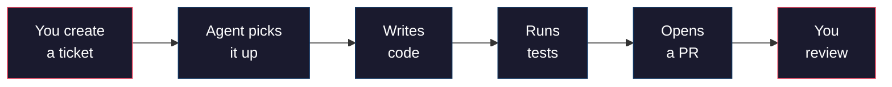
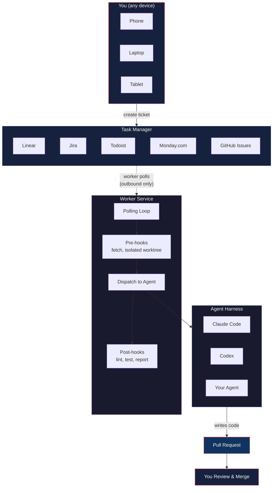
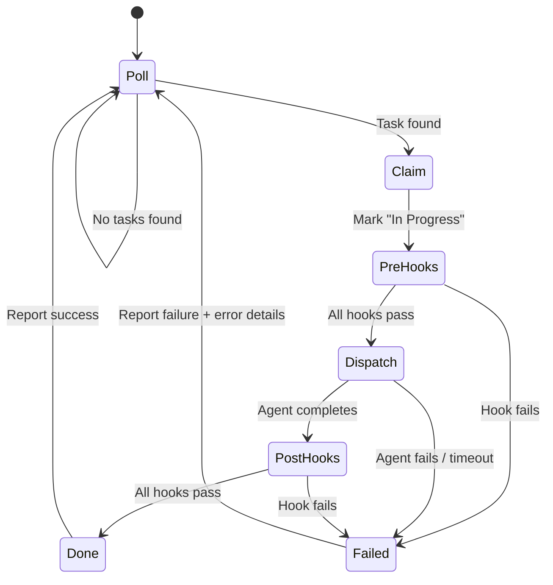
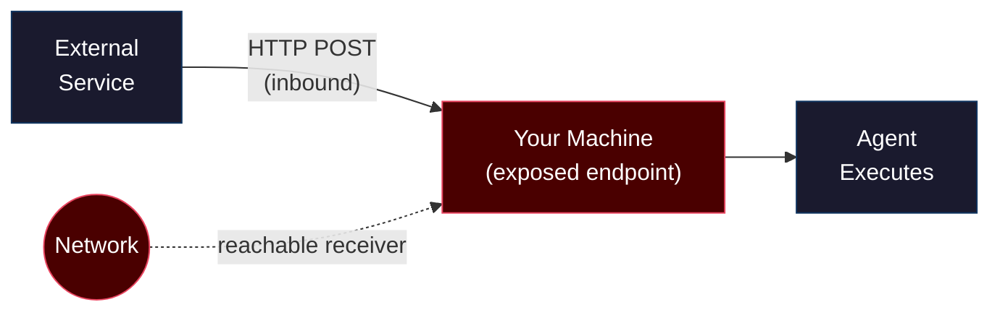
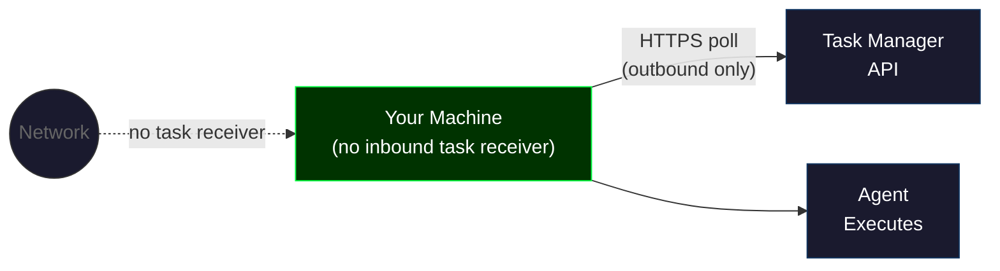
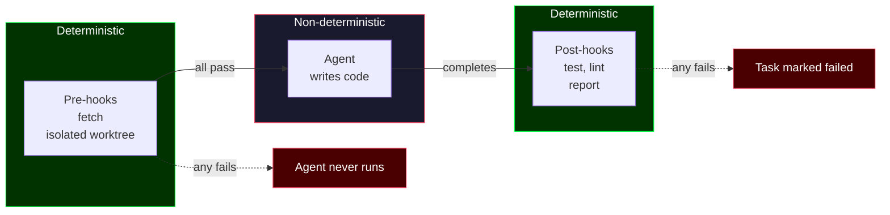
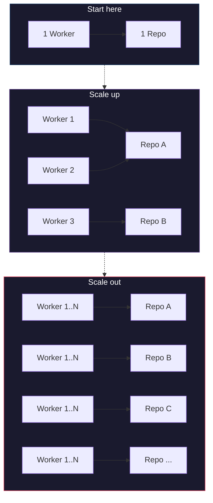

# Background Agent Workers: A Pull-Based Architecture

Companion guide for [My Multi-Agent Team (Built From Scratch)](https://youtube.com/@owainlewis).

---

## The Problem

Most of us use AI coding agents interactively: open a terminal, start a session, provide context, wait, review, and repeat. That works well for ambiguous work, but it also means every task waits for you to start it.

Background workers remove that scheduling step. The main architectural choice is how work reaches the machine: an external service can push events to a receiver, or the worker can poll a task manager. Security depends on the controls around either design. Polling is useful when you do not need a low-latency trigger or an inbound worker endpoint.

There's a simpler approach.

---

## The Solution

**agent-worker** is a polling-based background agent that watches your task manager for work, picks it up, executes an agent harness, and reports results back. It can progress routine work until it reaches a review gate or an exception.



> **Task manager adapter.** The reference implementation uses Linear. The same pattern can work with another task manager when an adapter can query ready tasks, claim one safely, and update its status.

> **Agent harness adapter.** The worker separates task coordination from agent execution. The reference repository documents the currently supported adapters. A new harness needs an implementation of the executor interface.

The full source code is at [github.com/owainlewis/agent-worker](https://github.com/owainlewis/agent-worker).

---

## Architecture

The system has three components:



1. **Task Manager** is the source of truth. You create tickets here from any device. A label or status marks a ticket as agent-ready. The reference uses Linear, but any task manager with an API works.
2. **Worker Service** runs on your machine and polls the task manager on a schedule. When it finds a ready ticket, it claims it and starts processing.
3. **Agent Harness** does the actual coding work through a supported executor adapter.

### The Worker Loop



1. **Poll** the task manager for tickets marked ready
2. **Claim** the ticket with an atomic state transition so competing workers cannot both succeed
3. **Pre-hooks** run deterministic setup: fetch and create an isolated worktree
4. **Dispatch** the ticket to the agent harness with a structured prompt
5. **Post-hooks** run deterministic verification: lint, test, and report
6. **Report** success or failure back to the task manager with details

If a step fails, the worker should mark the ticket failed and attach a useful error summary. Keep detailed logs in the worker, and avoid copying secrets or raw credentials into task comments.

---

## Pull-Based vs Push-Based Architecture

This choice changes the system's network surface and operating model. It does not decide whether the whole system is secure.

### Push-based (webhook)

In a push design, an external service sends an event when work is ready. The receiver might run on the worker machine, on a managed service, or behind a private network boundary.



**What this requires:**
- A receiver reachable by the event source
- Authentication and authorization for incoming events
- Replay protection, validation, and retry handling
- A deliberate route from the receiver to the agent worker

The receiver is an additional component to secure. A request reaching the endpoint must not be enough to trigger arbitrary agent execution. Validate the source, validate the task identifier, constrain what the worker can read and change, and keep the worker's credentials scoped.

### Pull-based (polling)

This is how agent-worker works. The worker reaches out to the task manager on a schedule, so it does not need an inbound endpoint for task delivery.



**What this requires:**
- Outbound HTTPS requests to the task manager API
- A scoped API credential
- A safe claim operation and state transitions
- The same sandboxing, review, and secret-handling controls as a push worker

**Why polling can fit background agent work:**
- **No inbound task receiver.** The worker can make outbound requests only.
- **Fewer delivery components.** You do not need to operate a webhook receiver or event-delivery authentication.
- **Flexible placement.** The worker can run behind NAT or another network boundary that permits the task manager API.

Polling does not make task content trusted. A compromised task-manager account or a malicious ticket can still feed instructions to the worker. Treat labels and statuses as routing metadata, validate task fields, restrict credentials and tools, and keep a human approval gate before merge or deployment.

### The Tradeoff

Polling adds pickup latency. With a 60-second interval, a new ticket can wait about one interval before the next successful poll. That may be acceptable for long-running coding tasks. A low-latency workflow may justify a push design.

### Comparison

| | Push-based (webhooks) | Pull-based (polling) |
|---|---|---|
| **Direction** | Service pushes to your machine | Your machine pulls from service |
| **Task-delivery surface** | Reachable event receiver | No inbound worker endpoint |
| **Delivery controls** | Event authentication, validation, replay protection | API credential, safe polling and claim logic |
| **Infrastructure** | Receiver and event retry handling | Polling loop and scheduler |
| **Latency** | Event-delivery latency | Poll interval, for example 60 seconds |
| **Useful when** | Low-latency triggers matter | Delayed pickup is acceptable |

---

## Hooks: Deterministic Guardrails Around Non-Deterministic Agents

Agent output varies. Hooks wrap execution with deterministic, auditable steps, but each hook only proves the condition it checks.



### Pre-hooks

Run before the agent starts. If any pre-hook fails, the agent never runs.

```yaml
hooks:
  pre:
    - "git fetch --prune origin"
    - "git worktree add '../agent-worktrees/{safe_id}' -b 'agent/{safe_id}' origin/main"
```

This example creates a separate checkout from the fetched `origin/main`. The hook runner must stop on the first non-zero exit code. In a real worker, derive the branch and worktree name from a validated identifier, not a free-form ticket title. Allow only an expected character set and reject path separators or shell syntax.

### Post-hooks

Run after the agent finishes. If any post-hook fails, the task is marked failed.

```yaml
hooks:
  post:
    - "bun run test"
    - "bun run lint"
```

Passing tests and lint provides verification evidence. It does not prove the change is correct or safe to deploy. Review the diff, scan staged files for secrets and generated output, then require explicit human approval before merge or deployment.

### Why This Matters

Without hooks, you're letting an agent loose on your codebase with no guardrails. With hooks, you have a deterministic process wrapped around a non-deterministic agent. The agent does the creative work. The hooks enforce the process.

---

## Configuration

The worker is configured with a YAML file. Project-specific commands and credentials still need to match the repository and its risk level.

```yaml
linear:
  project_id: "your-project-uuid"
  poll_interval_seconds: 60

  statuses:
    ready: "Todo"
    in_progress: "In Progress"
    done: "Done"
    failed: "Canceled"

repo:
  path: "/path/to/your/repo"

hooks:
  pre:
    - "git fetch --prune origin"
    - "git worktree add '../agent-worktrees/{safe_id}' -b 'agent/{safe_id}' origin/main"
  post:
    - "bun run test"
    - "bun run lint"

claude:
  timeout_seconds: 300
  retries: 0

log:
  file: "./agent-worker.log"
```

Hook commands support variable interpolation:

| Variable | Value | Example |
|---|---|---|
| `{safe_id}` | Validated ticket identifier | `ENG-42` |
| `{branch}` | Generated branch name | `agent/ENG-42` |

Do not interpolate untrusted ticket text directly into shell commands. Prefer argument arrays over shell strings when the worker supports them.

---

## Getting Started

### Prerequisites

- [Bun](https://bun.sh) 1.0+
- An agent harness installed and authenticated (Claude Code or Codex)
- A task manager with an API (Linear ships out of the box)

### Setup

```bash
git clone https://github.com/owainlewis/agent-worker
cd agent-worker
bun install
```

Copy and edit the config:

```bash
cp agent-worker.example.yaml agent-worker.yaml
```

Set your API key:

```bash
export LINEAR_API_KEY=lin_api_...
```

### Run

```bash
bun run start
```

The worker starts polling. Create a ticket, add the agent label, and watch it get picked up.

---

## Scaling

One possible expansion is to add isolated workers gradually:



- **One worker, one repo.** Run `agent-worker` on your laptop. It processes tickets sequentially.
- **Multiple workers, one repo.** Run multiple instances only when the task-manager adapter provides an atomic compare-and-set or equivalent claim. A plain status update can race and allow duplicate pickup.
- **Multiple workers, multiple repos.** Each worker gets its own config pointing at a different repo. They all poll the same project or different ones.

Start with one worker. Add concurrency only after claim behavior, isolated worktrees, rate limits, logs, and cleanup have been tested.

---

## Links

- [agent-worker source code](https://github.com/owainlewis/agent-worker)
- [Video: My Multi-Agent Team (Built From Scratch)](https://youtube.com/@owainlewis)
