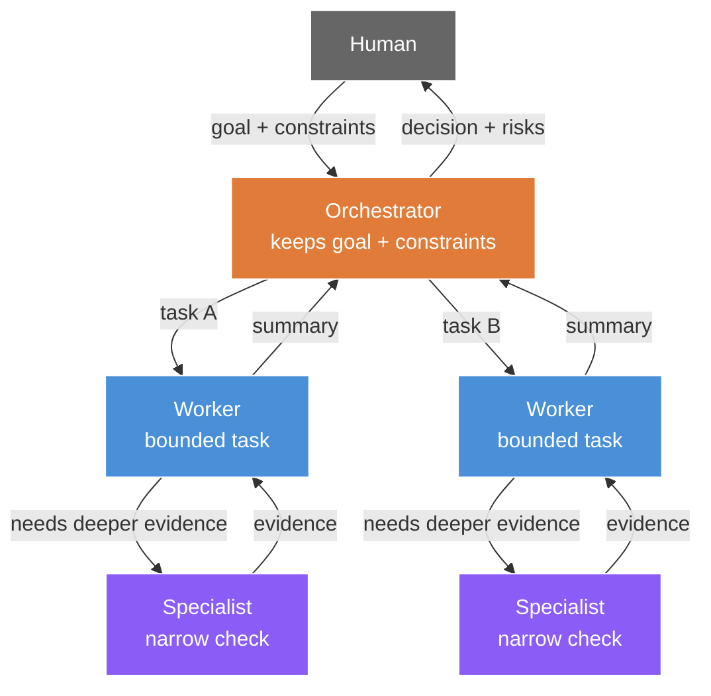
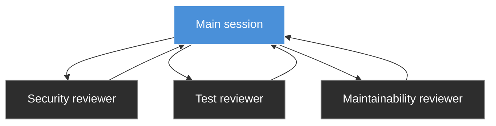
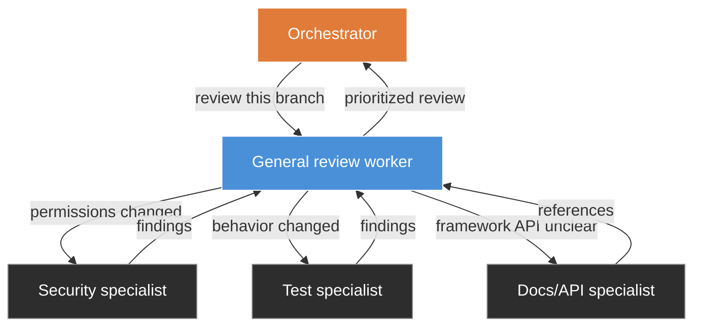

# Nested Subagents in Claude Code + Codex

Companion lesson for the video:

**Nested Subagents in Claude Code + Codex: Orchestrator-Worker Patterns**

Airtable content record: <https://airtable.com/appJ7cZnLDiiq8OUy/tblQQIS9RyEhJBrnU/recKtlpXuB9gJBtK9>

Script: [SCRIPT.md](./SCRIPT.md)
Prompt pack: [PROMPTS.md](./PROMPTS.md)

## The angle

Anthropic just added nested subagents to Claude Code.

Codex already has subagent workflows, custom agents, and an `agents.max_depth` setting.

The useful question is not which tool has the feature first.

The useful question is:

> How do we use nested agents without creating a chaotic tree of expensive, hard-to-review work?

My answer is the **orchestrator-worker pattern**.

One agent owns the goal. Workers handle bounded work. Specialist workers answer narrow questions. Evidence comes back up the chain. The human approves consequential changes.

## Why care?

AI coding agents are good at tool use:

- searching a repo
- reading files
- running tests
- checking logs
- using MCP servers
- validating framework behavior
- comparing branches

That tool use is valuable, but it is noisy.

If every file read, failed command, search result, partial theory, and browser trace lands in the main conversation, the main agent has to make important decisions inside a messy context window.

Subagents help by moving noisy work into separate context windows.

Nested subagents help when a worker discovers a narrower question and needs a specialist to investigate it without polluting the worker's own context.

The goal is not maximum autonomy.

The goal is cleaner delegation.

## The basic mental model



## Flat subagents vs nested subagents

Flat subagents are useful when the main session can directly assign independent work and collect the results.



Nested subagents are useful when a worker should decide which specialist checks are needed.



The important difference: the review worker is responsible for deciding what deeper review is needed.

## Claude Code version

Use Claude Code nested subagents when you want the lead session to keep the goal clean while workers do messy investigation.

Good first demo:

```text
Use nested subagents to review the current diff.

Start with one general code-review worker.
That worker should inspect the diff and decide which specialist reviews are needed.

If needed, it may spawn specialist workers for:
- security and permissions
- correctness and edge cases
- test coverage
- maintainability

Specialist workers must not edit files.
They should return evidence-backed findings with file paths and what they checked.

The general review worker should synthesize specialist findings and report back to the orchestrator.

The orchestrator should return critical issues, warnings, suggestions, what I should fix first, and what was not checked.
```

## Codex version

Codex supports subagent workflows, custom agents, and project-level agent configuration.

Example project config:

```toml
# .codex/config.toml
[agents]
max_threads = 6
max_depth = 1
```

`max_depth = 1` allows direct child agents to spawn but prevents deeper recursion. Raise it only when you deliberately want recursive delegation.

Example custom agents:

```toml
# .codex/agents/pr-explorer.toml
name = "pr_explorer"
description = "Read-only codebase explorer for gathering evidence before changes are proposed."
model = "gpt-5.3-codex-spark"
model_reasoning_effort = "medium"
sandbox_mode = "read-only"
developer_instructions = """
Stay in exploration mode.
Trace the real execution path, cite files and symbols, and avoid proposing fixes unless the parent agent asks for them.
Prefer fast search and targeted file reads over broad scans.
"""
```

```toml
# .codex/agents/reviewer.toml
name = "reviewer"
description = "PR reviewer focused on correctness, security, and missing tests."
model = "gpt-5.4"
model_reasoning_effort = "high"
sandbox_mode = "read-only"
developer_instructions = """
Review code like an owner.
Prioritize correctness, security, behavior regressions, and missing test coverage.
Lead with concrete findings, include reproduction steps when possible, and avoid style-only comments unless they hide a real bug.
"""
```

```toml
# .codex/agents/docs-researcher.toml
name = "docs_researcher"
description = "Documentation specialist that uses the docs MCP server to verify APIs and framework behavior."
model = "gpt-5.4-mini"
model_reasoning_effort = "medium"
sandbox_mode = "read-only"
developer_instructions = """
Use the docs MCP server to confirm APIs, options, and version-specific behavior.
Return concise answers with links or exact references when available.
Do not make code changes.
"""

[mcp_servers.openaiDeveloperDocs]
url = "https://developers.openai.com/mcp"
```

Example Codex prompt:

```text
Review this branch against main.

Use an orchestrator-worker pattern:
- have pr_explorer map the affected code paths
- have reviewer find real correctness, security, and test risks
- have docs_researcher verify the framework APIs that the patch relies on

Wait for all subagents to finish, then synthesize the findings into:
- critical issues
- non-blocking risks
- evidence from files or docs
- what should be fixed before merge
- what was checked and what was not checked
```

## The demo flow

### 1. Explain the feature

Claude Code can now use nested subagents.

Codex also has subagents, custom agents, and a nesting-depth setting.

Both point toward the same workflow shape: orchestrator-worker delegation.

### 2. Show the wrong way

A vague prompt like this is risky:

```text
Use a bunch of agents to improve this codebase.
```

It is too broad. It invites noisy exploration, unpredictable edits, and weak review.

### 3. Show the useful pattern

A better prompt is bounded:

```text
Review this branch against main.
Use specialist subagents for code path exploration, risk review, and API verification.
Do not edit files.
Return evidence-backed findings and tell me what should be fixed before merge.
```

### 4. Show Claude Code

Use nested subagents for code review or debugging.

### 5. Show Codex

Show the `.codex/config.toml` and `.codex/agents/*.toml` files.

Run a branch review prompt that explicitly asks for the custom agents.

### 6. Compare

Claude Code angle:

- newly added nested subagents
- natural fit for Claude Code code review and debugging workflows
- good for keeping the main session clean

Codex angle:

- subagents already available
- project-scoped custom agents
- configurable `max_depth`
- useful for explicit specialist roles and MCP-backed research

Shared lesson:

- do not optimize for more agents
- optimize for clearer delegation
- keep risky actions behind human approval

## Safety rules

Use nested agents first for read-only work.

Good candidates:

- review this diff
- investigate this failing test
- map this code path
- verify this API behavior
- compare these implementations
- find the blast radius of this change

Bad candidates:

- improve this app
- rewrite the architecture
- fix everything
- update auth or billing without approval
- deploy if it looks good

Default rules:

- workers return evidence
- specialists answer narrow questions
- editing permissions stay narrow
- risky systems need approval
- the orchestrator synthesizes
- the human decides what ships

## Takeaway

Nested subagents are not interesting because they let you create a giant agent tree.

They are interesting because they make orchestrator-worker workflows cleaner.

Claude Code now has nested subagents.

Codex has subagents and custom agents with configurable nesting.

The pattern is the same in both:

```text
Human
  -> Orchestrator
      -> Worker
          -> Specialist
      -> Worker
          -> Specialist
  -> Evidence-backed summary
  -> Human approval
```

That is how to use the feature without turning your coding workflow into chaos.
