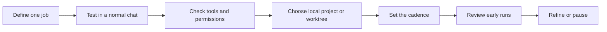

# Codex Scheduled Tasks: Bug Scan and Bug Fix

Last verified against the official OpenAI documentation: 2026-08-04.

## Opening Script

Codex can run recurring tasks in the background, but a schedule does not make a
weak workflow reliable. The useful part is defining one narrow job, testing it
manually, and giving it clear limits before it runs without you. In this lesson,
I will show you the supported Scheduled task workflow, then use a bug scan and a
bug fix as practical examples. We will also cover worktrees, permissions, and
the points where a human still needs to review the result. The prompt examples
are linked for free in this repository. So, let's get into it.

## What Scheduled tasks are

A Scheduled task is a prompt that ChatGPT runs at a time or cadence you choose.
You create and manage these tasks from ChatGPT on the web or from the ChatGPT
desktop app. The results and recent runs appear in **Scheduled**.

This is a product workflow, not a folder format. There is no documented process
for importing a TOML file into an automations directory. Codex CLI and the IDE
extension can help you test a prompt or prepare a repository, but they do not
provide the Scheduled task management interface.

The supported surfaces have different boundaries:

| Surface | Good for | Important boundary |
| --- | --- | --- |
| ChatGPT desktop app | Recurring work against a local project | The computer must be on, the app must be running, and the project must still exist on disk. |
| ChatGPT on the web | Reports and checks using uploads, projects, and connected tools | A web task cannot work directly in a folder on your computer. |
| Existing chat | A follow-up that should keep the chat's context | The prompt still needs a clear stop condition and durable instructions. |
| Standalone task | Independent scans or reports | Each run starts from the saved prompt rather than an ongoing chat. |

For repository work, the desktop app can run a task in the local checkout or in
a dedicated worktree. Use a worktree when the task may change files. It keeps
the scheduled run separate from unfinished work in your main checkout.

## The reliable order

The weak default is to start with a broad prompt and schedule it immediately.
That hides unclear scope until the task is already running unattended.

Use this order instead:

### 1. Define one job

Do not ask one task to scan the codebase, fix every problem, deploy the result,
and report to several tools. Give it one outcome that is easy to inspect.

For example:

- Find one high-impact bug and create a deduplicated issue.
- Pick one labelled issue, make a focused fix, and open a pull request.

### 2. Test the prompt manually

Run the prompt in a normal Codex chat before you schedule it. Check that the
scope, tools, permissions, output, and stop conditions behave as expected.

This is where you catch missing repository access, vague labels, unavailable
plugins, and prompts that produce too much work.

### 3. Choose where it runs

Use ChatGPT on the web when the job depends on uploaded context or connected
tools and does not need a local folder.

Use the desktop app when the task needs a project on your computer. For a Git
repository, prefer a worktree when the task can edit files. Local mode is useful
for read-only checks, but it can also change files in the checkout you are using.

### 4. Create the schedule

Open **Scheduled** in the supported web or desktop app, create a task, and set:

- the tested prompt
- the project or chat context
- the cadence
- the local project or worktree, when using the desktop app
- the model and reasoning effort, only when the defaults are not suitable

You can also ask ChatGPT in a chat to create or update a Scheduled task by
describing the job, schedule, and whether it should return to that chat or start
a separate run.

### 5. Review the first runs

Treat the first few runs as validation. Look for false positives, repeated
issues, changes outside scope, missing checks, and output that is hard to review.
Refine or pause the task before increasing its frequency.

## Example 1: scan for a real bug

The scan should be read-only. Its job is to find evidence, deduplicate it, and
report a useful result. It should not create speculative cleanup tickets.

The optional [bug scan prompt](./resources/prompts.md#bug-scan) asks the task to:

1. inspect a defined part of the repository
2. report only a bug with a clear failing path and impact
3. search existing GitHub issues before creating a new one
4. stop cleanly when the required access is unavailable

Run this as a standalone task when each scan should produce an independent
report in **Scheduled**.

## Example 2: fix one approved issue

The fix task starts from an issue that a human has already made eligible with a
label. It handles one reviewable change and opens a pull request. It does not
merge the result.

The optional [bug fix prompt](./resources/prompts.md#bug-fix) asks the task to:

1. select one suitable labelled issue
2. stop when the work is ambiguous, destructive, or needs unavailable secrets
3. make the smallest required change
4. run the relevant tests and repository checks
5. open a pull request for human review

Use a dedicated worktree because this task edits the repository. Keep the final
merge as a human decision until the workflow has enough evidence and safeguards
for your project.

## Permissions are part of the design

Scheduled tasks run unattended with the configured sandbox. When organization
policy allows it, they use non-interactive approval behavior. If an admin policy
disallows that setting, the task falls back to the approval behavior of the
selected permission mode. Do not design a scheduled workflow that depends on a
person approving a tool call during the run. Start with the narrowest access
that lets the job succeed, and make the task report missing access.

A worktree prevents a task from colliding with your active checkout. It does not
limit what commands the task can run or what network services it can reach. The
sandbox and workspace policy control those permissions.

Use these defaults for maintenance work:

- Prefer workspace-write over full access.
- Grant network access only when the task needs a connected service.
- Keep secrets out of prompts and repository files.
- Put durable repository rules in `AGENTS.md`.
- Make the prompt stop when a required tool, secret, or decision is missing.
- Require tests and a reviewable summary for any code change.

Managed workspaces can impose stricter permission rules. If a scheduled run
cannot use its expected tools or sandbox mode, report the missing capability
instead of weakening the task silently.

## Prompts are examples, not installation files

The [prompt resource](./resources/prompts.md) contains plain Markdown prompts.
Copy one into a normal chat, replace its placeholders, and test it. After it
works, use that tested prompt when you create the Scheduled task.

If the method becomes more complex, move the repeatable instructions into a
skill and let the Scheduled task define the cadence and project. This keeps the
workflow easier to test and reuse without treating undocumented files as a
public API.

## References

- [Scheduled tasks](https://learn.chatgpt.com/docs/automations)
- [Git worktrees in the desktop app](https://learn.chatgpt.com/docs/environments/git-worktrees)
- [Sandboxing](https://learn.chatgpt.com/docs/sandboxing)
- [Build skills](https://learn.chatgpt.com/docs/build-skills)

## Summary

- The one thing to remember: test one narrow job before scheduling it.
- The honest limitation: unattended tasks need explicit scope, permissions, and
  human review around risky changes.
- What to try next: run one prompt manually, then schedule it at a low frequency
  and inspect the first few results.
