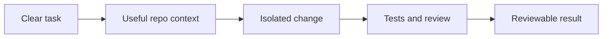

# OpenAI Codex For Developers

Last verified against the official OpenAI documentation: 2026-08-04.

Codex can work from the command line, the IDE extension, the ChatGPT desktop app, or a cloud environment. The useful part is not choosing one perfect surface. It is giving the agent a clear job, a safe working boundary, and a check that proves the result.

## Opening Script

This is a practical guide to using OpenAI Codex as a professional developer.

Codex can work in your terminal, editor, desktop app, and cloud environments. That range is useful, but it also makes the product easy to learn as a list of features instead of a development workflow.

In this lesson, I will show you how to install the CLI, choose the right surface for a task, give Codex useful repository instructions, isolate changes, verify the result, and turn repeated work into skills or plugins.

The resources and example files are included in this tutorial.

So, let's get into it.

## The Simple Model

Use the surface that matches the job.

| Surface | Good fit |
| --- | --- |
| CLI | Focused work in one repository, shell automation, and local review. |
| IDE extension | Interactive work while staying close to the editor. |
| Desktop app | Several visible projects or long-running tasks, plus files and connected tools. |
| Cloud | Isolated work that can continue away from your local machine. |

The workflow stays the same:



## Install The CLI

OpenAI's current standalone installer for macOS and Linux is:

```bash
curl -fsSL https://chatgpt.com/codex/install.sh | sh
```

The official docs also list npm and Homebrew:

```bash
npm install -g @openai/codex
brew install --cask codex
```

Open a repository and start Codex:

```bash
cd /path/to/project
codex
```

The first run asks you to sign in. Use `codex --help` when you need the commands supported by the installed version.

## Start With A Small Real Task

A good first task has one outcome and one proof:

```text
Add validation for the email field in src/api/users.py.
Follow the existing validation pattern.
Add focused tests and run them.
Do not change unrelated endpoints.
```

This is stronger than `improve the API` because Codex can tell when it is done.

The task defines:

- the result
- the relevant file
- the existing pattern to follow
- the verification
- the boundary

## Give Codex Repository Context

Codex reads `AGENTS.md` instructions that apply to the current directory. Use the file for facts and rules that the repository cannot explain by itself.

Good instructions include:

- the product purpose
- exact test and quality commands
- workflow rules
- non-obvious constraints
- files that are the source of truth

Keep commands in one real source such as a `justfile`, `Makefile`, or package script. Point to that source instead of copying a second version into `AGENTS.md`.

You can ask the CLI to create a starting file with `/init`, then edit it down.

See the [example AGENTS.md](./resources/AGENTS.md).

## Use The CLI For Focused Work

The interactive CLI is the shortest feedback loop:

```bash
codex
```

Use `/permissions` to inspect or change the current permission mode. Use `/status` to inspect the active workspace and configuration. Type `/` to see the commands supported by your installed version.

Resume a saved session:

```bash
codex resume
```

Run a non-interactive task from a script or CI job:

```bash
codex exec "run the focused unit tests and explain any failures"
```

Review uncommitted work without asking the review command to edit it:

```bash
codex review --uncommitted
```

Use non-interactive mode only when the prompt, permissions, output, and failure behavior are clear. An unattended command still needs a real quality gate.

## Use The Desktop App For Visible Parallel Work

The desktop app is useful when several projects or longer tasks need to stay visible. Start a chat or project, open a folder, and give each task a clear outcome.

For Git repositories, isolated worktrees prevent one task from mixing with unfinished work in another checkout. The safe pattern is:

1. Start from a clean, current base branch.
2. Give one task one branch or worktree.
3. Let the task run its checks.
4. Review the diff before merging.
5. Remove the worktree when the work is finished.

Parallel work is useful only when the tasks do not depend on each other. If task B needs task A's schema or API, merge A before starting B.

## Permissions Are Two Separate Decisions

The sandbox controls what commands can reach. The approval policy controls when Codex pauses to ask.

For normal version-controlled work, OpenAI documents the Auto combination as workspace write with on-request approvals:

```toml
sandbox_mode = "workspace-write"
approval_policy = "on-request"
```

Command network access is off by default in the workspace-write sandbox. Enable it only when the task needs package installation or external services:

```toml
[sandbox_workspace_write]
network_access = true
```

Use `/permissions` for a read-only task such as explanation or review. Avoid full access unless the environment and task justify the larger boundary.

See the dated [permissions guide](./resources/codex-permissions-guide.md) and the [official security guide](https://developers.openai.com/codex/agent-approvals-security).

## Turn Repeated Work Into Skills

A skill is a directory with a required `SKILL.md` and optional scripts, references, and assets. Codex can select a skill when its description matches the task, or you can invoke it explicitly.

Use `/skills` or type `$` in the CLI to find an installed skill.

The smallest skill is:

```md
---
name: focused-review
description: Review a code change without editing it. Use before a commit or pull request.
---

Read the task and current diff.
Report only actionable correctness, security, regression, and test findings.
Do not edit files.
```

Save a repo skill under `.agents/skills/<name>/SKILL.md`. Save a personal skill under `~/.agents/skills/<name>/SKILL.md`.

Keep one job per skill. The description should say when the skill should and should not run. Put deterministic work in a script when plain instructions are not enough.

See the [example plan skill](./resources/04-skills/plan-skill/SKILL.md) and [OpenAI's skill documentation](https://developers.openai.com/codex/skills).

## Use Plugins For External Systems

Plugins can bundle skills, connectors, MCP servers, hooks, and other reusable capabilities. In the CLI, open the browser with:

```text
/plugins
```

In the desktop app, open **Plugins** and inspect the plugin before installing it. Start a new chat after installation so its capabilities are available.

Treat plugin actions like any other external change:

- grant the narrowest useful access
- inspect the requested permissions
- require approval for meaningful writes
- verify the result in the source system

See the [plugin workflow](./resources/05-plugins/README.md) and [official plugin documentation](https://developers.openai.com/codex/plugins).

## A Professional End-To-End Workflow

### 1. Define the task

Write the outcome, scope, constraints, and checks. Use the [plan template](./resources/plan-template.md) when the work needs more structure.

### 2. Inspect before editing

Ask Codex to read the relevant code, repository instructions, and existing tests. The current codebase is usually a better guide than a generic pattern.

### 3. Isolate the work

Use a branch or worktree. Keep unrelated edits out of the task.

### 4. Implement and verify

Run focused tests first, then the broader checks required by the repository. A summary is not proof. Keep the command output.

### 5. Review the diff

Check scope, behavior, tests, security, and maintainability. Use a separate review pass when the change matters.

### 6. Publish only after the checks pass

Write a focused commit and pull request. Include the verification commands and any limitation a reviewer needs to know.

## Common Failure Modes

### The task is too broad

`Improve this repo` forces the agent to invent priorities. Give it one bounded result.

### The instructions duplicate the repo

Copied commands go stale. Point `AGENTS.md` to the executable source of truth.

### Parallel tasks depend on each other

They produce conflicts or incompatible assumptions. Sequence dependent work.

### The agent reports success without evidence

Require the exact tests, linters, or build commands. Review the diff as well as the summary.

### Permissions are wider than the task

Start with the narrowest mode that works. Expand the boundary only for a concrete reason.

## References

- [Codex CLI](https://developers.openai.com/codex/cli)
- [ChatGPT desktop app](https://developers.openai.com/codex/app)
- [Skills](https://developers.openai.com/codex/skills)
- [Plugins](https://developers.openai.com/codex/plugins)
- [Agent approvals and security](https://developers.openai.com/codex/agent-approvals-security)
- [AGENTS.md guide](https://developers.openai.com/codex/guides/agents-md)

## Summary

- The one thing to remember: a clear task and a real check matter more than the Codex surface you choose.
- The honest limitation: product controls change, so use the installed CLI help and dated official documentation for exact UI details.
- What to try next: run one small repository task, review the diff, and record the workflow that worked.

If you want to go deeper on building real software with AI agents, that is what I am building inside [AI Engineer](https://aiengineer.co).
