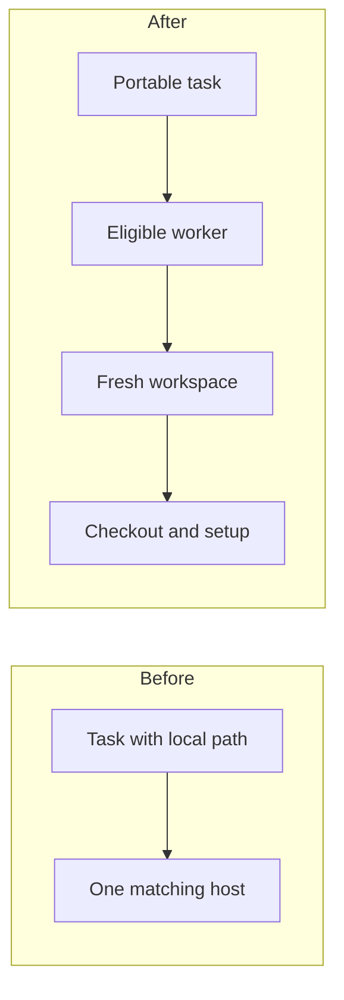
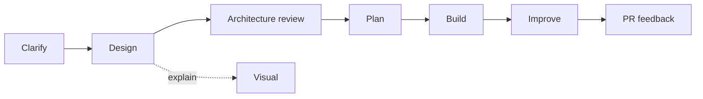

# 7 Codex Skills I Use As An AI Engineer

Last verified against the official OpenAI documentation: 2026-08-04.

Skills are useful when they encode a repeatable way of working. I do not want hundreds of vague prompts. I want a small set of workflows that help me make decisions, build the change, and check the result.

## Opening Script

These are seven types of Codex skills I use in my AI engineering workflow.

If you spend time looking at agent setups, it can feel as if you need a huge skill library before you can do useful work. I think the opposite is true. A small number of focused skills can cover most of the path from a rough idea to reviewed code.

In this lesson, I will show you the seven jobs, where each one fits, how Codex discovers skills, and how to decide whether a workflow should become a skill at all.

So, let's get into it.

## What A Skill Is

A skill is a directory with a required `SKILL.md` file. It can also include scripts, references, assets, and optional metadata.

```text
my-skill/
  SKILL.md
  scripts/       # optional
  references/    # optional
  assets/        # optional
  agents/        # optional metadata
```

The smallest useful `SKILL.md` is:

```md
---
name: focused-review
description: Review a code change without editing it. Use before a commit or pull request.
---

Read the task and current diff.
Report only actionable correctness, security, regression, and test findings.
Do not edit files.
```

Codex can invoke a skill when its description matches the task. You can also invoke one explicitly. In the CLI, run `/skills` or type `$` to find installed skills.

Skill names depend on what is installed in your environment. The command names below describe my current setup. If your names differ, choose the skill that performs the same job.

## The Seven Jobs

| # | Job | Example invocation | Output |
| --- | --- | --- | --- |
| 1 | Design | `$design` | A decided feature or system specification. |
| 2 | Plan | `$plan` | Ordered implementation tasks and checks. |
| 3 | Explain visually | `$explain-visually` | A source-grounded visual explanation. |
| 4 | Clarify | `$clarify` | A clean prompt from a vague request. |
| 5 | Address PR feedback | `$github:gh-address-comments` | Triaged findings, verified fixes, and replies. |
| 6 | Improve | `$improve` | Simpler code with behavior preserved. |
| 7 | Architecture review | `$architecture-review` | Risks and missing decisions in a proposal. |

The names are less important than the boundaries. Each skill should do one job and produce one clear artifact.

## 1. Design Before Code

Use a design skill when important product or technical choices are still open.

```text
$design

Design portable task execution for a worker system.
Tasks should not depend on absolute paths from the control-plane machine.
Cover workspace creation, worker eligibility, migration, and failure handling.
```

The result should decide goals, non-goals, behavior, and tradeoffs. It should not hide an unresolved product decision inside implementation detail.

## 2. Turn A Decision Into A Plan

Use a plan skill after the direction is decided.

```text
$plan docs/portable-task-execution/design.md
```

A good plan creates tasks that another developer or agent can run without the original chat. Each task needs:

- one concrete outcome
- relevant context and files
- acceptance criteria
- exact verification
- dependencies on earlier tasks

Planning too early creates a detailed list for an undecided design. Design first, plan second.

## 3. Explain The System Visually

Use a visual explanation when prose makes a relationship hard to see.

```text
$explain-visually docs/portable-task-execution/design.md
```

For portable task execution, the visual should show the before and after:



Use a diagram when it reduces explanation. Do not create a visual just because the skill exists.

## 4. Clarify A Vague Ask

Use clarify when the request contains hidden decisions:

```text
$clarify

Add a command that sends an MP3 to an audio enhancement API.
The API key already exists in the environment.
```

The useful output is a self-contained prompt. It should resolve questions the repository cannot answer, state assumptions, and preserve the user's intent.

The skill should inspect the codebase before asking questions. A neutral menu is not enough. It should recommend an answer with reasoning when a real choice remains.

## 5. Address Pull Request Feedback

Review comments are evidence to inspect, not commands to apply blindly.

```text
$github:gh-address-comments <pull-request-url>
```

The workflow should:

1. Read unresolved comments.
2. Inspect the current code and tests.
3. Decide which findings are valid.
4. Fix the cause, not only the visible symptom.
5. Run the relevant checks.
6. Reply with evidence.

A good feedback skill preserves judgment. It does not turn every comment into scope.

## 6. Improve Working Code

Use an improvement skill after behavior works and tests provide a safety net.

```text
$improve

Simplify the worker eligibility logic without changing behavior.
Run the focused tests before and after the change.
```

The skill should remove duplication, improve names, and simplify structure. It should not quietly redesign the feature.

## 7. Review Architecture Before Implementation

Use architecture review for a proposal with cross-cutting risk:

```text
$architecture-review docs/portable-task-execution/design.md
```

The reviewer should look for:

- missing requirements
- unclear ownership or boundaries
- unsafe failure modes
- migration and rollback gaps
- operational cost
- decisions that cannot be reversed cheaply

This review belongs before implementation. A code review cannot repair a missing system decision cheaply.

## The Workflow

The seven jobs form a simple path:



You will not use every skill on every task. A small bug may need only implementation and review. A new system boundary may need the full sequence.

## Where Skills Live

Codex scans repository and personal locations for skills.

| Scope | Location | Use |
| --- | --- | --- |
| Repository | `.agents/skills/<name>/SKILL.md` | A workflow shared with this codebase. |
| Personal | `~/.agents/skills/<name>/SKILL.md` | A workflow you use across projects. |

Repository skills can also live in applicable parent directories. Codex supports symlinked skill folders.

The description matters because Codex uses it to decide when the skill applies. Write the trigger and boundary near the start.

## When Not To Create A Skill

Do not create a skill when:

- the task happened once
- the process changes every time
- the repository already has an executable command
- the instructions cannot define a clear output
- the workflow is still untested

Run the workflow manually first. Turn it into a skill after the repeated shape is visible.

## References

- [Official Codex skills documentation](https://developers.openai.com/codex/skills)
- [Owain's public agent skill examples](https://github.com/owainlewis/agent-skills)
- [Clarify skill source](https://github.com/owainlewis/agent-skills/blob/main/skills/clarify/SKILL.md)
- [Explain visually skill source](https://github.com/owainlewis/agent-skills/blob/main/skills/explain-visually/SKILL.md)

## Summary

- The one thing to remember: organize skills around stable jobs, not product tricks.
- The honest limitation: exact installed skill names vary by environment.
- What to try next: find one workflow you have repeated three times and write the smallest skill that captures it.
