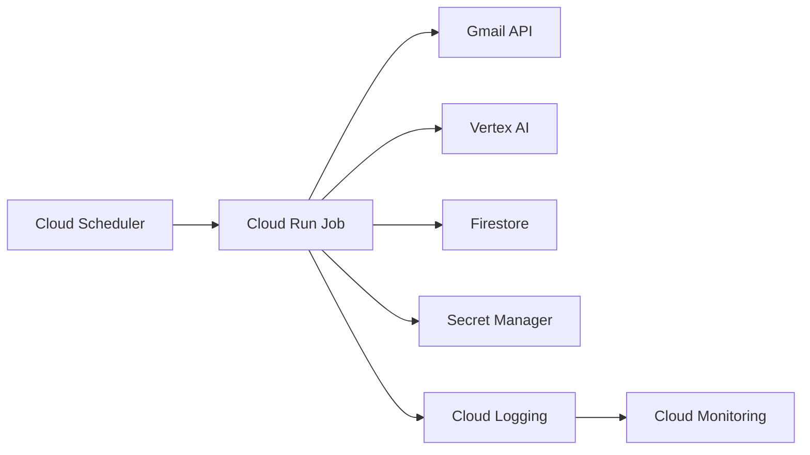
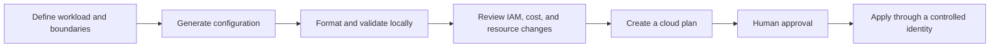

# Deploy AI Systems on Google Cloud With OpenAI Codex

## Opening Script

This is a practical guide to deploying AI systems on Google Cloud with help from a coding agent. Cloud deployment gets confusing because the code is only one part of the job. You also need identity, secrets, scheduling, monitoring, billing, and a safe way to repeat changes. In this lesson, I will show you a small Google Cloud architecture, where an agent helps, what you still need to review, and how to validate the included Terraform without creating cloud resources. All of the checked-in examples and references are linked in this repository. So, let's get into it.

## Before You Deploy

This tutorial contains three kinds of material:

| Path | What is actually included | What it proves |
| --- | --- | --- |
| [`code/email-classifier/`](code/email-classifier/) | A Python Cloud Run Job sample, Dockerfile, dependency list, and environment template | The shape of a scheduled AI job |
| [`code/terraform/`](code/terraform/) | Terraform for the job, scheduler, service accounts, IAM, monitoring, and alerting | How the infrastructure fits together |
| [`code/proposal-generator/backend/app/prompts/`](code/proposal-generator/backend/app/prompts/) | Two prompt assets only | How system instructions and a fictional voice example can be separated |

The proposal generator application is not included. Its [`resources/spec.md`](resources/spec.md) is a design exercise, not a runnable application. There is also no checked-in customer-support RAG application. This lesson uses architecture diagrams instead of claiming those applications are available.

The safe path in this tutorial only formats and validates Terraform. It does not authenticate to Google Cloud, enable APIs, link billing, build images, or create resources.

## The Simple Architecture

Start with the smallest set of services that fit the workload. A scheduled classifier needs a container, a timer, access to the model and Gmail, a little state, secrets, and logs.



Cloud Run Jobs are for containers that run a finite task and exit. They can be started manually or by a schedule. This is different from a Cloud Run service, which listens for requests. Google documents that distinction in the [Cloud Run Jobs guide](https://cloud.google.com/run/docs/create-jobs).

For a web application, add a public web service, a private API when that boundary is useful, and a managed database when the data is relational. Do not add those services to a background job just because they appear in a larger reference architecture.

## Where A Coding Agent Helps

Cloud work contains a lot of exact but repetitive detail. An agent can help you:

- turn an agreed architecture into Terraform
- explain an IAM error and identify the missing permission
- produce Docker and deployment configuration
- add labels, logs, dashboards, and alerts
- capture a working setup in a runbook

The weak default is to let the agent improvise directly against a cloud project. A safer workflow keeps the work reviewable:



You still own the important decisions:

- which services are public
- which identity can deploy
- which identity the workload runs as
- which secrets the workload can read
- which regions and data controls are required
- what the plan will create, replace, or delete
- whether the expected cost is acceptable

An agent can propose IAM. It cannot decide your risk tolerance for you.

## Verify The Terraform Without A Cloud Account

From the repository root, run:

```bash
terraform -chdir=tutorials/deploy-ai-on-gcp/code/terraform fmt -check -diff
bash tutorials/deploy-ai-on-gcp/code/terraform/validate.sh
python3 -m unittest discover \
  -s tutorials/deploy-ai-on-gcp/code/email-classifier/tests \
  -v
```

The validation script copies the Terraform files to a temporary directory, downloads the provider there, runs `terraform validate`, and removes the temporary files. The Python tests prove dry-run mode does not create or apply Gmail labels and does not write processed-message state. None of these commands runs `terraform plan` or `terraform apply`, authenticates to Google Cloud, or creates cloud resources.

Expected final output:

```text
Success! The configuration is valid.
```

`terraform validate` needs an initialized provider. The temporary directory keeps generated provider files and the generated dependency lockfile out of this repository. The commands follow Google's [Terraform format and validation guidance](https://cloud.google.com/docs/terraform/basic-commands).

## Understand What The Module Would Create

The reference module describes:

- required Google Cloud APIs
- one service account for the job
- one service account for the scheduler
- selected Vertex AI, Firestore, Secret Manager, and Cloud Run permissions
- one Cloud Run Job
- one Cloud Scheduler trigger
- a log-based failure metric
- an alerting policy
- an optional dashboard

Read these files before any cloud plan:

```text
code/terraform/main.tf
code/terraform/variables.tf
code/terraform/outputs.tf
code/terraform/terraform.tfvars.example
```

Pay particular attention to project-level IAM grants, the container image, schedule, retry policy, secret names, notification channels, and dashboard toggle. "Minimum scope" is a design goal, not proof that a policy fits every organisation.

## Cost And Billing Safety

Cloud prices change by service, region, usage, billing mode, discounts, and currency. That makes a fixed monthly table misleading. Use the [Google Cloud Pricing Calculator](https://cloud.google.com/products/calculator) with your own region and expected usage. Check the product pricing pages again before deployment. For example, Cloud Run pricing is usage-based and varies with configuration and region, as described in the [current Cloud Run pricing guide](https://cloud.google.com/run/pricing).

Model IDs also expire. The classifier requires an explicit `GEMINI_MODEL` value instead of carrying a stale default. Choose a supported model from Vertex AI and check its date in the [model lifecycle documentation](https://cloud.google.com/vertex-ai/generative-ai/docs/learn/model-versions).

Before creating resources:

1. Use a dedicated test project.
2. Confirm which billing account will be linked.
3. Estimate every service in the Terraform plan, including logs, image storage, network traffic, model calls, and persistent data services.
4. Create budget alerts and route them to someone who will act.
5. Confirm how you will remove the resources.

Normal Google Cloud budgets send alerts. They do not automatically stop general usage or spending. Google states this clearly in the [budget alerts documentation](https://cloud.google.com/billing/docs/how-to/budgets). Google also offers spend caps in preview for eligible services, with important limits documented separately. Do not treat either feature as a substitute for reviewing the plan and watching actual spend.

## Deploy Only After Review

The next commands require Google Cloud credentials and an active billing account. They can create billable resources. They are not part of the repository's default checks.

First, read [`code/terraform/README.md`](code/terraform/README.md) and [`resources/checklist.md`](resources/checklist.md). Build and push the container image before planning the module. Then, from the Terraform directory:

```bash
cd tutorials/deploy-ai-on-gcp/code/terraform
cp terraform.tfvars.example terraform.tfvars
# Edit terraform.tfvars with a test project, image, and notification settings.
terraform init
terraform plan
```

Stop and read the complete plan. Check resources, IAM grants, project, region, image, schedule, and deletion effects. Only apply after that review:

```bash
terraform apply
```

The example sets `DRY_RUN="true"` and creates the scheduler paused. Applying it does not schedule executions. Follow [`resources/checklist.md`](resources/checklist.md) to run one job manually, inspect the dry-run logs, and enable writes and scheduling as a separate reviewed change.

For a disposable test project, remove the managed resources when the exercise is complete:

```bash
terraform destroy
```

`terraform destroy` only knows about resources in its state. Check the Google Cloud project and billing report afterwards for resources created outside Terraform.

## A Safer Agent Prompt

Give a coding agent boundaries before asking for deployment help:

```text
Review the checked-in Terraform for this scheduled Cloud Run Job.

Do not run gcloud commands, terraform apply, terraform destroy, or change billing.
Start by listing the resources, IAM grants, secrets, and estimated cost drivers.
Run formatting and local validation only.
Then produce a terraform plan command for my review.
Flag any permission broader than the workload needs.
Explain how to remove every resource after the test.
```

This makes the first agent pass read-only and reviewable. You can grant more authority later when you understand the proposed change.

## Common Failure Points

### Validation fails before contacting Google Cloud

Check that Terraform is installed and that the provider download is allowed on your network. Run `terraform fmt` before validation.

### Planning reports missing credentials

That is expected outside the safe local path. A plan against Google Cloud needs an authenticated identity with permission to read the project and proposed resources.

### The image cannot be pulled

Confirm the Artifact Registry path, region, project, and runtime service account access. The example image value is a placeholder until you build and push the classifier image.

### Scheduler cannot start the job

Review the scheduler service account and its `roles/run.invoker` grant on the specific job. Do not solve the error by granting a broad project role without understanding it.

### A budget alert did not stop spend

That is the normal behaviour of standard budgets. Alerts tell you about spend. They do not generally shut services down.

## References

- [Google Cloud: Create Cloud Run Jobs](https://cloud.google.com/run/docs/create-jobs)
- [Google Cloud: Basic Terraform commands](https://cloud.google.com/docs/terraform/basic-commands)
- [Google Cloud: Cloud Run pricing](https://cloud.google.com/run/pricing)
- [Google Cloud: Vertex AI model versions and lifecycle](https://cloud.google.com/vertex-ai/generative-ai/docs/learn/model-versions)
- [Google Cloud: Create budgets and budget alerts](https://cloud.google.com/billing/docs/how-to/budgets)
- [`resources/architecture.md`](resources/architecture.md)
- [`resources/checklist.md`](resources/checklist.md)
- [`resources/spec.md`](resources/spec.md), a design-only proposal generator exercise

External Google Cloud guidance was checked on 2026-08-04. Product behaviour and prices can change, so verify the linked primary documentation before deployment.

## Summary

- The useful model is configuration, local validation, review, plan, approval, then apply.
- The checked-in proposal material is two prompt files and a design spec, not an application.
- Local verification creates no cloud resources.
- Cloud credentials, billing, IAM, and cleanup need deliberate human review.

Licensed under the [MIT License](../../LICENSE).
