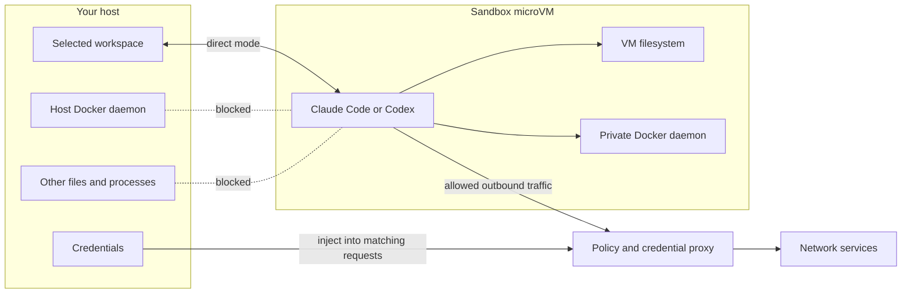
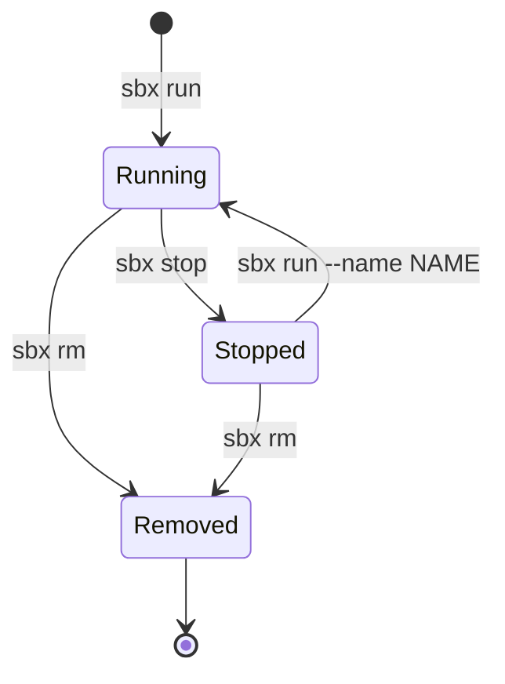

# Docker Sandboxes for Developers

## Title Options

1. Docker Sandboxes for Developers: The Quick Guide
2. Run Claude Code and Codex Safely with Docker Sandboxes
3. Docker Sandboxes Explained: Files, Git, Secrets, and Networks

## Opening Script

AI coding agents are most useful when they can run commands, install packages, start services, and test their own work. The awkward part is permissions. Ask before every command and the agent keeps interrupting you. Skip every permission and the agent gets broad access to your laptop. Docker Sandboxes gives us a better boundary. Claude Code or Codex gets a Linux environment with sudo and its own Docker daemon, while we decide which project files, credentials, and network destinations cross into that environment. In this guide, I will show you what a sandbox is, what it protects, what it does not protect, and the commands you need for everyday development. We will test the filesystem and network boundaries, then run the same coding task with Claude Code and Codex. So, let's get into it.

## Before We Build

We will use the dependency-free Python server in [`code/`](./code/).

The complete route through the lesson is:

1. Install `sbx` on macOS and choose a network policy.
2. Prove that the sandbox cannot see an unmounted host file.
3. Prove that network policy blocks an unapproved destination.
4. Run Claude Code in direct mode.
5. Run Codex in clone mode.
6. Finish with the commands for secrets, ports, persistence, and cleanup.

Docker Desktop is not required. Docker currently supports Apple silicon Macs on macOS Sonoma or later, Windows 11, and Ubuntu 24.04 or later with KVM. Check the [current prerequisites](https://docs.docker.com/ai/sandboxes/get-started/#prerequisites) before following along.

Docker Sandboxes changes quickly. The core syntax in this lesson was checked with `sbx` v0.35.0. Check your version and upgrade if it is older:

```bash
sbx version
brew update
brew upgrade docker/tap/sbx
```

## What is a sandbox?

A sandbox is a boundary around a process and the resources it can reach.

Docker Sandboxes creates a microVM for a coding agent. Inside that VM, the agent has broad freedom. It can use `sudo`, install packages, change its filesystem, and build or run containers. Across the VM boundary, access is narrow and explicit.



Each sandbox gets:

- its own kernel and filesystem;
- its own Docker daemon;
- controlled network access;
- persistent packages, images, containers, and agent state until removal; and
- access only to workspaces and other resources you explicitly share.

This is a stronger boundary than a normal container with the host Docker socket mounted. A process with access to that socket can control the host Docker daemon. A Docker Sandbox uses a separate daemon inside its microVM.

## Why developers should care

A coding agent does more than write source files. It may run an installer, execute a repository script, start a database, alter a Git hook, or follow instructions found in a dependency.

There are two weak defaults:

| Default | Benefit | Cost |
| --- | --- | --- |
| Approve every action | You see each command | Constant interruption and approval fatigue |
| Skip all permissions on the host | The agent can work autonomously | The agent runs with your host access |

A sandbox lets the agent run without its own approval prompts while the microVM, workspace mount, credential proxy, and network policy enforce the outer boundary.

Docker's built-in Claude Code sandbox starts Claude with `--dangerously-skip-permissions`. Its Codex sandbox starts Codex with `--dangerously-bypass-approvals-and-sandbox`. Those flags sound alarming on a host. Inside this setup, they remove the agent's inner prompts. They do not remove the microVM boundary or Docker's policy layer.

The result is a smaller blast radius:

| Agent action | Running on the host | Running in a Docker Sandbox |
| --- | --- | --- |
| Install a system package | Changes the host | Changes the VM |
| Start a container | Uses the host daemon | Uses the VM's private daemon |
| Read unrelated projects or `~/.ssh` | Possible with host permissions | Blocked unless mounted |
| Contact a network service | Uses host network access | Subject to sandbox policy |
| Edit the selected project in direct mode | Changes host files | Still changes host files |

That last row matters. A sandbox is not a magic undo button. In direct mode, the selected project is deliberately shared read-write. The VM protects the rest of the machine, not the files you handed to the agent.

## Install on macOS

Install Homebrew first from [brew.sh](https://brew.sh/) if `brew` is not available. Then run:

```bash
brew trust docker/tap
brew install docker/tap/sbx
sbx login
```

`sbx login` opens a browser-based Docker sign-in and asks you to confirm a one-time code.

The CLI itself is free to use, including commercial use. Docker's organization governance is a separate paid feature.

On first login, choose a network preset:

- **Open** allows outbound traffic.
- **Balanced** uses default-deny with common development services allowed.
- **Locked Down** blocks outbound traffic until you add rules, including model-provider APIs.

Choose **Balanced** for this demo. It is a practical default, not a guarantee that every allowed domain is safe.

Inspect the exact active rules:

```bash
sbx policy ls
```

## Demo 1: prove the filesystem boundary

Create a disposable Git repository and a host-only file beside it:

```bash
DEMO_ROOT="$(mktemp -d)"
DEMO_DIR="$DEMO_ROOT/docker-sandbox-demo"

cp -R tutorials/docker-sandboxes-for-developers/code "$DEMO_DIR"
rm -f "$DEMO_DIR/.gitkeep"
HOST_ONLY_FILE="$DEMO_ROOT/not-mounted.txt"
printf 'host-only\n' > "$HOST_ONLY_FILE"

cd "$DEMO_DIR"
git init -b main
git config user.name "Sandbox Demo"
git config user.email "sandbox-demo@example.com"
git add .
git commit -m "Initial sandbox demo"
python3 -m unittest -v
```

Expected baseline:

```text
test_home_returns_plain_text ... ok
```

Create a shell sandbox for a clean boundary test:

```bash
sbx run shell --name boundary-demo "$DEMO_DIR"
```

From the sandbox shell, inspect the mounted project:

```bash
pwd
ls -la
exit
```

Back on the host, pass the sibling file's absolute path to a command inside the sandbox:

```bash
if sbx exec boundary-demo cat "$HOST_ONLY_FILE"; then
  echo "Unexpected: host-only file was readable"
else
  echo "Expected: host-only file is outside the sandbox workspace"
fi
```

The project is visible because we mounted it. The sibling file is not. The agent also cannot browse unrelated host directories just because it knows their absolute paths.

The sandbox itself persists after you exit. Packages, files, Docker images, and agent state created inside the VM remain until you remove the sandbox with `sbx rm`.

## Demo 2: prove the network boundary

With the Balanced preset, choose a real destination that is not on the development allowlist:

```bash
DENIED_HOST=www.iana.org
sbx policy check network "$DENIED_HOST"
```

Continue only when the result says `Denied`. If your active policy allows this domain, set `DENIED_HOST` to another harmless HTTPS domain that `sbx policy check` reports as denied. Try that destination from the sandbox:

```bash
sbx exec boundary-demo curl -I "https://$DENIED_HOST"
```

Inspect what Docker's proxy observed on the host:

```bash
sbx policy log boundary-demo
```

The log should show the denied request and the policy rule that matched. This is more useful than guessing why an installer or agent request failed.

Allow that destination for this sandbox only, then retry:

```bash
sbx policy allow network --sandbox boundary-demo "$DENIED_HOST"
sbx policy check network --sandbox boundary-demo "$DENIED_HOST"
sbx exec boundary-demo curl -I "https://$DENIED_HOST"
```

Local policy changes take effect immediately. Raw ICMP and UDP traffic remain blocked at the network layer. Installing `ping` inside the VM does not grant permission to send ICMP packets.

## Authenticate agents without exposing raw keys

Do not paste API keys into the sandbox shell or commit them to `.env`.

For Claude Code, either store an Anthropic API key on the host:

```bash
sbx secret set -g anthropic
```

Or start Claude Code and run `/login` to use a Claude subscription. The OAuth flow keeps the token on the host.

For Codex, authenticate ahead of time with host-side OAuth:

```bash
sbx secret set -g openai --oauth
```

Or store an OpenAI API key:

```bash
sbx secret set -g openai
```

For GitHub CLI access:

```bash
echo "$(gh auth token)" | sbx secret set -g github
```

The host-side proxy gives the sandbox a sentinel value such as `proxy-managed`. When a matching request leaves the VM, the proxy writes the real authentication header. The raw service token does not enter the VM.

List configured entries without printing complete values:

```bash
sbx secret ls
```

Two details matter:

1. Global secrets apply when a sandbox is created. Recreate an existing sandbox after adding a new global secret.
2. Registry credentials that an agent needs for `docker push` are written into the VM's Docker config. They are less isolated, so prefer sandbox scope over global scope.

## Demo 3: Claude Code in direct mode

The demo server currently responds on `/`. We will ask Claude to add `/health`.

Create a host branch and launch Claude from the demo repository:

```bash
cd "$DEMO_DIR"
git switch -c demo/claude-direct
sbx run claude --name claude-direct
```

Direct mode is the default. The current working tree is mounted read-write, so changes appear on the host as Claude writes them.

Use this prompt:

```text
Add a GET /health endpoint that returns HTTP 200 with the JSON body
{"status": "ok"}. Add a focused unittest, run the full test suite, and
summarize the files you changed. Do not commit.
```

From another host terminal:

```bash
cd "$DEMO_DIR"
git status --short
git diff
python3 -m unittest -v
```

The evidence is visible outside the agent session:

- the diff appears immediately;
- the tests pass on the host; and
- you still control staging and committing.

Review before running changed project scripts. Direct mode can modify hidden files, CI configuration, editor tasks, `Makefile` targets, package scripts, and Git hooks. Hooks inside `.git` do not appear in a normal source diff, so inspect `.git/hooks` when the input or task is untrusted.

After review, commit the complete Claude result so the next demo can return to a clean `main` branch:

```bash
git add -A
git commit -m "Add health endpoint with Claude"
test -z "$(git status --porcelain)"
```

Do not continue if the final command fails. If you do not want to keep Claude's implementation, discard all changes in this disposable demo instead:

```bash
git reset --hard HEAD
git clean -fdx
test -z "$(git status --porcelain)"
```

Direct mode is useful for one supervised task on one branch. Do not run multiple agents against the same direct-mounted checkout. Their file writes and branch changes can collide.

## Demo 4: Codex in clone mode

Reset the host demo to its initial branch. Use the actual initial branch name if yours is not `main`:

```bash
git switch main
sbx run --clone codex --name codex-clone
```

Use this prompt with Codex:

```text
First configure this clone to use Git author name "Sandbox Demo" and email
"sandbox-demo@example.com". Create a branch named demo/codex-health. Add a
GET /health endpoint that returns HTTP 200 with the JSON body
{"status": "ok"}. Add a focused unittest, run the full test suite, and
commit the finished change. Do not push to origin.
```

Inspect the host checkout while Codex works:

```bash
git status --short
```

It should stay clean. In clone mode, the host repository is available read-only at `/run/sandbox/source`. Codex edits a separate clone inside the VM.

Fetch and review the sandbox branch:

```bash
git fetch sandbox-codex-clone
git log --oneline sandbox-codex-clone/demo/codex-health
git diff main..sandbox-codex-clone/demo/codex-health
```

Check it out only after review:

```bash
git switch -c demo/codex-health sandbox-codex-clone/demo/codex-health
python3 -m unittest -v
```

Clone mode is a better default for autonomous or parallel work because the agent cannot alter the host checkout directly. The tradeoff is an extra Git handoff. The agent must commit or push changes, and you must fetch anything worth keeping before deleting the sandbox.

The `--clone` setting is fixed when the sandbox is created. Remove and recreate the sandbox to change modes.

## Direct mode or clone mode?

| Question | Direct mode | Clone mode |
| --- | --- | --- |
| Where does the agent edit? | Host working tree | Private clone in the VM |
| When do changes appear on the host? | Immediately | After fetch or push |
| Who manages branches? | You on the host | The agent inside the clone |
| Best fit | One supervised task | Autonomous or parallel tasks |
| Main risk | Immediate changes to project files | Losing work if you remove before fetch or push |

A third option is a host Git worktree mounted directly. It gives host-side branch isolation, but the sandbox cannot resolve the worktree's `.git` pointer because the parent repository is not mounted. The agent can edit files but cannot use Git. This works when you want all Git operations to remain on the host.

## Daily-use reference

The core 15–20 minute lesson ends with the direct-versus-clone comparison. The remaining commands are the short reference you will need in day-to-day use.

### Publish a development server

A server inside the microVM is not reachable from your browser by default.

Clone mode keeps its writable clone at the workspace path inside the VM, so `$DEMO_DIR` selects Codex's checked-out branch rather than the host's read-only source mount:

```bash
sbx exec -d -w "$DEMO_DIR" codex-clone \
  python3 server.py --host 0.0.0.0 --port 3000
```

Publish the sandbox port to the host:

```bash
sbx ports codex-clone --publish 8080:3000
curl http://127.0.0.1:8080/health
```

Expected response from Codex's implementation:

```json
{"status": "ok"}
```

The server must listen on `0.0.0.0` or `[::]` inside the sandbox, not only `127.0.0.1`. Ports are published after sandbox creation. There is no `--publish` flag for `sbx run`.

Inspect or remove the mapping:

```bash
sbx ports codex-clone
sbx ports codex-clone --unpublish 8080:3000
```

### Local models and custom environments

Inside a sandbox, `127.0.0.1` means the sandbox itself. To reach an HTTP service on the host, including LM Studio or Docker Model Runner, allow its localhost port and use `host.docker.internal` from the sandbox:

```bash
sbx policy allow network localhost:1234
# Inside the sandbox
curl http://host.docker.internal:1234
```

Point the agent's provider base URL at that hostname. The model remains on the host while the coding agent keeps the same microVM boundary. Docker has a complete [Claude Code with Docker Model Runner guide](https://docs.docker.com/guides/claude-code-sandbox-model-runner/) for this setup.

For repeatable tools, files, environment variables, network rules, and startup commands, use a Docker Sandbox kit. Kits are experimental, so review their specs and sources before using them.

### Stop, restart, and remove

A sandbox persists until you remove it.



`sbx stop` stops the sandbox while retaining its persistent filesystem state. Installed packages, command history, agent state, Docker images, volumes, and a clone-mode repository remain. Do not assume a running process resumes from the same in-memory state.

`sbx rm` deletes the VM and its contents. Direct-mounted workspace files remain on the host. In clone mode, unpushed and unfetched work is deleted with the VM.

Each sandbox has its own image cache, so old sandboxes consume disk space. List and clean them deliberately:

```bash
sbx ls
sbx stop boundary-demo
sbx stop claude-direct
sbx stop codex-clone
sbx rm boundary-demo
sbx rm claude-direct
sbx rm codex-clone
```

If a sandbox has an attached session, `sbx rm` refuses. Exit the session first. Use `--force` only when you understand what is still running.

### Configuration note

A sandbox does not automatically inherit all of `~/.claude` or `~/.codex`. Project-level instructions in the workspace are available. User-level host configuration is not. Docker documents shared agent skills for `sbx` v0.37.0 and later. That store is mounted read-write across participating sandboxes. Use `--no-share-skills` at creation time when projects should not share that trust boundary.

### Practical checklist

Before launch:

- Start from a clean Git state.
- Use direct mode only for supervised, single-branch work.
- Use `--clone` for autonomous or parallel work.
- Inspect `sbx policy ls` and allow only required destinations.
- Add credentials with `sbx secret`, not inside the VM.
- Use `--no-share-skills` when sandboxes should not share a trust boundary.

After the agent finishes:

- Review tracked, untracked, and relevant hidden files.
- Inspect `.git/hooks` after direct-mode work on untrusted input.
- Run tests independently.
- Fetch valuable clone-mode commits before removal.
- Remove old sandboxes to delete VM state and reclaim disk space.

### Honest limitations

Docker Sandboxes trades CPU, memory, disk, and startup overhead for a stronger boundary. Every sandbox runs a VM and separate Docker daemon. It is heavier than a normal container.

The network model is restrictive by design. Some tools that need UDP, arbitrary private-network access, or unsupported authentication patterns may need another setup or may not work.

Direct mode still exposes the selected workspace. A malicious change can affect you later when you run a modified hook, build script, editor task, or package command on the host. Clone mode reduces this risk, but reviewed code can still be dangerous when executed.

Avoid absolute claims that a sandbox makes destructive behavior impossible. It limits what the process can reach. It does not prove that generated code is correct, make every allowed dependency trustworthy, or protect an external service after you deliberately grant access to it.

Keep Git review, tests, narrow network rules, least-privilege credentials, and human judgment in the workflow.

## References

- [Docker Sandboxes overview](https://docs.docker.com/ai/sandboxes/)
- [Get started](https://docs.docker.com/ai/sandboxes/get-started/)
- [Workflow patterns](https://docs.docker.com/ai/sandboxes/workflows/)
- [Security model](https://docs.docker.com/ai/sandboxes/security/)
- [Claude Code agent guide](https://docs.docker.com/ai/sandboxes/agents/claude-code/)
- [Codex agent guide](https://docs.docker.com/ai/sandboxes/agents/codex/)
- [Claude Code with Docker Model Runner](https://docs.docker.com/guides/claude-code-sandbox-model-runner/)
- [Reusable demo prompts](./resources/prompts.md)
- [Demo code](./code/)

## Summary

- **The one thing to remember:** the agent gets broad control inside a microVM, while you decide what crosses the boundary.
- **The honest limitation:** direct mode still gives the agent live write access to the selected workspace, and no sandbox replaces code review.
- **What to try next:** run one disposable task in direct mode, repeat it with `--clone`, and inspect the host after each step.

If you want to go deeper on building real software with AI agents, that's what I'm building inside AI Engineer: https://aiengineer.co
