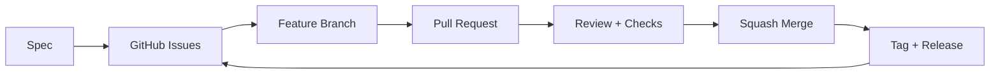

# GitHub AI Workflow

The useful version of an AI coding workflow is not just "ask an agent to write code".

The useful version is a small development system:

- GitHub Issues hold the work.
- A spec defines the shape of the change.
- Branches and pull requests keep the work reviewable.
- Checks prove the code still works.
- Releases turn merged work into something people can use.

The GitHub CLI is the bridge.

Once `gh` is authenticated, an agent can operate GitHub from the terminal instead of asking you to click around the web UI.

## The Problem

Most AI coding demos stop too early.

They show an agent editing files, but they skip the rest of software development:

- creating the repo
- writing the spec
- breaking work into issues
- keeping the board up to date
- opening pull requests
- responding to review feedback
- merging safely
- cutting a release

That is where real projects get messy.

If the agent can only write code, you still have to manage the workflow around it.

The better question is:

> Can the agent move through the same development loop a professional engineer would use?

## The Workflow

Use GitHub as the system of record.

Use the agent as the worker.

Use `gh` as the interface between them.



The loop is simple:

1. Write a small spec.
2. Turn the spec into issues.
3. Pick one issue.
4. Create a branch.
5. Implement the change.
6. Open a pull request.
7. Review and verify.
8. Merge.
9. Repeat.
10. Release when the work is useful.

The point is not to memorize GitHub commands.

The point is to make the workflow visible and repeatable.

## Demo Project

For the tutorial, build a small Go CLI called `shiplog`.

`shiplog` generates Markdown release notes from merged GitHub pull requests.

It can:

- detect the current GitHub repo from the local git remote
- accept a previous tag and a new tag
- find merged pull requests between those refs
- group pull requests by label
- print clean Markdown release notes
- optionally write the output to a file

This is a good demo because it naturally uses GitHub concepts:

- pull requests
- labels
- tags
- releases
- GitHub Actions

The app is small enough to build in pieces, but real enough to justify the workflow.

## Prerequisites

You need:

- Git
- Go
- a GitHub account
- GitHub CLI
- Claude Code, Codex, or another coding agent with terminal access

Install GitHub CLI on macOS:

```bash
brew install gh
```

Authenticate:

```bash
gh auth login
gh auth status
gh --version
```

The important check is `gh auth status`.

If that works, the agent can use `gh` commands from the terminal.

## Step 1: Create The Repo

Start with a small, explicit repo setup prompt.

```text
Create a new public GitHub repo called shiplog.

Initialize it with a README and a Go module.
Add a standard Go .gitignore.

Set the description to:
"Generate Markdown release notes from merged GitHub pull requests."

Add these topics:
- cli
- golang
- github
- release-notes
- ai-workflow
```

The agent will usually run commands like:

```bash
gh repo create shiplog --public --clone --add-readme
cd shiplog
go mod init github.com/YOUR_USERNAME/shiplog
gh repo edit --description "Generate Markdown release notes from merged GitHub pull requests."
gh repo edit --add-topic cli --add-topic golang --add-topic github --add-topic release-notes --add-topic ai-workflow
```

This is a small step, but it teaches the main idea.

The agent is not only editing code.

It is setting up the development environment around the code.

## Step 2: Write The Spec

Before the agent writes code, give it a spec.

```text
Use the spec skill.

I want to build a Go CLI called shiplog.

The tool generates Markdown release notes from merged GitHub pull requests.

It should:
- detect the current GitHub repo from the local git remote
- accept a previous tag and a new tag
- find merged pull requests between those refs
- group pull requests by label
- print clean Markdown release notes to stdout
- optionally write the output to a file

Write a complete spec covering:
- requirements
- command structure
- flags and arguments
- technical approach
- external dependencies
- error handling
- test strategy

Save it to specs/initial-spec.md.
```

Review the spec before moving on.

This is where you catch bad assumptions while they are still cheap.

Check:

- Is the CLI small enough?
- Are the commands clear?
- Are the first tasks independently buildable?
- Is there a realistic happy path for the release pipeline?

## Step 3: Create Issues From The Spec

Now turn the spec into GitHub Issues.

```text
Use the plan skill.

Take the spec at specs/initial-spec.md and break it down into GitHub issues.

Each issue should include:
- a clear title
- a short description
- acceptance criteria as a checklist
- relevant context from the spec

Push the issues to GitHub using gh issue create.

Use labels:
- feature
- bug
- chore
- docs
```

A good issue breakdown might look like this:

1. Initialize Go CLI structure.
2. Detect GitHub repository from git remote.
3. Fetch merged pull requests between refs.
4. Group pull requests by labels.
5. Render Markdown release notes.
6. Add file output flag.
7. Add tests and fixtures.
8. Add GitHub Actions CI.
9. Add release workflow.

Create labels first:

```bash
gh label create feature --color 0E8A16 --description "New user-facing functionality"
gh label create bug --color D73A4A --description "Bug fixes"
gh label create chore --color C5DEF5 --description "Maintenance work"
gh label create docs --color 0075CA --description "Documentation"
```

Then create issues:

```bash
gh issue create --title "Initialize Go CLI structure" --label feature
```

The board matters because it gives the agent a clean queue.

Instead of asking for one giant change, you give it one reviewable task at a time.

## Step 4: Implement One Issue

The safest agent workflow is narrow.

Give the agent one issue, one branch, and one verification path.

```text
Use the implement skill.

Take issue #1 from the project board.

1. Move the issue to In Progress.
2. Check out a new Git branch named after the issue.
3. Write the code to satisfy the acceptance criteria.
4. Run formatting and tests.
5. Use a fresh review context to inspect the diff.
6. Fix valid review findings.
7. Open a pull request back to main using gh pr create.

The PR description should include:
- summary
- testing notes
- follow-up work
- Closes #1
```

Expected commands:

```bash
git checkout -b feature/initialize-go-cli
go fmt ./...
go test ./...
gh pr create --base main --head feature/initialize-go-cli
```

A useful PR body is short and factual:

```markdown
## Summary
- Initialize the Go CLI project structure
- Add the first command entrypoint
- Add basic tests

## Testing
- `go test ./...`

Closes #1
```

The review step is important.

The same context that wrote the code is often too attached to its own assumptions.

A fresh review context catches different mistakes.

## Step 5: Address Review Feedback

Do not blindly accept every review comment.

Make the agent triage feedback.

```text
Use the address PR feedback skill.

Pull down all comments on this PR using gh pr view and gh api.

Work through them one by one.

For each comment, decide whether it is:
- valid feedback that needs a code change
- valid feedback that does not need a code change
- feedback you disagree with

Apply fixes where appropriate.

When you push a fix, reply on the comment thread saying what changed.

For comments you do not act on, reply with the reason.
```

Useful commands:

```bash
gh pr view --comments
gh pr checks
gh pr diff
```

This is where judgment matters.

The agent should help you process feedback, not turn every suggestion into code.

## Step 6: Merge And Continue

When the PR is ready, squash merge it.

```bash
gh pr merge --squash --delete-branch
```

Then repeat the same loop for the next issue.

```text
Take the next issue from the project board.

Move it to In Progress.
Create a branch.
Implement the acceptance criteria.
Run tests.
Review the diff in a fresh context.
Open a PR.
Address feedback.
Prepare it for squash merge.
```

This is deliberately boring.

Boring is good here.

The agent gets more useful when the workflow around it is predictable.

## Step 7: Add A Release Pipeline

Once the CLI works, ship it.

For a Go CLI, a simple release workflow can build platform binaries and attach them to a GitHub release when you push a tag.

Planning prompt:

```text
I want to set up a release pipeline for this Go CLI as a GitHub Action.

When I push a Git tag like v0.1.0, the workflow should:

1. Check out the code at the tag.
2. Build binaries for macOS arm64, macOS amd64, Linux amd64, and Windows amd64.
3. Name the binaries clearly.
4. Generate release notes from merged PRs since the previous tag.
5. Create a GitHub release.
6. Attach all platform binaries to that release.

Before you write any code, walk me through your plan.
I want to sanity-check the approach.
```

Example workflow:

```yaml
name: Release

on:
  push:
    tags:
      - "v*.*.*"

permissions:
  contents: write

jobs:
  release:
    runs-on: ubuntu-latest

    steps:
      - name: Check out code
        uses: actions/checkout@v4
        with:
          fetch-depth: 0

      - name: Set up Go
        uses: actions/setup-go@v5
        with:
          go-version-file: go.mod

      - name: Build binaries
        shell: bash
        run: |
          mkdir -p dist

          platforms=(
            "darwin amd64 shiplog-darwin-amd64"
            "darwin arm64 shiplog-darwin-arm64"
            "linux amd64 shiplog-linux-amd64"
            "windows amd64 shiplog-windows-amd64.exe"
          )

          for platform in "${platforms[@]}"; do
            set -- $platform
            GOOS=$1 GOARCH=$2 go build -o "dist/$3" ./cmd/shiplog
          done

      - name: Create GitHub release
        env:
          GH_TOKEN: ${{ github.token }}
        shell: bash
        run: |
          gh release create "${GITHUB_REF_NAME}" dist/* \
            --repo "${GITHUB_REPOSITORY}" \
            --title "${GITHUB_REF_NAME}" \
            --generate-notes
```

The key details are:

- `permissions: contents: write` allows the workflow token to create releases.
- `fetch-depth: 0` gives the workflow access to tag history.
- `--generate-notes` asks GitHub to generate release notes for the tag.
- `GH_TOKEN: ${{ github.token }}` lets `gh` authenticate inside the workflow.

## Step 8: Tag The Release

Commit the workflow, tag the release, and push the tag.

```bash
git add .github/workflows/release.yml
git commit -m "ci: add release workflow"
git tag v0.1.0
git push origin main
git push origin v0.1.0
```

Watch the workflow from the terminal:

```bash
gh run list --limit 5
gh run watch
gh release view v0.1.0
```

This is the payoff.

The agent did not just produce a file.

It moved through a real software delivery loop.

## Where This Breaks

This workflow still needs human oversight.

Watch for:

- weak specs that create vague issues
- giant issues that produce unreviewable PRs
- agents merging without enough verification
- review comments applied without judgment
- release workflows that work once but are hard to maintain

The fix is not a bigger prompt.

The fix is smaller work, clearer acceptance criteria, and verification at every step.

## Resources

Copyable prompts and command references live in:

- [resources/prompts.md](./resources/prompts.md)
- [resources/github-cli.md](./resources/github-cli.md)

## Summary

The one thing to remember:

GitHub can become the control plane for an AI development workflow.

The honest limitation:

An agent can move issues, branches, PRs, and releases, but you still need to review the spec, scope, feedback, and verification.

What to try next:

Build one tiny CLI or internal tool with this loop.

Do not start with your biggest repo.
