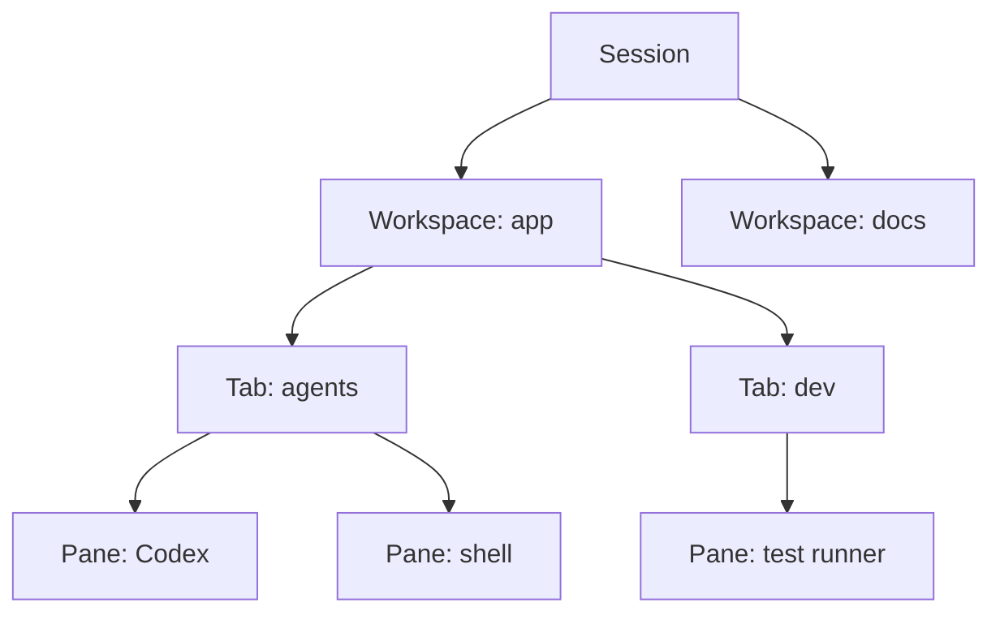

# Herdr: The Agent Multiplexer AI Developers Need

Last verified against the official Herdr documentation and repository: 2026-08-04.

Herdr is a terminal workspace manager for coding agents. It keeps real terminal processes running in a background server, lets clients attach again later, and shows recognized agent state in a sidebar.

The useful idea is simple: give each job a visible place and keep long-running work separate.

## Opening Script

This is a practical guide to Herdr for developers working with coding agents.

Normal terminal windows become hard to manage when several agents, servers, test runners, and logs are active at once. Herdr keeps those processes in persistent workspaces and makes their state visible without hiding the real terminal.

In this lesson, I will show you the basic model, the current installation path, a small workspace layout, agent integrations, and the safe way an agent can control Herdr itself.

The setup helper and ticket workflow are included in this tutorial.

So, let's get into it.

## The Four Pieces

Learn these in order:

| Piece | Meaning |
| --- | --- |
| Session | A persistent background server namespace. Most people need only the default session. |
| Workspace | A project, task, or investigation. It owns tabs and panes. |
| Tab | A layout inside a workspace, such as `agents`, `dev`, or `logs`. |
| Pane | A real terminal process inside a tab. |



Herdr recognizes supported coding agents running in panes. The sidebar can show lifecycle states such as `working`, `blocked`, `done`, `idle`, and `unknown`.

`unknown` does not mean finished. It means Herdr cannot classify the current state confidently.

## Install Herdr

The current installer for Linux and macOS is:

```bash
curl -fsSL https://herdr.dev/install.sh | sh
herdr --version
```

The official repository also lists Homebrew and mise:

```bash
brew install herdr
mise use -g herdr
```

Use the [official install page](https://herdr.dev/docs/install/) for Windows preview, Nix, manual downloads, and current platform notes.

For an installation managed by Herdr's own installer, update with:

```bash
herdr update
```

Update Homebrew, mise, or Nix installations through the package manager that installed Herdr.

## Start From A Project

Run Herdr from the directory where the work lives:

```bash
cd /path/to/project
herdr
```

Herdr launches or attaches to the default session and creates a workspace when needed.

If `HERDR_ENV=1` is already set, you are inside a Herdr pane. Do not start nested Herdr from that pane. Herdr blocks nested launches by design.

```bash
test "${HERDR_ENV:-}" = 1 && echo "already inside Herdr"
```

## Learn The Mouse First

You can click panes and tabs, drag split borders, use right-click menus, and drag-select text. You do not need to learn keybindings before Herdr is useful.

The default prefix is `ctrl+b`. Press the prefix, release it, then press the next key.

| Action | Default binding |
| --- | --- |
| Show active bindings | `ctrl+b`, then `?` |
| New tab | `ctrl+b`, then `c` |
| Split right | `ctrl+b`, then `v` |
| Split down | `ctrl+b`, then `-` |
| Detach | `ctrl+b`, then `q` |

Use the [keyboard guide](https://herdr.dev/docs/keyboard/) before changing bindings. Operating systems and outer terminals can consume some key combinations before Herdr sees them.

## Build A Small Layout

Start with fewer panes than you think you need:

```text
workspace: app
  tab: agents
    pane: one coding agent
    pane: review shell
  tab: dev
    pane: development server
    pane: focused tests
  tab: logs
    pane: application logs
```

Give each pane one job. A random collection of shells is still hard to understand, even when a multiplexer keeps them visible.

Detach with `ctrl+b`, then `q`, or close the terminal window. Reattach later:

```bash
herdr
```

To stop the server and its pane processes, run this only when you intend to stop the whole session:

```bash
herdr server stop
```

## Run A Coding Agent

Start the agent normally inside a pane:

```bash
codex
```

or:

```bash
claude
```

Herdr can detect supported agents. Installing the matching integration improves state detection:

```bash
herdr integration install codex
herdr integration install claude
herdr integration status
```

The included helper checks the installation, installs the integrations you request, and offers the official Herdr skill:

```bash
./code/setup-herdr.sh codex claude
```

Inspect the script before running it. It writes to agent configuration when an integration or global skill is installed.

## Let An Agent Control Herdr

Herdr exposes a CLI and local socket API. Its official skill teaches a coding agent how to inspect and control the current Herdr session.

For agents supported by the open skills CLI, install it globally with:

```bash
npx skills add herdrdev/herdr --skill herdr -g
```

The skill requires `HERDR_ENV=1`. It should refuse to control a focused Herdr session from outside a Herdr-managed pane.

Useful discovery commands are:

```bash
herdr --help
herdr workspace
herdr tab
herdr pane
herdr agent
```

Do not run a mutating nested command without checking its help. Some create commands have valid defaults and will execute immediately.

## A Safe Control Example

From an agent already inside Herdr, inspect the current context:

```bash
printf '%s\n' "$HERDR_WORKSPACE_ID" "$HERDR_TAB_ID" "$HERDR_PANE_ID"
herdr pane current --current
herdr agent list
```

Create a background pane in the current tab while keeping focus where it is:

```bash
herdr pane split --current --direction right --cwd "$PWD" --no-focus
```

Read the returned JSON and use `.result.pane.pane_id` as the target. Do not guess an ID from the sidebar order.

Run an ordinary command in that pane:

```bash
herdr pane run <pane-id> "just test"
herdr pane read <pane-id> --source recent-unwrapped --lines 120
```

Start a supported agent in an available shell pane:

```bash
herdr agent start reviewer --kind codex --pane <pane-id>
herdr agent prompt reviewer \
  "Review the current diff and report only actionable findings." \
  --wait --timeout 120000
```

An available shell pane must be at an interactive prompt. `agent start` does not create or split layout for you.

## Ticket Workflow

The included [`/ticket` command](./resources/commands/ticket.md) shows the larger pattern:

1. Read one GitHub issue.
2. Create a fresh worktree from the default branch.
3. Create a background tab with that worktree as its directory.
4. Read the returned root pane ID.
5. Start a named agent in the pane.
6. Prompt the agent with the full task and checks.
7. Leave the result for human review.

The command is an example, not a reason to delegate every task. Parallel work is useful only when the jobs are independent and the result remains reviewable.

## Configuration

Herdr works without a config file. The default config location is:

```text
~/.config/herdr/config.toml
```

Print the full default configuration:

```bash
herdr --default-config
```

After editing the file, reload a running server:

```bash
herdr server reload-config
```

Use the [configuration reference](https://herdr.dev/docs/configuration/) for current keys. Do not copy guessed tmux settings into Herdr.

## Troubleshooting

### An agent is not detected

```bash
herdr agent list
herdr integration status
```

For one target, inspect why Herdr classified it:

```bash
herdr agent explain <target> --json
```

### A key does nothing

The operating system or outer terminal may own the chord. Check the [keyboard guide](https://herdr.dev/docs/keyboard/).

### You need runtime evidence

```bash
herdr status
herdr status server
herdr status client
```

Herdr logs live under `~/.config/herdr/`, including `herdr.log`, `herdr-client.log`, and `herdr-server.log`.

## References

- [Herdr quick start](https://herdr.dev/docs/quick-start/)
- [Herdr concepts](https://herdr.dev/docs/concepts/)
- [Herdr agent guide](https://herdr.dev/agent-guide.md)
- [Herdr CLI reference](https://herdr.dev/docs/cli-reference/)
- [Herdr source repository](https://github.com/herdrdev/herdr)
- [Official Herdr skill](https://raw.githubusercontent.com/herdrdev/herdr/master/skills/herdr/SKILL.md)

## Summary

- The one thing to remember: one visible job per workspace, tab, or pane keeps agent work understandable.
- The honest limitation: Herdr shows agent state, but `unknown` is not proof that work finished correctly.
- What to try next: run one agent and one test pane, detach, reattach, and review what survived.
