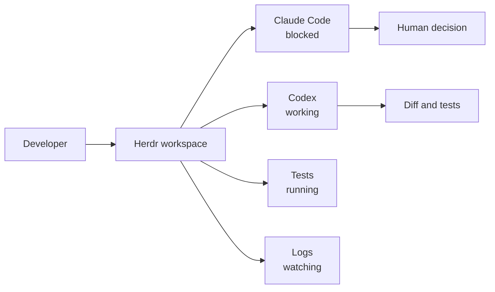
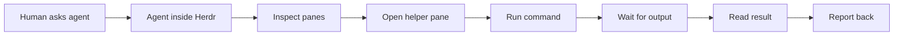

# Herdr for AI Coding Agents

Herdr is a terminal workspace manager built for AI coding agents.

The practical reason to care is simple: once you run more than one coding agent, the hard part is not starting agents. The hard part is knowing which agent is working, which one is blocked, which one is done, and which terminal still has the server, tests, or logs you need.

Herdr gives you tmux-style persistence, mouse-native panes, agent state, integrations, and a CLI/socket API that agents can use from inside the terminal.

My honest opinion is that the Codex UI is still the easiest place for my day-to-day development work when I need to manage multiple projects and agents. It gives me a clean view of the work, and that matters.

But I keep coming back to Herdr because it solves a slightly different problem. I have tried tmux and cmux, and both were interesting, but neither quite felt right for my workflow. Herdr feels different. I enjoy using it, and it helps me stay organised when agent sessions run for hours.

## Title Options

1. Herdr Complete Guide for AI Coding Agents
2. Herdr: The Agent Multiplexer for Claude Code and Codex
3. How to Run Multiple Coding Agents Without Losing Control
4. My Herdr Workflow for Claude Code, Codex, Tests, and Logs
5. Stop Losing Track of Your AI Coding Agents
6. Herdr vs tmux for AI Developers
7. The Terminal Runtime for AI Coding Agents
8. Why Herdr Finally Clicked for My Agent Workflow

## Opening Script

This is a complete guide to Herdr for AI coding agents.

By the end of the video, you'll understand what Herdr is, why it is useful for developers using tools like Claude Code and Codex, and how to set it up as a practical workspace for agents, tests, servers, and logs.

For my normal day-to-day development work, I still love the Codex UI because it makes it easy to manage multiple projects and multiple agents. But one of the hardest parts of building with agents now is staying organised when you have many projects, agents, servers, tests, and long-running sessions open at the same time.

I have tried tmux and cmux, and both are useful, but something did not quite feel right for me. Herdr feels different. I enjoy using it, and the reason is not just tabs and panes. The interesting part is that Herdr understands coding agents as long-running terminal processes. It can show you which agents are working, which ones are blocked, which ones are done, and it gives your agents a CLI they can use to inspect panes, run commands, and coordinate work.

In this video, we'll cover what Herdr is, how to install it, how to set up integrations and the agent skill, how to create a useful agent workspace, how to customize the style and keyboard setup, and where I would be careful before making this part of a serious coding workflow.

All of the config examples, prompts, and setup files are linked for free in the description below.

So, let's get into it.

## What Herdr Is

Herdr is a terminal multiplexer for coding agents.

The closest mental model is tmux:

- A background server owns the terminal processes.
- A client attaches to show the UI.
- You can detach and reattach later.
- Your panes keep running while the client is gone.

Herdr adds the pieces tmux does not know about:

- Workspaces for projects or investigations.
- Tabs for layouts inside a workspace.
- Panes that run real terminal processes.
- Agent state in the sidebar.
- Integrations for agent session restore and state reporting.
- A CLI and socket API that scripts and agents can drive.

The important shift is this:

```text
tmux manages terminals.
Herdr manages terminals plus agent state.
```

That matters because coding agents are not just commands you run once. They are long-running workers that pause for permission, need review, run tools, and often sit beside servers, test runners, logs, and other agents.

## Why AI Developers Should Care

Running one coding agent is easy.

Running several is where the workflow starts to break:

- One agent is waiting for permission.
- One agent is still editing files.
- One agent says it is done, but you have not reviewed it.
- A dev server is running in another pane.
- Tests failed somewhere else.
- You closed the terminal and now you do not know what survived.

This gets worse because agent sessions often last for hours.

You might start one agent on a feature, another on a review, another on docs, and a fourth terminal with the dev server. At the start, it feels productive. An hour later, it is easy to lose track of what needs your attention.

That is the real reason I care about Herdr.

It is not just a prettier terminal multiplexer. It gives you one visible control surface for long-running agent work.



The lesson is not "run as many agents as possible."

The lesson is "give each agent a clear job, keep the work visible, and make review easy."

## Install Herdr

On Linux or macOS, the direct install path is:

```bash
curl -fsSL https://herdr.dev/install.sh | sh
herdr
```

On Windows preview beta:

```powershell
powershell -ExecutionPolicy Bypass -c "irm https://herdr.dev/install.ps1 | iex"
herdr
```

If you already use Homebrew:

```bash
brew install herdr
```

If you already use mise:

```bash
mise use -g herdr
```

If you use Nix, Herdr provides a flake:

```bash
nix run github:ogulcancelik/herdr
```

Check the install:

```bash
herdr --version
herdr
```

If your shell cannot find `herdr`, restart the terminal or check that the install directory is on your `PATH`.

For direct installs, Herdr can update itself:

```bash
herdr update
```

Homebrew, mise, and Nix installs update through those package managers.

## The Basic Model

Teach Herdr in this order:

| Concept | What it means | When to use it |
| --- | --- | --- |
| Session | A persistent background Herdr server namespace. | Use the default session first. Use named sessions for fully separate contexts. |
| Workspace | A project-level container. | One repo, task, or investigation. |
| Tab | A layout inside a workspace. | Separate `agents`, `server`, `logs`, and `review`. |
| Pane | A real terminal process. | Run agents, shells, servers, tests, and logs. |
| Agent | A recognized coding agent process. | Claude Code, Codex, Pi, OpenCode, Cursor Agent, and others. |

Start Herdr from a project:

```bash
cd ~/Code/my-project
herdr
```

Run an agent inside the first pane:

```bash
claude
```

Or:

```bash
codex
```

Herdr detects supported agents and shows their state in the sidebar:

| State | Meaning |
| --- | --- |
| `working` | The agent is actively running. |
| `blocked` | The agent needs input, permission, or a decision. |
| `done` | The agent finished and you have not looked at it yet. |
| `idle` | The agent is ready or has been seen. |
| `unknown` | Herdr cannot classify it confidently. |

## The First Workspace To Build

For the video demo, use one repo and four panes:

```text
workspace: project-name
  tab: agents
    pane 1: claude or codex
    pane 2: second agent or shell
  tab: dev
    pane 1: dev server
    pane 2: test runner
  tab: logs
    pane 1: logs or git diff
```

You can create most of this with the mouse:

- Click panes, tabs, workspaces, and agents.
- Drag split borders.
- Right-click for context menus.
- Drag-select text to copy.

The keyboard basics are:

| Action | Key |
| --- | --- |
| New tab | `ctrl+b`, then `c` |
| Split right | `ctrl+b`, then `v` |
| Split down | `ctrl+b`, then `minus` |
| Workspace picker | `ctrl+b`, then `w` |
| Detach | `ctrl+b`, then `q` |
| Show all bindings | `ctrl+b`, then `?` |

The important demo moment is detach and reattach:

```bash
# inside Herdr
ctrl+b, then q

# back in your shell
herdr
```

The panes are still there because the Herdr server kept them alive.

To stop the session and terminate panes:

```bash
herdr server stop
```

## Install Agent Integrations

Herdr detects supported agents automatically, but integrations make the workflow better.

Install the integrations for the agents you use:

```bash
herdr integration install claude
herdr integration install codex
herdr integration install pi
herdr integration install opencode
herdr integration status
```

For Claude Code and Codex, integrations report native session identity so Herdr can restore agent sessions after a server restart when possible. Their state still comes from Herdr's screen detection.

For agents such as Pi, Kimi, OpenCode, Kilo, and Hermes, integrations can provide stronger lifecycle state.

The honest version is this: Herdr is good at state, but agent state is still a moving target. Agent terminal UIs change. Hooks differ. Detection can be wrong. Use the sidebar as a visibility layer, not as a reason to skip review.

When state looks wrong:

```bash
herdr agent list
herdr agent explain <target> --json
herdr pane read <pane-id> --source recent --lines 50
```

## Add Herdr To Your Agent Instructions

There are two different files to understand.

First, Herdr has an agent skill. This teaches an agent how to control Herdr from inside a Herdr pane.

Install it globally for supported agents:

```bash
npx skills add ogulcancelik/herdr --skill herdr -g
```

The skill tells the agent to check `HERDR_ENV=1` before controlling Herdr. If the agent is not running inside Herdr, it should stop instead of trying to inspect a session it does not own.

Second, Herdr has a human onboarding guide for agents:

```text
https://herdr.dev/agent-guide.md
```

Use that when you want an agent to help you understand, set up, or troubleshoot Herdr. The guide explains the concepts, setup path, configuration, and diagnosis recipes.

Copy this into your repo's agent instructions when Herdr is part of the workflow:

```md
## Herdr

If you are running inside Herdr, `HERDR_ENV=1` will be set.

When `HERDR_ENV=1` is set:

- Use `herdr pane list` to inspect available panes.
- Use `herdr pane read <pane-id> --source recent --lines 80` before assuming what another pane is doing.
- Use `herdr wait output` for servers and tests.
- Use `herdr wait agent-status` for coding agents.
- Use `--no-focus` when creating helper panes so you do not steal the user's active pane.
- Do not close panes, stop servers, or send input to another agent unless the user asked or the task clearly requires it.

When helping a human set up Herdr, read:

https://herdr.dev/agent-guide.md
```

This repo includes a fuller example at `resources/example-AGENTS.md`.

## The Agent-Controlled Workflow

The most interesting Herdr feature is not the UI.

It is that an agent can control the Herdr workspace it is running inside.

That is the demo to lean into.

Inside a Herdr-managed agent, say:

```text
Can you open a Herdr pane for me, run the test suite inside it, wait for the result, and then tell me what happened?

Do not steal focus.
Do not modify files.
Do not close the pane when you are done.
```

If the Herdr skill is installed and `HERDR_ENV=1` is set, the agent can inspect the current panes, create a sibling pane, run the command, wait for output, read the result, and report back.

That changes the feel of the workflow.

You are no longer manually creating every terminal, copying output between panes, and telling the agent what happened. The agent can use the terminal workspace as part of its own working environment.

From inside Herdr, an agent can:

- list panes
- split panes
- start commands
- wait for output
- read output
- wait for another agent
- spawn helper agents

The core loop looks like this:



Underneath, the agent is using commands like these:

```bash
herdr pane list
herdr workspace list
herdr pane read w1:p1 --source recent --lines 80
```

Run a test in a new pane without stealing focus:

```bash
NEW_PANE=$(herdr pane split w1:p1 --direction right --no-focus | python3 -c 'import sys,json; print(json.load(sys.stdin)["result"]["pane"]["pane_id"])')
herdr pane run "$NEW_PANE" "npm test"
herdr wait output "$NEW_PANE" --match "test" --timeout 60000
herdr pane read "$NEW_PANE" --source recent --lines 80
```

Wait for another agent:

```bash
herdr wait agent-status w1:p2 --status done --timeout 120000
herdr pane read w1:p2 --source recent --lines 100
```

The strongest version of this demo is not "look, Herdr has panes."

It is:

```text
I ask one agent to create the environment it needs to verify its own work.
```

Use this carefully. An agent that can control panes is useful, but it should still have boundaries.

Good jobs:

- start a dev server and wait for readiness
- run tests beside the main agent
- read logs after a failure
- check what a helper agent reported
- create a clean workspace for a narrow task

Risky jobs:

- sending instructions to another agent without asking
- closing panes with active work
- making several agents edit the same files
- treating `done` as reviewed

## Customize The Style And Feel

Herdr works without a config file. Add one when you want custom keys, themes, sidebar behavior, notifications, or session behavior.

The config file is:

```text
~/.config/herdr/config.toml
```

Print the default config:

```bash
herdr --default-config
```

Create a starting config:

```bash
mkdir -p ~/.config/herdr
herdr --default-config > ~/.config/herdr/config.toml
```

After edits, reload the running server:

```bash
herdr server reload-config
```

The most useful style settings for recording:

```toml
onboarding = false

[theme]
name = "catppuccin"
auto_switch = true
light_name = "catppuccin-latte"
dark_name = "catppuccin"

[ui]
sidebar_width = 32
sidebar_min_width = 22
sidebar_max_width = 42
pane_borders = true
pane_gaps = true
show_agent_labels_on_pane_borders = true
agent_panel_sort = "priority"
accent = "cyan"

[ui.toast]
delivery = "herdr"
delay_seconds = 1

[ui.toast.herdr]
position = "bottom-right"

[ui.sound]
enabled = false
```

This makes the sidebar more useful on camera, sorts agents by attention priority, shows agent labels on pane borders, and uses in-app notifications without sound.

The giveaway configs are in `resources/configs/`.

## A Practical Demo Flow

Use this flow for the video.

1. Show the problem.

Start two agents in separate panes or tabs. Ask one to inspect the repo and one to make a small README change. Show that the real issue is tracking state.

2. Install and start.

```bash
curl -fsSL https://herdr.dev/install.sh | sh
herdr --version
herdr
```

3. Add integrations.

```bash
herdr integration install claude
herdr integration install codex
herdr integration status
```

4. Install the agent skill.

```bash
npx skills add ogulcancelik/herdr --skill herdr -g
```

5. Create the workspace.

Use the mouse first. Then show `ctrl+b ?` so keyboard users know where to look.

6. Show persistence.

Detach with `ctrl+b q`, reattach with `herdr`, and show that the agents and server are still running.

7. Show the CLI layer.

```bash
herdr pane list
herdr agent list
herdr pane read <pane-id> --source recent --lines 50
```

8. Show agent-assisted control.

Use the prompt from `resources/prompts.md` that asks the agent to open a Herdr pane, run tests inside it, wait for output, read the result, and summarize what happened.

9. Show style config.

Copy one reference config:

```bash
cp resources/configs/agent-dashboard.toml ~/.config/herdr/config.toml
herdr server reload-config
```

10. Close with the limitation.

Herdr makes agent work visible and persistent. It does not replace specs, tests, code review, or human judgment.

## Tradeoffs

Where Herdr is strong:

- running multiple terminal agents
- seeing blocked, working, done, and idle state
- keeping work alive after detach
- remote SSH work
- agent and script coordination through CLI commands
- a lighter alternative to desktop agent managers

Where to be careful:

- too many agents can create review debt
- state detection can lag behind agent UI changes
- server restart is different from detach
- pane screen history can store sensitive output if enabled
- custom plugins run as normal code on your machine
- Windows support is still beta

The best workflow is still boring:

1. Give the agent a small job.
2. Keep the workspace visible.
3. Run tests.
4. Review the diff.
5. Decide what to merge.

## References

- Herdr docs: https://herdr.dev/docs/
- Install docs: https://herdr.dev/docs/install/
- Agent guide for humans using agents: https://herdr.dev/agent-guide.md
- Agent skill docs: https://herdr.dev/docs/agent-skill/
- Configuration docs: https://herdr.dev/docs/configuration/
- CLI reference: https://herdr.dev/docs/cli-reference/
- Socket API: https://herdr.dev/docs/socket-api/
- Herdr GitHub repo: https://github.com/ogulcancelik/herdr
- Prompts: `resources/prompts.md`
- Setup helper: `code/setup-herdr.sh`
- Reference configs: `resources/configs/`

## Summary

- The one thing to remember: Herdr is useful because it treats coding agents as visible, persistent terminal workers.
- The honest limitation: it helps you supervise agent work, but it does not make parallel agent work safe by itself.
- What to try next: install Herdr, add the integrations for your agents, install the agent skill, and run one small project with an agent pane, a test pane, and a log pane.
