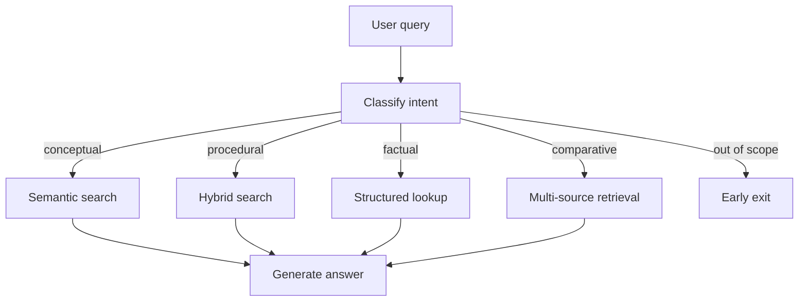

# Intent-Based Query Routing for RAG

A single retrieval pipeline is a useful starting point for RAG. It is a weak
default once the system needs to handle different kinds of questions.

Consider these queries:

| Query | What the user needs | Useful route |
| --- | --- | --- |
| "What is OAuth?" | A broad explanation | Semantic search |
| "How do I reset my API key?" | Exact steps and terms | Hybrid search |
| "What was our Q3 revenue?" | A precise data point | Structured lookup |
| "Postgres or MongoDB?" | Evidence about both options | Multi-source retrieval |
| "What is the weather?" | Nothing from this knowledge base | Early exit |

Intent-based routing adds one decision before retrieval. The system classifies
what the user is trying to do, then chooses a strategy that fits that job.

## The basic architecture



The classifier does not answer the question. It returns a small structured
decision. The router owns the mapping between that decision and application
behaviour.

This separation matters. You can evaluate the classifier, test the routing
policy without a model, and change a retriever without rewriting the prompt.

## Start with routes, not labels

Do not begin by inventing a long taxonomy. List the actions your system can
actually take, then create the smallest set of intents that selects between
those actions.

This sample uses five:

| Intent | Boundary | Route |
| --- | --- | --- |
| `conceptual` | The user wants to understand a concept | Semantic search with broad context |
| `procedural` | The user wants to perform a task | Hybrid semantic and keyword search |
| `factual` | The user wants a specific value | Structured data lookup |
| `comparative` | The user is choosing between options | Retrieve each side separately |
| `out_of_scope` | The system should not answer from its data | Do not retrieve or generate |

These labels are examples, not a universal RAG taxonomy. An order-support
system might route between order status, returns, product information, and
human escalation. If two labels always select the same action, merge them. If
one label selects several unrelated actions, split it.

## Return a typed decision

The classifier returns an `Intent`, a confidence value, and a short reason.

```python
class QueryClassification(BaseModel):
    intent: Intent
    confidence: float = Field(ge=0, le=1)
    reasoning: str
```

The sample uses the OpenAI Responses API with a Pydantic model:

```python
response = client.responses.parse(
    model=os.getenv("OPENAI_MODEL", "gpt-4o-mini"),
    input=CLASSIFICATION_PROMPT.format(query=query),
    text_format=QueryClassification,
)

classification = response.output_parsed
```

[OpenAI Structured Outputs](https://developers.openai.com/api/docs/guides/structured-outputs)
constrains the response to the supplied schema. That solves a format problem.
It does not prove that the chosen intent is correct.

The default model is a configurable sample value, not a cost or performance
recommendation. Set `OPENAI_MODEL` to another model that supports Structured
Outputs if that is a better fit for your application. Model availability,
pricing, and latency change, so measure them in your own environment.

## Keep the prompt boundaries concrete

Each category in `CLASSIFICATION_PROMPT` has:

- a plain definition
- the user outcome it represents
- examples that sit clearly inside the boundary

The difference between conceptual and procedural is easy to blur. "How does
OAuth work?" asks for an explanation. "How do I configure OAuth?" asks for
steps. Examples like these are more useful than adding abstract prompt rules.

Compound queries need an explicit product decision. "What is OAuth and how do
I configure it?" contains two intents. You can choose the dominant action,
split the query, or add a multi-intent result. The sample chooses exactly one
intent to keep the routing policy easy to see.

## Route with normal application code

Once a query has an intent, the routing layer is ordinary Python:

```python
def route_to_retrieval(intent: Intent, query: str) -> RetrievalResult:
    match intent:
        case Intent.CONCEPTUAL:
            return semantic_search(query, top_k=5)
        case Intent.PROCEDURAL:
            return hybrid_search(query, alpha=0.5)
        case Intent.FACTUAL:
            return structured_query(query)
        case Intent.COMPARATIVE:
            return multi_source_retrieval(query)
        case Intent.OUT_OF_SCOPE:
            return early_exit(query)

    raise ValueError(f"Unsupported intent: {intent!r}")
```

The retrievers in this tutorial use in-memory data so you can inspect the
control flow. In a real system, these functions might call a vector index, a
keyword index, a database, or an internal API.

The important boundary is that the model selects from allowed intents. It does
not choose an arbitrary function name, database, or SQL statement.

## Run the sample

You need Python 3.11 or newer, [uv](https://docs.astral.sh/uv/), and an OpenAI
API key for the live demo.

From a fresh checkout, enter the directory that contains `pyproject.toml`:

```bash
git clone https://github.com/owainlewis/youtube-tutorials.git
cd youtube-tutorials/tutorials/intent-based-classification/code
uv sync
```

Set your API key in the current shell. Do not put a real key in the repository.

```bash
export OPENAI_API_KEY="your-api-key"
```

The sample defaults to `gpt-4o-mini`. To use another compatible model:

```bash
export OPENAI_MODEL="your-model-id"
```

Run all five example queries:

```bash
uv run python example.py
```

The output shows an intent, confidence value, and reason for each query. The
exact values come from the model and can vary.

Run one query through classification, routing, retrieval, and answer
generation:

```bash
uv run python example.py "How do I reset my API key?"
```

The result should report `procedural` and `hybrid_search`, followed by an answer
based on the mock procedural documents. If authentication fails, check that
`OPENAI_API_KEY` is set in the same shell.

## Verify routing without credentials

The routing policy and mock retrievers do not need a model. Run their offline
checks from `tutorials/intent-based-classification/code`:

```bash
uv run python -m unittest -v test_offline.py
```

Expected result:

```text
Ran 2 tests

OK
```

These checks prove that every allowed intent selects the expected strategy and
that an out-of-scope query performs no search. They do not measure classifier
accuracy. That requires labelled queries and live model calls.

## Evaluate the classifier before using it

Build a test set from real queries for your domain. Give each query the intent
you expect, run the classifier, and record the result.

```python
TEST_CASES = [
    ("What is OAuth?", Intent.CONCEPTUAL),
    ("How do I reset my API key?", Intent.PROCEDURAL),
    ("What was our Q3 revenue?", Intent.FACTUAL),
    ("Postgres or MongoDB?", Intent.COMPARATIVE),
    ("What is the weather?", Intent.OUT_OF_SCOPE),
]

correct = 0
for query, expected in TEST_CASES:
    actual = classify_query(query, client).intent
    correct += actual == expected

print(f"accuracy={correct / len(TEST_CASES):.1%}")
```

Start with obvious examples, then add the cases your users make difficult:

- vague language
- spelling mistakes and informal phrasing
- categories with similar boundaries
- compound questions
- prompt-injection attempts
- requests that are related to the domain but still outside the product scope

Do not copy an accuracy target from another system. Choose a threshold from the
cost of a wrong route in your application. A documentation search can use a
fallback strategy. A route that exposes private data or triggers an action
needs deterministic authorization outside the classifier.

Treat the model's confidence field as a model-generated value, not a calibrated
probability. Compare confidence with real errors before using it for fallback or
escalation decisions.

Use the optional [evaluation checklist](./resources/evaluation-checklist.md) to
plan a domain-specific test set.

## Production boundaries

Intent routing improves control, but it is not a complete safety layer.

- Authorize access after routing. An intent must never grant data access.
- Validate database and API inputs with deterministic code.
- Log the query, chosen intent, route, and outcome without leaking secrets.
- Define a fallback for model errors, refusals, timeouts, and unknown intents.
- Monitor confusion patterns as user behaviour and content change.
- Keep the early-exit response honest about what the system can answer.

Measure the full pipeline before claiming lower cost or latency. Classification
adds a model call. It only improves those measures when the chosen routes avoid
more work than that call adds.

## Files

| File | Purpose |
| --- | --- |
| `code/intents.py` | Shared intent enum |
| `code/intent_classifier.py` | Prompt, Pydantic result, and OpenAI call |
| `code/routing.py` | Credential-free routing policy |
| `code/retrieval.py` | In-memory retrieval strategy examples |
| `code/router.py` | Live classify, retrieve, and generate pipeline |
| `code/example.py` | Command-line demo |
| `code/test_offline.py` | Offline routing checks |

## Summary

- Define intents from the actions your system can take.
- Use structured output for a typed decision, then route with normal code.
- Test routing without a model and classifier accuracy with labelled queries.
- Keep authorization, validation, and operational fallbacks deterministic.
- Measure model choice, latency, cost, and accuracy in your own environment.

Setup and credential-free verification were last checked on 2026-08-04.
