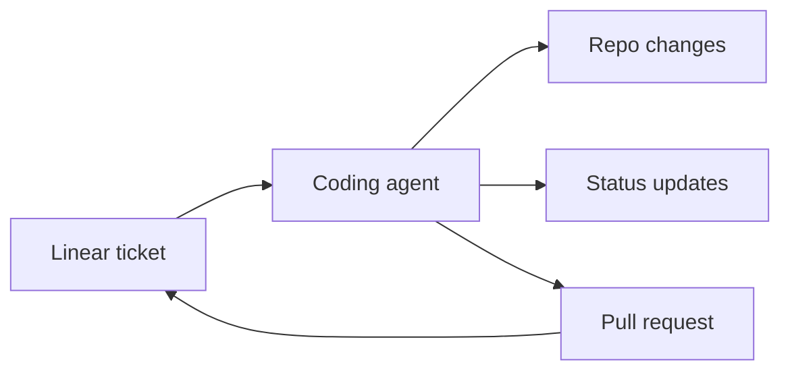
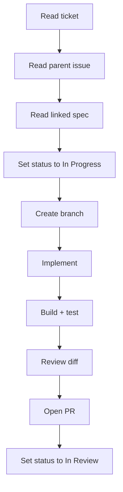
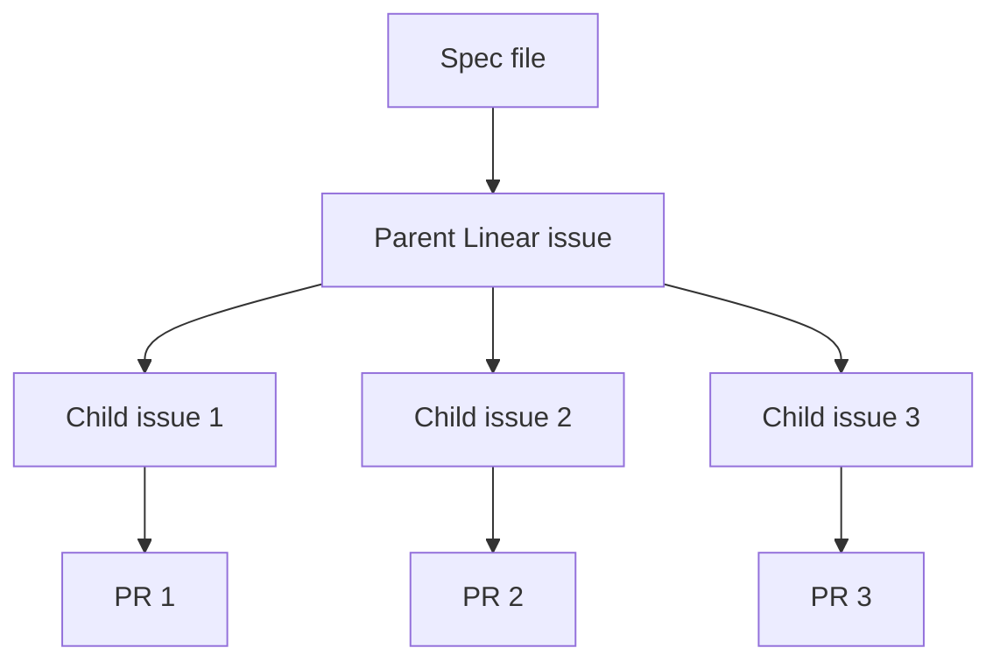

# Linear As Your Agent's Control Plane

Linear MCP lets an AI coding agent work from your project management system instead of from pasted ticket descriptions.

The agent can read issues, inspect parent context, update status, create sub-issues, and leave comments while it works.

That turns Linear from a board you manually maintain into a control plane the agent can participate in.

## The Problem

Copy-paste works for one ticket.

It breaks down when you are trying to run a real development workflow.

Common failure modes:

- ticket context gets lost
- parent issues and specs are ignored
- status updates are forgotten
- PRs do not link back to the issue
- parallel agent work overlaps files
- the board stops reflecting reality

The weak default is treating project management as a separate admin task.

The better workflow is to make project state part of the agent's job.

## What Linear MCP Gives The Agent

MCP stands for Model Context Protocol.

The Linear MCP server gives tools like Claude Code direct access to your Linear workspace.

The agent can:

- read issues, parent issues, projects, and comments
- update issue status, labels, and assignees
- create issues, sub-issues, and comments
- search across the workspace

The important shift is this:



The ticket is no longer just copied into the prompt.

It becomes part of the workflow.

## Setup

First, create a Linear API key.

Go to:

```text
Linear Settings -> API -> Personal API keys
```

Then configure Claude Code.

You can add the MCP server globally:

```text
~/.claude/settings.json
```

Or per project:

```text
.claude/settings.json
```

Example configuration:

```json
{
  "mcpServers": {
    "linear": {
      "type": "npm",
      "package": "@anthropic-ai/linear-mcp-server",
      "env": {
        "LINEAR_API_KEY": "lin_api_xxxxxxxxxxxxx"
      }
    }
  }
}
```

Restart Claude Code and verify the connection:

```text
List my Linear teams.
```

If the agent returns your teams, the connection works.

## The Agent Workflow

Once Linear is connected, the agent can follow the ticket lifecycle.



The useful part is not just reading the ticket.

The useful part is keeping the board accurate as the work moves.

That removes a surprising amount of manual cleanup.

## What Goes In CLAUDE.md

`CLAUDE.md` is loaded into every session.

Keep it lean.

Put rules and conventions there, not long procedures.

Good content for `CLAUDE.md`:

- branch naming
- commit format
- "never force push"
- "never commit code that does not build"
- issue lifecycle
- build and test commands
- requirement to read parent issues

Example:

```markdown
# CLAUDE.md

## Project

- Runtime: Bun
- Build: `bun run build`
- Test: `bun test`

## Linear

- Fetch issues using the Linear MCP tool.
- Always read the parent issue if one exists.
- If the description references a spec file, read it before implementing.
- Issue lifecycle: Backlog -> Todo -> In Progress -> In Review -> Done.
- Done happens after merge.

## Branching

Branch format: `<prefix>/<issue-id-lowercase>-<slug>`

Prefix by label:

- `feature/` for feature work
- `fix/` for bugs
- `cleanup/` for cleanup or tech debt
- `docs/` for documentation

## Commits

- Format: `<summary> (<ISSUE-ID>)`
- Example: `Add auth middleware (PROJ-12)`
- Never amend.
- Never force push.
- Never commit code that does not build.

## Pull Requests

Create PRs with `gh pr create`.

The body must include:

- summary
- verification
- Linear issue link

## Error Handling

If build, push, or PR creation fails, stop and report.

Do not invent silent workarounds.
```

This is enough context for normal sessions.

It does not try to encode the whole implementation workflow.

## What Goes In A Slash Command

A slash command should hold the procedure you run on demand.

For example:

```text
/implement PROJ-42
```

The command can tell the agent to:

1. Read the ticket.
2. Read parent issues and linked specs.
3. Set the ticket to In Progress.
4. Create a branch using the `CLAUDE.md` convention.
5. Implement the change.
6. Build and test.
7. Review the diff in a fresh context.
8. Fix critical issues.
9. Push and open a PR.
10. Set the ticket to In Review.

`CLAUDE.md` owns the rules.

The slash command owns the playbook.

That separation keeps token usage low and behavior predictable.

## Common Commands

Once Linear MCP is configured, you can ask for project state directly.

Reading:

```text
Show me issue PROJ-42.
```

```text
What are my open issues?
```

```text
Show me the parent issue for PROJ-42.
```

Working:

```text
Pick up PROJ-42.

Read the ticket and any referenced spec.
Set it to In Progress.
Create a branch using the repo convention.
Implement the smallest complete change.
Run verification.
Open a PR and link it back to Linear.
```

Updating:

```text
Set PROJ-42 to In Review and add a comment with the PR link.
```

Creating:

```text
Create sub-issues for this parent issue.
Each sub-issue should be independently implementable and include acceptance criteria.
```

Searching:

```text
Find open issues assigned to me that mention authentication.
```

## Spec-Driven Linear Workflow

Linear works best when it carries the result of a spec-driven process.

Use this pattern:

1. Write a spec for the feature.
2. Create a parent Linear issue for the feature.
3. Split the spec into small child issues.
4. Put acceptance criteria directly in each child issue.
5. Link the spec from the parent and child issues.
6. Let the agent pick up one child issue at a time.



The parent issue preserves context.

The child issue keeps the implementation small.

The PR proves the change.

## Where This Breaks

Linear MCP does not remove the need for judgment.

Watch for:

- vague tickets with no acceptance criteria
- parent issues that are never read
- status transitions that do not match your real workflow
- agents creating too many sub-issues
- parallel agents editing the same files
- tickets that point to stale specs

The fix is to keep the workflow boring and explicit.

Small tickets.

Clear statuses.

Linked specs.

Verification before PR.

## Resources

This tutorial includes:

- [CLAUDE.md](./CLAUDE.md)
- [examples/settings.json](./examples/settings.json)

## Summary

The one thing to remember:

Linear can be the control plane for agent work if the agent can read and update it directly.

The honest limitation:

The MCP connection only helps if the tickets are clear and the workflow has rules.

What to try next:

Connect Linear MCP, pick one small ticket, and make the agent update status as part of the implementation.
