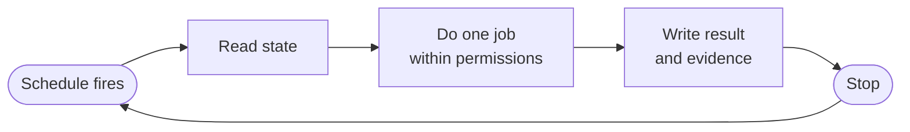
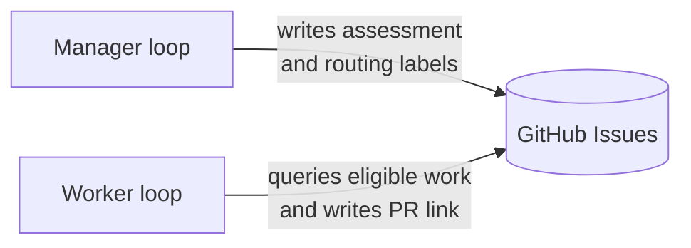

# Loop Engineering: A Practical Example

Loop engineering means designing the system around a recurring agent job.

The hard part is not scheduling an agent. It is deciding what the agent may do, what evidence it must produce, and when a human must step in.

This lesson uses two roles. A manager classifies backlog items. A worker implements an approved item and opens a pull request. Neither role owns the final merge.

By the end, you will have a practical model for building and evaluating one of these systems.

So, let's get into it.

## What a loop actually is

A loop is a job an agent does on repeat. It wakes up on a schedule, reads current state, does one specific job within configured permissions, writes the result back, and stops until the next run.

A person does not need to start each run. They still need logs, alerts, and review points.



Every loop needs five things:

```text
JOB         what it owns
PERMISSIONS what it may change
SCHEDULE    when it runs
STATE       what persists outside the chat
EVALUATION  how the result is checked
```

Most of this system is ordinary software. A scheduler starts work. Labels route tickets. Tool permissions constrain available actions. Tests provide evidence. Pull request review is an approval gate. The model handles the parts that require interpretation, such as classifying a ticket or proposing code.

## Start with the coordination surface

Use one central place to manage work. This example uses GitHub Issues.

Each piece of work is a ticket. Agents and humans update the same item, so classifications, questions, and links to changed code are visible in one place. This is useful coordination data. It is not a complete audit log unless every relevant action is recorded there.

The manager and worker do not need to talk directly:



Keep the routing scheme small:

```text
RISK      risk:low | risk:medium | risk:high
TYPE      bug | feature | docs | test | refactor | chore
ROUTING   agent:ready | needs:human
```

`agent:ready` means that a ticket is eligible for the worker policy. The worker should also require `risk:low` before pickup.

Labels are routing metadata, not a security boundary. Anyone with issue-edit permission may be able to change them. Real enforcement comes from scoped credentials, tool permissions, sandboxing, branch protection, and a human merge gate. The worker must not grant itself broader permissions when it sees a different label.

## Loop 1: the manager

The manager keeps the backlog organised so a person or worker can pick up a clear task.

On each run, it can:

1. Read open issues, project state, and linked pull requests.
2. Propose a risk and work type for each ticket.
3. Mark clear, low-risk work as `agent:ready`.
4. Mark ambiguous or higher-risk work as `needs:human` with a specific question.
5. Report stale or inconsistent board state.
6. Leave an assessment that explains each classification.

An assessment should be short and inspectable:

```text
## Agent Assessment

Risk: low
Type: docs
Agent-ready: yes

Reason: README onboarding text only. Small, isolated,
verified by reading the rendered README.
```

You can disagree with the assessment and change the route. The worker can read the same explanation when it picks up the ticket.

### Choose a trigger

There are two common ways to trigger the manager:

- **A GitHub Action.** A scheduled workflow runs the triage job. It can run while your laptop is closed and can also be triggered manually. Usage, billing, secrets, and runner permissions depend on the repository and account configuration.
- **A local or hosted assistant.** A long-running process starts the same job on a schedule and can notify you when a ticket needs a decision.

Both triggers can target the same output shape: a labelled queue with an assessment attached to each changed ticket.

### Start with a dry run

Before the manager can change anything, inspect its judgement:

```text
Use the backlog-manager skill in DRY-RUN mode.

Repo: owner/repository.

Goal: inspect the backlog. Change NOTHING.

Report:
- missing labels
- open issues missing from the board
- closed work still marked In Progress
- which issues you would mark agent:ready, and why
- which issues need a human, and why

Rules: no edits, no comments, no labels, no code, no PRs.
End with the exact actions you would take in apply mode.
```

Grade the report against known examples. If it marks everything low-risk, or marks vague architecture work `agent:ready`, the policy is too loose.

Apply mode should be a separate configuration with scoped credentials for labels, comments, and board state. Do not give the manager code, pull request, merge, deployment, or issue-closing permissions.

## Loop 2: the worker

The worker pulls one eligible ticket from the queue and turns it into a pull request.

Require both `risk:low` and `agent:ready`. Use one issue, one task, one branch, and one isolated worktree. A typical run is:

```text
read the issue and its assessment
check that the task meets the worker policy
make a short plan
create an isolated worktree from current main
implement the change
run focused tests and repository checks
ask a separate agent to review the diff
fix valid findings and run the checks again
open a pull request
comment on the issue with the PR link and evidence
wait for explicit human approval to merge
```

A separate review pass can check the diff against the ticket. This adds another source of findings, but it does not replace tests or human review. The final approver remains a person.

Agents can also report out-of-scope findings such as broken links, stale commands, skipped tests, or small bugs. They should not fix these during an unrelated task. An evidence-backed ticket keeps the finding reviewable, and the manager can classify it on a later run.

## The guardrails

Broad permissions and vague goals make failures harder to contain. The agent may fill gaps with guesses, spend time on the wrong work, or finish without enough evidence. Design each loop so it can stop and ask for help.

- **Only clear, low-risk work is eligible for the worker.** Everything else waits for a human.
- **The manager has no code tools.** It cannot implement the work it classifies.
- **The worker cannot change routing policy.** It works only on tickets selected by the configured policy.
- **A separate pass reviews every diff.** The review is evidence, not approval by itself.
- **A person approves every merge.** The worker does not merge or deploy changes.

These controls make common mistakes easier to inspect and reverse. A wrong label can be corrected. A bad pull request can be closed before merge. They do not remove the need to protect secrets, isolate execution, monitor usage, and review changes.

The human merge gate limits throughput to the available review capacity. That is a deliberate tradeoff while the system handles production code.

## Putting it together

Strip everything away and the system is a chain of transformations:

```text
backlog             -> manager -> assessed, routed queue
eligible ticket     -> worker  -> tested, reviewed pull request
pull request        -> human   -> merge or requested changes
```

Each arrow is a place to record evidence. Ticket changes can be inspected. Pull requests can be reviewed. CI can verify specific properties. None of these checks is a complete guarantee on its own.

## Design your first loop

Write this card before you build anything:

```text
JOB:        what does this agent own?
INPUTS:     what does it inspect?
ALLOWED:    what may it change?
FORBIDDEN:  what may it not do?
OUTPUT:     what exists after a good run?
EVALUATION: how do I know it did well?
ESCALATION: when and how does it ask for help?
```

If you cannot answer how the job will be evaluated, keep it interactive.

Start with the manager loop alone. Review its dry run on a representative set of clear, ambiguous, low-risk, and high-risk tickets. Enable apply mode only after the classifications match your written policy. Monitor early runs and keep rollback simple.

The practical shape is small: two loops, one coordination surface, scoped tools, recorded evidence, and a human who owns every merge. Implementation can be delegated. Accountability stays with the person operating the system.
