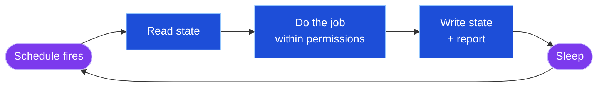
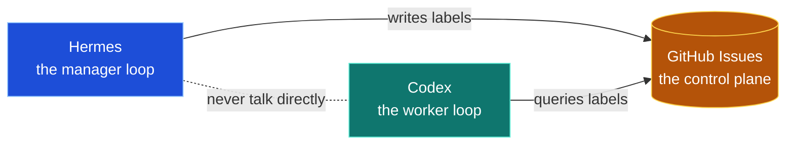
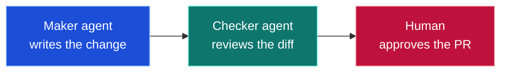
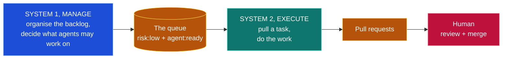
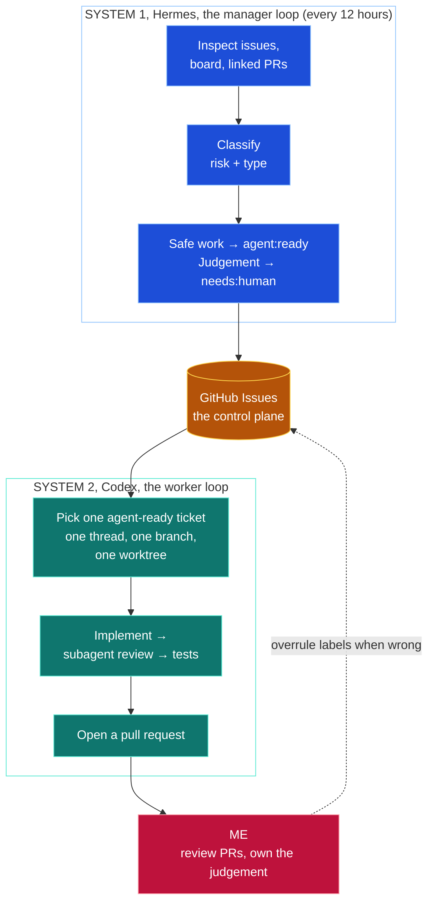
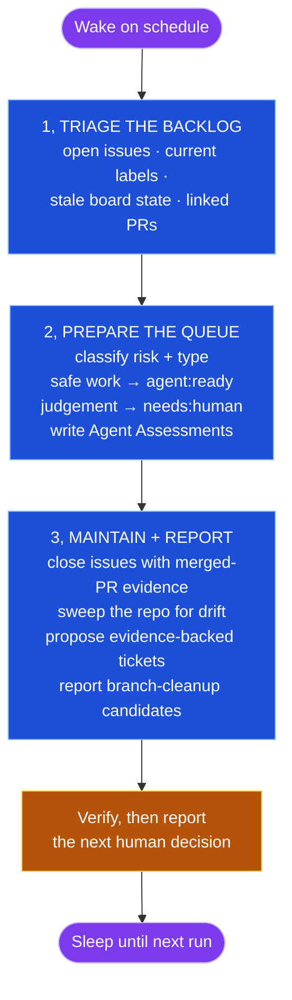
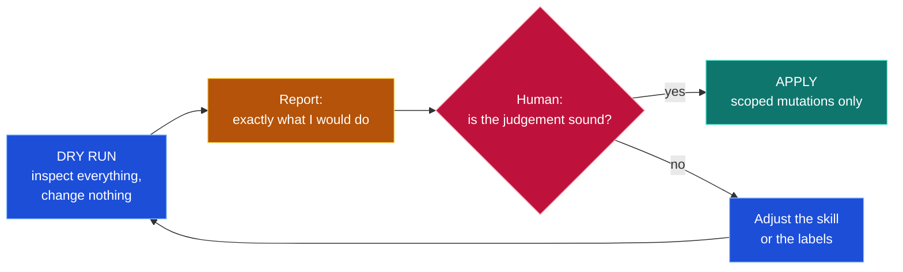
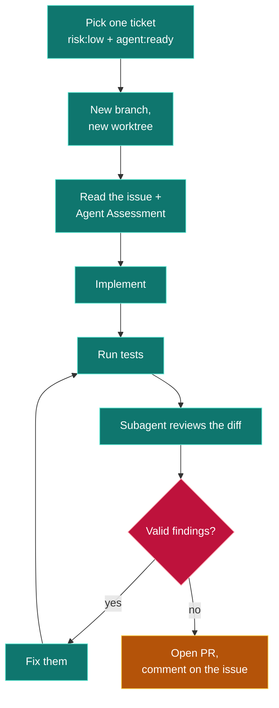

# Loop Engineering: A Practical Example

Right now, while you're reading this, there are AI agents working inside my project. They're reviewing the backlog, writing tickets, and deciding what's safe to work on, and then picking up issues, fixing them, and opening pull requests. 24/7. Unattended. I wake up to work that's already been done.

I know how that sounds. There's a lot of hype around "loop engineering" and autonomous agents right now, and most of it doesn't survive contact with reality. The dream is real, agents running in the background, doing the painful, tedious work, saving us time. But these systems are much more complicated than they sound, and very few people show you how to actually build one. The most common question I hear about tools like Hermes is simply: *what do I actually do with this thing?*

So this is the full, working example: how the system works, why it works, and all of the engineering thinking that goes into it. And here's the spoiler, the secret isn't smarter agents. It's that we're *not* letting agents take over everything. We're giving them very defined roles and letting them act autonomously within boundaries. That, more than anything else, is what makes all of this work.

---

## 1. What is a loop?

A loop is a system that prompts the agent so you don't have to.

The people building these tools have landed in the same place. Boris Cherny, the creator of Claude Code:

> "I don't prompt Claude anymore. I write loops — and the loops do the work. My job is to write loops."

And [Peter Steinberger](https://x.com/steipete/status/2063697162748260627):

> "Here's your monthly reminder that you shouldn't be prompting coding agents anymore. You should be designing loops that prompt your agents."

In practice, a loop has four parts:

```
┌─────────────────────────────────────┐
│              A LOOP                 │
│                                     │
│  JOB         what it owns           │
│  PERMISSIONS what it may change     │
│  SCHEDULE    when it wakes up       │
│  STATE       shared, outside chat   │
└─────────────────────────────────────┘
```

And here's the shape of one cycle, this is what "loop" literally means:



The key piece is **state**. In my system that's GitHub Issues, and calling it "memory" undersells it. It's the **agent control plane**: the shared surface the loops coordinate through. The two loops never talk to each other. One writes labels; the other queries them. Memory is part of what it does, the agent forgets everything between runs, the repo doesn't, but its real job is coordination.



A prompt is something you write once and supervise.
A loop is something you **design** once and **review**.

**Are autonomous agents and loop engineering the same thing?**

No, and the distinction is worth being precise about, because the terms get used interchangeably and they aren't.

An **autonomous agent** is an agent that acts without you in the moment: you give it a goal and it decides how to get there. That's a property of a single run. "Keep going until the tests pass" is an autonomous run, but it isn't a loop, because nothing wakes it up tomorrow and it remembers nothing between runs.

A **loop** is the *recurring* kind of autonomous system: an agent plus a job, permissions, a schedule, and shared state. An autonomous system with a heartbeat and memory.

**Loop engineering** is the design work around the agents, not the agents themselves: the job, the boundaries, the schedule, the control plane, the review gates. Autonomous agents are what run inside the loop. Loop engineering is why the loop doesn't make a mess.

In my system: Hermes and Codex doing unattended runs are the autonomous agents. The scheduled backlog manager and the scheduled worker are the loops. The labels, the `agent:ready` contract, the dry-run gate, and the PR review boundary are the loop engineering.

The way I think about these systems is as **advanced automations**. The agents inside them are genuinely intelligent, and they can do an enormous amount of work very quickly, but they aren't people. They don't have creative taste. The mistake is forgetting that, and treating them like team members instead of what they are: intelligent automations that should work within bounded contexts, with fixed guardrails, and a clear way to evaluate the quality of their work.

And here's the part the hype skips: **most of a good loop isn't AI.** Mine is mostly ordinary software, a schedule, labels, branches, tests, review gates. The LLM makes exactly two kinds of judgement in the whole system: classifying tickets and writing code. Everything else is deterministic. That's where the reliability comes from.

---

## 2. Why care?

I used to do this job as a human. Part of being an engineering manager or tech lead is keeping the backlog organised so your team can pick up work, labelling tickets, setting priorities, deciding what's ready and who it's for. The work genuinely matters. It's also mechanical, laborious, and time-consuming, which is exactly the profile of work agents are good at.

So the first thing I built wasn't a coding agent. It was an agent that does the **management** job. And after installing it, my backlog was tidier than it had ever been, and for the first time it was obvious which work I could safely hand off.

That's the hard problem in autonomous coding, by the way. It isn't getting agents to write code, they can already do that. It's: **which work is safe to hand over?** Most people answer that manually, ticket by ticket, forever. I built a loop that answers it for me.

The second loop solves the other problem every engineer recognises: there's always work you want done but are too busy to do. Doc fixes, small bugs, pipeline drift. Those tickets now turn into pull requests, *pull requests, not merges*. I'm still in the loop. I still review everything that ships.

The honest pitch:

- This won't build your app.
- It won't replace your judgement.
- It **will** turn the boring 20% of your backlog, doc fixes, small bugs, test gaps, into pull requests while you sleep.

That 20% is pure recovered time.

---

## 3. The problems with autonomy

Let's be honest about why "just let the agent run" doesn't work.

The clearest example is letting an agent build an entire application from scratch. It will absolutely build you *something*. But unless you're making throwaway prototypes, the quality will usually disappoint, because building good software involves hundreds of product, UX, architecture, and security decisions, and that's just not how high-quality product development works. You need human judgement and instinct for those things.

Hand full control to an agent and the failures are predictable:

| Failure | Why it happens |
|---|---|
| Wrong assumptions | Vague goals get filled with confident guesses |
| Stuck / spinning | No stopping condition, no way to ask for help |
| Burned tokens | Expensive model doing cheap triage work |
| Mess, not help | Open-ended loops mutate things you can't easily undo |
| Self-graded homework | The model that wrote the code is too kind to it |

And there's a quieter problem: project boards **lie**. Mine did. Closed issues marked "In Progress". Open issues missing from the board entirely. Default labels that say nothing.

A stale board can't be a control surface for agents. Fixing that is a job in itself.

---

## 4. Principles

Anyone can type a goal command and walk away. That part takes ten seconds. Making the system *reliable* is everything you build around the LLM call, and almost all of it is ordinary software engineering.

### 4.1 Jobs to be done: start with the job, not the tool

When people pick up a tool like Hermes, the first question is usually "what can this thing do?", and the answer tends to be trivial demos. AI news summaries. Daily digests. They look great in a video and provide almost no practical value.

The better question is: **what job should this agent own?** That's the jobs-to-be-done framing, and it forces clarity on the three things that actually matter: what the job is, where the boundaries are, and how you'll know whether it's being done well.

Write a job card:

```
JOB:        what does this agent own?
INPUTS:     what does it inspect?
ALLOWED:    what may it change?
FORBIDDEN:  what must it never do?
OUTPUT:     what exists after a good run?
EVALUATION: how do I know it did well?
```

The forbidden list is the most important part. And the evaluation line is the one people skip, if you can't answer "how would I know the agent did this job well?", you're not ready to run it autonomously.

There's an even simpler way to put all of this: **a good automation has a clear input and a clear output.** If you can write the function signature, *this goes in, that comes out*, you can evaluate it, because the output is the thing you grade. If you can't write the signature, the job isn't defined yet. This is just systems thinking, and it's why "act as my assistant" fails as a job: there's no input, no output, no boundary, nothing to check.

To make that concrete, here are some autonomous systems that pass the bar, each one is a clean signature:

```
backlog        →  manager loop  →  labelled, routed queue
CI logs        →  triage loop   →  failure summary + tickets
dependencies   →  upgrade loop  →  patch-bump PRs with passing tests
docs + code    →  drift loop    →  evidence-backed doc-fix tickets
support inbox  →  triage loop   →  tagged, prioritised tickets
```

Every one of these is mechanical, bounded, and gradeable by its output. "Be my AI assistant" doesn't appear on this list, and never will.

### 4.2 The loop-safety test

Work belongs in a loop when it passes four checks:

```
BOUNDED        clear start and finish
VERIFIABLE     a test or a glance can confirm it
REVERSIBLE     cheap to undo
LOW-JUDGEMENT  no product / architecture decisions
```

- README fix → passes all four → loop it.
- Auth change → fails two → human keeps it.

A quick mental shortcut: **mechanical vs taste.** Documentation updates, bug fixes, release fixes, infrastructure and pipeline drift, mechanical work, perfect loop targets. UI design, product decisions, anything that needs iteration and aesthetic judgement, taste work, poor targets. The question isn't "can the agent do it?" It's "does it need a human's taste?"

It's never "loops or no loops". It's: which of your work passes the test? Most won't. That's fine.

### 4.3 Design for reversibility, not trust

Don't try to trust the agent. Design the system so trust isn't required:

- Wrong label? → change the label. Seconds.
- Bad PR? → close it. Nothing merged.
- **Nothing irreversible happens without a human.**

Failures become cheap and visible instead of rare and catastrophic.

### 4.4 Separate the maker from the checker

The agent that wrote the code must not be the only one judging it. A separate review agent is the only reason unattended operation is rational at all.



### 4.5 Delegate implementation, never accountability

This is management, just with agents. You delegate the implementation. You let an agent coordinate the work. But you stay accountable for the quality of everything that ships, the system opens pull requests, it never merges them.

Building autonomous systems doesn't mean stepping out of the loop. It means choosing your level of risk and staying in the loop where quality matters.

That's also why the system can't go faster than I can review pull requests. It's not a limitation, it's the governor that keeps quality from collapsing.

---

## 5. My design: two layers

At the highest level, this is a two-stage system. System 1 manages the work and decides what agents are allowed to touch. System 2 pulls tasks off that queue and does them.



And here's the full picture with the actual tools in place:



The separation is the design:

- **Hermes never writes code.** It only touches metadata, labels, comments, board state. Everything it does is reversible.
- **Codex never chooses its own work.** It only picks up tickets that are `risk:low` + `agent:ready`. One issue, one thread, one branch, one worktree, failure stays disposable.
- **The loops never talk to each other.** They coordinate entirely through GitHub Issues. Labels are the protocol; the issue tracker is the control plane. That's why either loop can be swapped out without touching the other.
- **Layer 1 is valuable on its own.** Even if no agent ever writes code, a self-maintaining, risk-classified backlog is worth running.
- **Cheap loop qualifies work for the expensive loop.** Triage is cheap tokens. Coding is expensive tokens. Only pre-screened work gets the expensive ones.

### The system as a pipeline

Here's the input/output view, and I find it clarifying. Strip everything away and the whole system is a chain of transformations:

```
tickets             →  Hermes  →  clearly labelled tickets
codebase            →  Hermes  →  evidence-backed new tickets
agent-ready ticket  →  Codex   →  pull request
pull request        →  me      →  merged code
```

Two things jump out when you write it like this.

First, Hermes is actually **two functions** sharing one skill: a classifier (tickets in, labelled tickets out) and a discoverer (codebase in, tickets out, the drift sweep that finds broken links, stale commands, skipped tests). The second one is the loop feeding itself: it turns code problems into tickets that humans or agents can then pick up.

Second, every arrow is a **boundary where evaluation happens**. Labelled tickets can be audited. Pull requests can be reviewed. Each stage produces something inspectable before the next stage consumes it, nothing flows through the system unobserved. That's what makes the pipeline safe, and it's why the last function is me.

### What Hermes actually does: jobs to be done

The skill defines one job, *engineering backlog manager*, broken into three phases per run:



That drift sweep in phase 3 is worth pausing on, it looks for concrete, evidence-backed problems: broken doc links, README commands that don't exist anymore, accidentally skipped tests, TODO comments describing clear bounded work. This is the loop feeding itself: code problems become tickets that humans or agents can then pick up.

Concrete examples of work it marks `agent:ready`: broken doc links, stale README commands, lint fixes, simple test additions, patch dependency upgrades with passing tests.

And `agent:ready` has a strict checklist, *all* must be true: risk is low, scope is clear, it fits in one pull request, the expected output is known, verification is known, no product / UX / security / data / auth / deployment judgement is needed, and nobody is already working on it.

### The label system

```
RISK      risk:low | risk:medium | risk:high
TYPE      bug | feature | docs | test | refactor | chore
ROUTING   agent:ready    ← permission to pick up
          needs:human    ← "this needs Owain"
```

Deliberately small. There's no `agent:complete` or `agent:blocked`, completion and review state already live in GitHub's issue and PR state, so labels don't duplicate them. If an issue can't be safely progressed, the loop removes `agent:ready` and adds `needs:human` with a specific question.

The risk labels are a **dial, not a verdict**. By default only `risk:low` work routes to agents. If I want medium-risk work in the queue, that's a policy I change explicitly, the system never widens its own permissions.

`agent:ready` is not a tag. It's a **permission grant**. The whole system is an access-control layer expressed as labels.

### The Agent Assessment

Every classified issue gets a comment explaining the decision:

```
## Agent Assessment

Risk: low
Type: docs
Agent-ready: yes

Reason: README onboarding text only. Small, isolated,
verified by reading the rendered README.

Suggested plan:
1. Rewrite the onboarding section
2. Verify all commands exist in the justfile
3. Check rendered README links
```

This makes the decision **inspectable**, and the plan gives the inner loop a head start. I can read it, disagree, flip the label. The next loop inherits the context.

### Where the AI actually is

Strip away the hype and most of this system is software you already know:

| Component | What it really is |
|---|---|
| Hermes schedule | a cron job |
| Labels | access control |
| Worktrees | process isolation |
| Dry run | a staging environment |
| GitHub Issues | the control plane, a shared database both loops read and write |
| Agent Assessment | an audit log |
| PR review | the approval gate |

The AI sits in exactly two places: Hermes's classification judgement and Codex's code. Everything else is deterministic. **That ratio, mostly software, a little judgement, is the design.**

---

## 6. The prompts

The operating pattern is simple: inspect first, mutate second, with a human gate in between.



### Dry run first, always

I always check the loop's judgement before letting it change anything. With the skill installed, the invocation is one line:

```
$backlog-manager dry-run backlog for GitHub repo owainlewis/neo
```

The skill carries the job, the rules, and the quality bar, the prompt just points it at a repo and sets the mode. Expanded, what it's being asked is:

```
Use the backlog-manager skill in DRY-RUN mode.

Repo: owainlewis/neo, project board #8.

Goal: inspect the backlog. Change NOTHING.

Report:
- missing labels
- open issues missing from the board
- closed work still marked In Progress
- which issues you'd mark agent:ready, and why
- which issues need a human, and why

Rules: no edits, no comments, no labels, no code, no PRs.
End with the exact actions you would take in apply mode.
```

What I'm grading:

- Everything marked low-risk? → bad, judgement is broken.
- Vague architecture work marked agent:ready? → bad.
- High-risk work kept human-led? → good.

### Apply mode

Same prompt, with scoped permission:

```
Use the backlog-manager skill in APPLY mode.
Apply the cleanup from the dry run.

Allowed: create labels, fix board state, apply
risk/type/agent labels, add Agent Assessments,
create issues only with concrete evidence.

Forbidden: no code, no PRs, no merges, no closing
issues without linked merged-PR evidence.

End with a report of everything changed.
```

### The inner loop (per ticket)



As a prompt, that's:

```
Pick up issue #110 (risk:low, agent:ready).

1. Read the issue and its Agent Assessment
2. New branch, new worktree
3. Implement the change
4. Run the tests
5. Subagent: review the diff against the issue
6. Fix valid findings, run tests again
7. Open a PR, comment back on the issue
```

### The Codex automation prompt

For the full worker loop, I want Codex to fetch the ready tickets itself and coordinate the work one ticket at a time.

This is the prompt:

```
Use GitHub to fetch open issues for this repository.

You are coordinating the work of multiple worker threads inside Codex.

Run this coordinator from the primary repository checkout, not from a long-lived feature worktree.

Before creating worker threads:

1. Switch to the main branch.
2. Fetch origin.
3. Pull the latest origin/main.
4. Confirm the coordinator working tree is clean.
5. If the coordinator working tree is dirty, pause and report the dirty files. Do not stash, overwrite, or discard coordinator changes.

Find all open issues with both labels:
- agent:ready
- risk:low

Ignore issues that are closed, already linked to an open pull request, already assigned to an active worker thread, or marked needs:human.

Select at most three eligible issues for this run.

Work sequentially.

Do not run multiple worker threads in parallel.

Finish or pause the current issue before starting the next issue.

For each selected issue, run this workflow in linear order:

1. Create a new Codex thread for the issue.
2. In that worker thread, start from the latest origin/main.
3. Create a fresh branch and worktree for the issue.
4. Read the ticket, its comments, and any Agent Assessment. Make a short implementation plan.
5. Write the code.
6. Ensure there is good test coverage for the change.
7. Run the relevant tests and any existing lint or type checks.
8. Use a subagent to review the diff against the issue and the plan.
9. Fix valid review findings, then rerun the relevant tests.
10. Open a pull request.
11. Move the pull request to Ready For Review.
12. Comment on the original issue with the PR link and a short summary of what changed.
13. Only after the pull request is open, or the worker is paused because human input is needed, continue to the next selected issue.

Rules:
- Process a maximum of three issues per automation run.
- Work on one issue at a time.
- One issue per Codex thread.
- One fresh branch and worktree per issue.
- Do not combine unrelated tickets.
- Do not start the next issue until the current issue has an open pull request or is explicitly paused.
- Do not merge pull requests.
- Do not widen scope beyond the issue.
- Do not implement changes in the coordinator checkout.
- Do not work on issues that are missing either agent:ready or risk:low.
- Do not work on issues marked needs:human.
- If the issue requires product judgement, architecture judgement, security judgement, credentials, secrets, paid services, or any decision that is not already answered in the ticket, pause that worker thread and report the question. Do not continue.
- If tests fail for reasons unrelated to the change, pause and report the failure instead of hiding it.
- If a worker branch or worktree cannot be created cleanly from latest origin/main, pause that worker and report why.

End with a coordinator report:
- issues considered
- issues selected for this run
- issues skipped, with reasons
- worker threads created
- branches and worktrees created
- PRs opened
- tests run
- human decisions needed
```

---

## 7. Where it breaks (and why that's okay)

- Hermes will sometimes mislabel. → Assessments are comments; I read and overrule them.
- Codex will sometimes ship a mediocre PR. → Nothing merges itself; I close it.
- The system doesn't eliminate mistakes. It makes them **cheap and visible**.

---

## Closing thoughts

So that's the system. Two loops, one control plane, and a human who still reviews everything that ships.

I want to end on a pragmatic but genuinely optimistic note. There's a lot of hype around autonomous agents, and the practical realities are more complicated than the demos suggest. You have to think clearly. You have to apply real engineering judgement. But when you do, when you give agents defined jobs, clear boundaries, and a way to check their work, these systems are incredibly powerful.

I think we're still figuring out the best use cases for autonomous agents, and over the next few years more and more teams will quietly adopt systems like this for the mechanical work inside their businesses. What I don't think they'll ever do is replace human judgement. What they let us do is better: higher-quality work, faster than ever before.

**The engineering isn't in the agents. It's in the boundaries.**

Hermes can't write code. Codex can't choose its work. Nothing merges without me.

I've delegated the implementation. I haven't delegated the accountability.

That's what makes it boring enough to run while I sleep, and boring is the goal.
