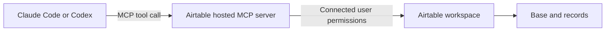

# Give Your AI Agents a Database (Airtable MCP)

Last verified against the official Airtable and Claude Code documentation: 2026-08-04.

Airtable's hosted MCP server lets supported AI tools work with Airtable data through the permissions of the connected user. The safest current setup for Claude Code is the official Airtable plugin and OAuth. You do not need to paste a bearer token into a shell command.

## Opening Script

This is a practical guide to connecting an AI coding agent to Airtable with MCP.

The useful result is not magical agent memory. It is a shared, structured data source that survives one chat and can be inspected by people as well as agents.

In this lesson, I will show you the current OAuth setup, how permissions work, a safe read-before-write workflow, and how to turn the connection into one focused skill.

So, let's get into it.

## What You Are Building



MCP provides the connection and tools. Airtable remains the source of truth for the data and permissions. A skill can provide the repeatable workflow that uses those tools.

This is persistent shared data, but it is not the same as automatic model memory. The agent sees only what the host, connection, and current permissions make available.

## Prerequisites

- An Airtable account with access to the data you need.
- Claude Code or Codex with plugin support.
- Permission to use third-party integrations in your Airtable organization.

If your organization restricts integrations, an Airtable administrator may need to allow the connection.

## Recommended Claude Code Setup

Airtable's current documentation recommends its official Claude Code plugin. It bundles the hosted MCP server and skills for Airtable's data model.

Install it:

```bash
claude plugin install airtable@claude-plugins-official
```

Restart Claude Code, then open:

```text
/plugin
```

Open the **Installed** tab, choose the Airtable plugin, open its MCP server details, and select **Authenticate**. Complete the OAuth flow in the browser.

OAuth keeps the credential out of your shell history and lets Airtable show the permissions you are granting.

## Manual Claude Code Setup

Use the manual path when the official plugin is not suitable:

```bash
claude mcp add --transport http airtable https://mcp.airtable.com/mcp
```

Restart Claude Code and open:

```text
/mcp
```

Choose Airtable, select **Authenticate**, and complete OAuth in the browser.

Do not add a copied token to the command line. If a development case genuinely requires a personal access token, store it in an environment variable or secret manager and follow Airtable's current PAT instructions. Do not commit it to `.mcp.json`, a skill, or this repository.

## Recommended Codex Setup

Airtable also documents an official Codex plugin:

```bash
codex plugin add airtable@openai-curated
```

In the desktop app, you can open **Plugins**, search for Airtable, and add it there. Follow the OAuth connection flow presented by the plugin.

For a manual Codex MCP connection:

```bash
codex mcp add airtable --url https://mcp.airtable.com/mcp
codex mcp login airtable
```

Use the official plugin when you want Airtable-specific skills as well as the connection.

## Verify With A Read

Start with a non-destructive request:

```text
List the Airtable bases I can access. Do not make changes.
```

Then inspect one base:

```text
Show the tables and fields in the Content Pipeline base. Do not create or update anything.
```

If a base is missing, check the Airtable account used during OAuth and that user's permissions. MCP mirrors the connected user's Airtable access.

## Permissions And Capability

Airtable permissions decide what the connection can do.

| Airtable access | Typical MCP capability |
| --- | --- |
| Read-only or commenter | Read data the user can access. |
| Editor, creator, or owner | Read and update records within the user's access. |
| Workspace owner or creator | May create bases when the workspace permissions allow it. |

The hosted server can do more than the old record-only examples. Airtable's current documentation includes searching and analyzing data, creating and updating records, working with bases and interfaces where permissions allow, and managing automation drafts.

Capabilities can change. Ask for the smallest action needed and verify important writes in Airtable.

## A Safe Read-Before-Write Workflow

### 1. Name the exact target

```text
Use the Content Pipeline base and Ideas table.
```

### 2. Read the schema

```text
Show the field names and types. Do not make changes.
```

### 3. Preview the intended write

```text
Prepare one record for the title "Agent Memory Explained" with status "Idea".
Show the exact field values before creating it.
```

### 4. Approve one bounded change

```text
Create only that record, then return its Airtable record ID and final values.
```

### 5. Verify the result

Open Airtable or read the record back through MCP. Do not treat a natural-language success message as the only proof.

## Use A Skill For One Repeatable Job

MCP gives the agent tools. A skill defines how to use them for a particular outcome.

An example skill lives at [`resources/claude/skills/research/SKILL.md`](./resources/claude/skills/research/SKILL.md).

The important boundaries are:

- exact base and table
- required fields
- allowed write action
- duplicate handling
- preview or approval rule
- final evidence

A focused version might say:

```md
---
name: capture-content-idea
description: Add one reviewed content idea to the configured Airtable table.
---

1. Read the target table schema.
2. Draft one record using only existing fields.
3. Search for an existing record with the same title.
4. Show the proposed values and ask before writing.
5. Create one record after approval.
6. Return the record ID and values read back from Airtable.
```

The skill should not contain credentials. Authentication belongs to the MCP connection.

## Common Failure Modes

### The server appears but is not authenticated

Open `/mcp` in Claude Code or run the relevant Codex login flow. Complete OAuth with the intended Airtable account.

### A base or field is missing

Check Airtable permissions and confirm the exact base. Do not ask the agent to invent a field name.

### A write targets the wrong table

Name the base and table, read the schema, and preview the payload before writing.

### The organization blocks the connection

Ask the Airtable administrator whether third-party integrations are allowed and whether this integration must be allow-listed.

### A token was pasted into a command

Revoke it in Airtable and replace the setup with OAuth. Shell history, terminal logs, and configuration files are poor places for long-lived secrets.

## References

- [Official Airtable MCP guide](https://support.airtable.com/docs/using-the-airtable-mcp-server)
- [Official Claude Code MCP guide](https://docs.anthropic.com/en/docs/claude-code/mcp)
- [Airtable permission overview](https://support.airtable.com/docs/airtable-permissions-overview)
- [Airtable plugin skills](https://github.com/Airtable/skills/tree/main/plugins/airtable/skills)

## Summary

- The one thing to remember: use OAuth and let Airtable permissions define the boundary.
- The honest limitation: an MCP connection does not make every action safe or give an agent automatic memory.
- What to try next: connect with OAuth, run one read-only schema query, then make one previewed write.
