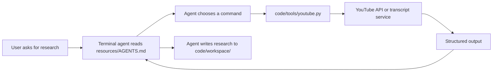

# Build a Micro Agent with Files and Command-Line Tools

## Title Options

### Recommended

Build a Micro Agent with Files and Command-Line Tools

Why: it names the pattern and the two concrete parts we will inspect.

### Options

1. Micro Agents, Explained with a Working Python Demo
2. How to Build a File-Based AI Agent
3. My Simple Pattern for Agent Instructions and Tools
4. Build a YouTube Research Agent with Plain Files
5. Stop Starting Every Agent with a Framework
6. A Small Agent Structure You Can Inspect and Test
7. The Agent Is Small. The Tooling Still Needs Engineering
8. Two Files for the Agent, Real Tests for the Tools

## Opening Script

This is a practical guide to building a micro agent with plain files and command-line tools. A lot of agent examples start with a framework, but a terminal agent can already read instructions and run commands. The useful part of this pattern is the small interface. The honest limitation is that the tools behind that interface can still be substantial software. In this lesson, we will inspect a YouTube research agent, run its Python tool, test the important behavior without credentials, and look at where this pattern helps and where it stops helping. All of the code and resources are included in this tutorial. So, let's get into it.

## Before We Build

A micro agent in this tutorial has two required parts:

```text
AGENTS.md    instructions, boundaries, and workflows
tools/       command-line programs the agent may run
```

That is the agent interface. It does not mean the implementation has no dependencies or complexity.

This demo uses a Python command-line tool of about 1,000 lines. It talks to the YouTube Data API, fetches transcripts, and supports OAuth uploads. Those features need third-party Python packages and credentials. The pattern is small. The example tool is real application code that still needs dependency management, error handling, and tests.

## The Simple Model

The terminal agent supplies the model loop and shell access. The files in this tutorial supply local instructions and capabilities.



The boundary is a normal command:

```bash
.venv/bin/python tools/youtube.py search_videos "AI agents" --max 10 --json
```

The agent does not need a Python function schema for this tutorial. It needs to know the command, its arguments, its output, and what to do when it fails.

## What Is in the Demo

```text
micro-agents-demo/
├── LESSON.md
├── code/
│   ├── .env.example
│   ├── pyproject.toml
│   ├── tests/
│   │   └── test_youtube.py
│   ├── tools/
│   │   └── youtube.py
│   └── workspace/
└── resources/
    ├── AGENTS.md
    ├── context/
    └── docs/
```

`resources/AGENTS.md` is the example agent instruction file. It describes the available commands and the workflow for research, scripts, titles, and uploads.

`code/tools/youtube.py` is the executable. It contains argument parsing, command dispatch, YouTube API access, transcript fetching, output formatting, OAuth, and upload handling.

`code/pyproject.toml` is the only dependency declaration. There is no lockfile in this teaching repo. uv installs directly from that file, so the setup does not create a lockfile.

## Install the Tool

The commands below start at the repository root.

You need:

- Python 3.11 or newer
- [uv](https://docs.astral.sh/uv/)
- A YouTube Data API key for research commands
- OAuth client secrets only if you want to test uploads

Install the declared dependencies:

```bash
cd tutorials/micro-agents-demo/code
uv venv --allow-existing
uv pip install --python .venv/bin/python -r pyproject.toml
```

Check the CLI without credentials:

```bash
.venv/bin/python tools/youtube.py --help
```

You should see the four commands: `get_channel_videos`, `search_videos`, `get_transcript`, and `upload`.

## Configure Credentials

Create a local environment file:

```bash
cp .env.example .env
```

Add your API key to `.env`:

```dotenv
YOUTUBE_API_KEY=replace-with-your-key
YOUTUBE_CLIENT_SECRETS=
```

The script reads shell environment variables. Load the file into your current shell before running a network command:

```bash
set -a
source .env
set +a
```

The `.env` file is ignored by Git. Do not commit API keys, OAuth secrets, or generated OAuth tokens.

## Run the Research Commands

Search for videos:

```bash
.venv/bin/python tools/youtube.py search_videos "AI agents" --max 10 --json
```

Inspect recent videos from a channel:

```bash
.venv/bin/python tools/youtube.py get_channel_videos @daveebbelaar --days 90 --json
```

Fetch a transcript:

```bash
.venv/bin/python tools/youtube.py get_transcript VIDEO_ID --max-chars 5000 --json
```

These commands call external services. Their output depends on the credentials, video, channel, API quota, and transcript availability.

## Understand the Dispatch Path

The parser turns command-line text into an `argparse.Namespace`. Research commands then go through one dispatch table:

```python
handlers = {
    "get_channel_videos": cmd_get_channel_videos,
    "search_videos": cmd_search_videos,
    "get_transcript": cmd_get_transcript,
}
```

Each handler receives parsed arguments and a `YouTubeService`. Upload is separate because it uses OAuth rather than an API key.

That separation gives us useful test boundaries:

| Boundary | What the test proves | External call |
| --- | --- | --- |
| Metadata parser | Frontmatter and description are parsed | None |
| Argument parser | Commands and options produce the expected values | None |
| Dispatch table | The selected handler is called | None |
| Error handler | Service errors print clearly and exit non-zero | Replaced with a fake service |
| Upload loop | Chunk polling stops when a response arrives | Replaced with a finite fake request |

The tests do not call YouTube, open an OAuth browser, upload a file, or invoke a model.

## Run the Offline Tests

From `tutorials/micro-agents-demo/code`:

```bash
bash tests/run.sh
```

The runner resolves the declared packages into a temporary isolated
environment. It does not create `.venv` or a lockfile in the tutorial folder.

The suite covers core parsing, CLI parsing, command dispatch, failure behavior, and upload loop termination. A passing test run proves those local boundaries. It does not prove that current YouTube credentials, API quota, or remote videos will work.

Run a syntax check for the executable:

```bash
uv run --isolated python -m py_compile tools/youtube.py
```

## Use It with a Terminal Agent

Open the tutorial root in a terminal agent and give it an explicit starting instruction:

```text
Read resources/AGENTS.md and help me research AI agent videos.
Do not upload or publish anything without my approval.
```

The agent can inspect the command help before it runs a tool. It can then save its work under `code/workspace/` as described in the instructions.

This is where the pattern earns its keep. The interface is visible in Markdown and shell commands. You can review the instructions, run the tool yourself, and test the tool without running the agent.

## Uploads Need a Stronger Boundary

The upload command changes an external system. Treat it differently from read-only research.

Before using it:

1. Create OAuth desktop credentials in Google Cloud.
2. Set `YOUTUBE_CLIENT_SECRETS` to the local JSON file.
3. Use `private` or `unlisted` while checking the workflow.
4. Review the title, description, tags, privacy, and video file yourself.

Example:

```bash
.venv/bin/python tools/youtube.py upload video.mp4 \
  --metadata metadata.md \
  --privacy unlisted
```

This command opens an OAuth flow when authorization is needed and then performs a real upload. It is intentionally outside the offline test suite.

## Where the Pattern Helps

This structure works well when:

- a terminal agent already provides the model loop and command execution
- the work can be expressed as a small set of inspectable commands
- files are a useful way to keep instructions and outputs
- a human can review consequential actions

It is less suitable when you need:

- strict isolation for untrusted commands
- durable queues and concurrent workers
- detailed tracing across many services
- central authorization and policy enforcement
- unattended writes to important external systems

At that point, add the engineering the job requires. A small file interface does not remove the need for security, observability, retries, idempotency, or approval controls.

## Reset the Demo

From `tutorials/micro-agents-demo/code`, remove only the local environment and virtual environment:

```bash
rm -rf .venv
rm -f .env
```

The tracked workspace placeholders remain. Delete any files you created under `workspace/` separately if you no longer need them.

## References

- [Example agent instructions](./resources/AGENTS.md)
- [Micro agent specification](./resources/docs/spec.md)
- [YouTube agent design reference](./resources/docs/design.md)
- [Runnable Python tool](./code/tools/youtube.py)

## Summary

- The one thing to remember: keep the agent interface small and make the tools normal, testable programs.
- The honest limitation: this demo's interface is small, but its Python tool is about 1,000 lines and uses external APIs.
- What to try next: run the offline tests, inspect `resources/AGENTS.md`, then try one read-only research command with your own API key.

## License

Licensed under the [MIT License](../../LICENSE).
