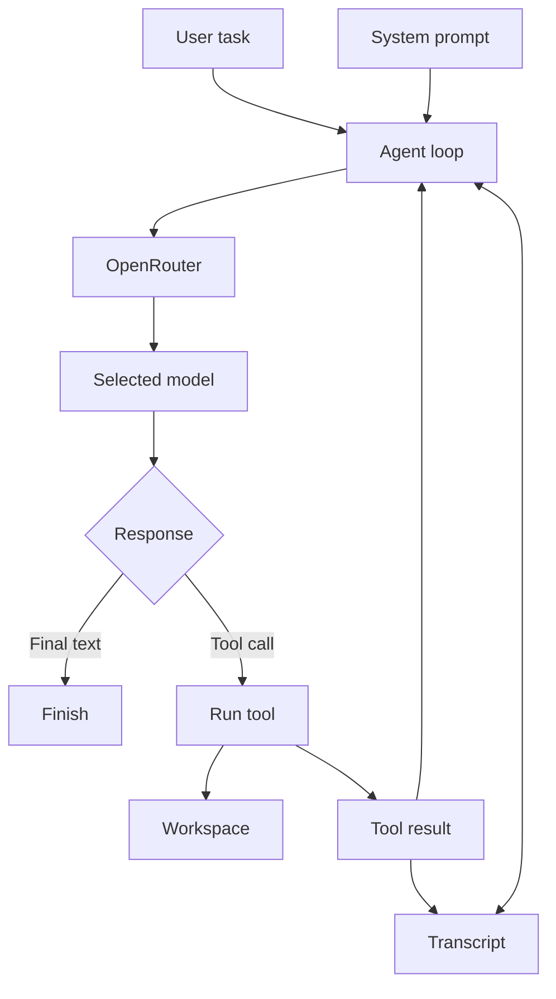

# Micro Neo: Build Your Own Coding Agent From Scratch in Go

## Title Options

### Recommended

**Build Your Own Coding Agent From Scratch**

This is clear, searchable, and focused on the result. Use `GO + OPENROUTER` on
the thumbnail to make the implementation concrete.

### Other options

1. How to Build a Coding Agent in Go
2. Coding Agents, Explained by Building One
3. I Built a Minimal Coding Agent From Scratch
4. Coding Agents Are Simpler Than They Look
5. A Coding Agent Is Just a Loop
6. What Is Actually Inside Claude Code and Codex?

## Opening Script

Coding agents are everywhere in 2026. Claude Code, Codex, Pi. It is difficult
to escape people talking about them.

But here is what might surprise you. Building your own coding agent from
scratch is much easier than it looks.

At its core, a coding agent is just a loop. You give a model a task, the model
calls a tool, you return the result, and the loop continues until the work is
finished.

Most of what makes an agent useful is good software built around that loop.

I learned this by building my own coding agent called Neo. Building it gave me
complete control over the agent loop, tools, event system, prompts, and user
interface. More importantly, it gave me a much better understanding of how
coding agents actually work.

In this video, we are going to build Micro Neo, a minimal coding agent written
in Go. We will use OpenRouter so the agent can work with different
tool-capable models through one API.

I will show you the agent loop, how tools work, why tool results must go back
into the transcript, and how a small event system keeps the user interface out
of the core logic.

Then we will look at what a serious agent such as Neo adds around this basic
design.

By the end, you will have a working coding agent and a clear mental model for
how tools such as Claude Code and Codex work under the surface.

All of the code and resources are linked for free in the description below.

So, let's get into it.

## Before We Build

Micro Neo is intentionally small.

It has:

- one model provider: OpenRouter
- one serial agent loop
- three tools: read, exact edit, and shell
- one in-memory transcript
- one small event-driven terminal interface

It does not have sessions, compaction, parallel tools, approvals, subagents, or
streaming. Those are useful product features, but they hide the basic mechanism
we want to understand.

The implementation uses only the Go standard library.

```text
code/
  main.go       the complete agent, built from top to bottom
  main_test.go  the safety net, kept out of the teaching path
  go.mod
  testdata/     a tiny broken project for the demo
```

The video builds only `main.go`. Each stage adds one idea to the same file, so
the audience never has to jump between packages or reconstruct hidden code.
The finished tests are included for people who want to verify the boundaries
after the lesson.

## See It Working

Start with the finished agent before explaining the code.

From the repository root:

```bash
cd tutorials/micro-neo/code
export OPENROUTER_API_KEY="your-key"
go run main.go --workspace testdata/demo
```

Micro Neo starts an interactive session. Enter the task at the prompt:

```text
› Find and fix the failing test. Run the tests when you are done.
```

The default model is `anthropic/claude-sonnet-4.6`. Choose another
tool-capable OpenRouter model with:

```bash
go run main.go \
  --model openai/gpt-5.4 \
  --workspace testdata/demo
```

Each message runs the agent loop until the model returns a final response.
Micro Neo then shows another prompt. The transcript stays in memory, so a
follow-up message has the full conversation and tool history. Enter `/exit` to
finish the session.

The model should:

1. inspect the demo project
2. run its tests
3. read the relevant file
4. make one exact edit
5. run the tests again
6. explain what changed

OpenRouter exposes many models through one API, but the selected model must
support tool calling. OpenRouter provides a
[tool-support filter](https://openrouter.ai/models?supported_parameters=tools)
for finding compatible models.

To restore the demo after recording, run this from the repository root:

```bash
git restore tutorials/micro-neo/code/testdata/demo/calculator.go
```

## The Basic Model

A coding agent has five important parts:

```text
Model      = judgment
Prompt     = policy
Tools      = capabilities
Transcript = memory
Agent loop = control
```

The model is not the complete agent. The agent is the software around the
model.



OpenRouter standardises the tool-calling format across supported models. The
model requests a tool, but it never executes the tool itself. Micro Neo owns
that boundary.

## Tools Are Normal Go Functions

Each Micro Neo tool contains:

- a name
- a description
- a JSON Schema shown to the model
- a Go function that executes the operation

```go
type Tool struct {
	Name        string
	Description string
	Parameters  map[string]any
	Run         func(context.Context, json.RawMessage) (string, error)
}
```

The model sees the schema. The Go program owns the function.

For example, the model might request:

```json
{
  "name": "read_file",
  "arguments": {
    "path": "calculator.go"
  }
}
```

Micro Neo looks up `read_file`, validates the arguments, runs the function,
and captures its output.

Keep tools small and predictable. The `edit_file` tool replaces one exact
piece of text. It fails if the old text is missing or appears more than once.
The model can then inspect the file again and make a safer request.

## The Agent Loop

The core loop is small:

```go
for turn := 0; turn < maxTurns; turn++ {
	response, err := provider.Complete(ctx, messages, toolDefinitions)
	if err != nil {
		return "", err
	}

	messages = append(messages, response)

	if len(response.ToolCalls) == 0 {
		return response.Content, nil
	}

	for _, call := range response.ToolCalls {
		result := runTool(ctx, call)
		messages = append(messages, Message{
			Role:       "tool",
			ToolCallID: call.ID,
			Content:    result,
		})
	}
}
```

The steps are:

1. Add the user's task to the transcript.
2. Send the prompt, transcript, and tool definitions to OpenRouter.
3. Append the assistant response.
4. If there are tool calls, execute them.
5. Append one matching result for every tool call.
6. Send the expanded transcript back to the model.
7. Stop when the model returns text without a tool call.

That is the central mechanism behind most coding agents.

## The Transcript Invariant

Every assistant tool call must have a matching tool result before the
transcript is sent back to the model.

```text
user
  "Fix the failing test"

assistant
  tool_call id=call_123 name=run_command

tool
  tool_call_id=call_123
  "1 test failed"

assistant
  tool_call id=call_456 name=read_file

tool
  tool_call_id=call_456
  "<file contents>"

assistant
  "Fixed the bug and all tests pass."
```

The identifier connects a result to the request that created it.

This rule must hold when a tool succeeds, fails, does not exist, or receives
invalid arguments. Micro Neo turns each of those outcomes into a tool result so
the model can understand the failure and recover.

## The System Prompt

Micro Neo uses a short prompt:

```text
You are Micro Neo, a focused coding agent.

Work in the current workspace. Inspect relevant files before making changes.
Prefer small, targeted edits. Run relevant tests after changing code.
Use relative file paths with the provided tools.

Before tool calls, briefly explain what you are checking or changing.
When the task is complete, summarize the changes and verification.
```

The prompt defines operating policy. The runtime owns guarantees.

The prompt can ask the model to make small changes. The tool must still reject
an ambiguous edit.

The prompt can ask the model to stay in the workspace. The execution
environment must still provide the real security boundary.

The prompt can ask the model to verify its work. The application must still
handle command timeouts and failures.

A useful rule is:

> Put preferences in the prompt. Put guarantees in code.

## Events Keep the Loop Clean

The agent loop should not know how to draw a terminal interface.

Micro Neo emits a few semantic events:

```text
assistant_text
tool_start
tool_finish
done
error
```

The terminal renderer subscribes to these events. It decides which colours,
symbols, arguments, durations, and errors to display.

This makes the same loop usable from a plain command, a terminal interface, a
web application, or a test.

The transcript remains the source of truth. Events are live notifications.
Micro Neo is event-driven, but it is not event-sourced.

## Why OpenRouter Is at the Edge

Micro Neo talks directly to OpenRouter's `/api/v1/chat/completions` endpoint
using `net/http`. The request shape is documented in the
[OpenRouter quickstart](https://openrouter.ai/docs/quickstart).

The provider adapter owns:

- authentication
- OpenRouter request and response JSON
- HTTP errors
- model selection

The agent loop only knows about its own `Message`, `ToolCall`, and
`ToolDefinition` types.

That boundary keeps model API details out of the loop. Micro Neo has only one
provider, but the architecture still makes ownership clear.

## What Neo Adds

Micro Neo is enough to teach and prove the mechanism. A dependable coding
product needs more around it.

| Micro Neo | Neo |
| --- | --- |
| One OpenRouter provider | Several provider adapters |
| In-memory transcript | Persisted resumable sessions |
| Serial tools | Runtime-controlled parallel tools |
| Basic events | Rich terminal and subagent event streams |
| Fixed context | Safe transcript compaction |
| Process cancellation | Steering and cancellation boundaries |
| No approval UI | Optional interactive confirmations |
| One agent | Coordinator and inspect subagents |

None of these features replaces the loop. They make it easier to operate,
observe, recover, and extend.

## Security Boundary

Micro Neo can execute shell commands. Run it only inside an environment whose
files, network, processes, and credentials you are willing for the selected
model to access.

The file tools reject paths outside the configured workspace. The shell tool
starts in the workspace, but shell commands can still use absolute paths,
network access, or available credentials.

The prompt is not a sandbox.

Command cancellation stops the shell process. A command that launches its own
background children may leave those children running. Production agents need
OS-specific process-group cleanup or a real sandbox.

## Tests

Run the automated checks from the code folder:

```bash
go test ./...
go vet ./...
```

The test suite uses fake providers and temporary workspaces. It does not make
paid OpenRouter requests.

It covers:

- multiple messages in one interactive conversation
- a tool call followed by a final response
- matching tool call and result identifiers
- cancellation without orphaning later tool calls
- the maximum-turn limit
- incomplete responses stopped by a model output limit
- OpenRouter request and error handling
- bounded file reads and traversal
- exact edits and strict tool arguments
- bounded command output
- terminal event rendering

## Tradeoffs

Micro Neo is designed for teaching, not unattended production work.

It buffers complete model responses instead of streaming them. It keeps the
whole transcript in memory. It runs tools serially. It has no interactive
approval gate. Its shell cancellation does not manage descendant processes.

Those choices keep the core visible. Add each production feature only after
the problem it solves is clear.

## References

- [OpenRouter tool calling](https://openrouter.ai/docs/guides/features/tool-calling)
- [OpenRouter quickstart](https://openrouter.ai/docs/quickstart)
- [Runnable code](./code/)
- [Live-build and demo prompts](./resources/prompts.md)
- [Deep coding-agent architecture guide](./resources/architecture-guide.md)
- [Visual architecture guide](./resources/slides/coding-agent-architecture.html)
- [Neo](https://github.com/owainlewis/neo)

## Summary

- The one thing to remember: a coding agent is a model in a loop with tools and
  a transcript.
- The honest limitation: the basic loop is small, but a safe production tool
  needs more engineering around it.
- What to try next: run Micro Neo against the demo, inspect the transcript
  tests, then add one capability whose boundary you understand.
