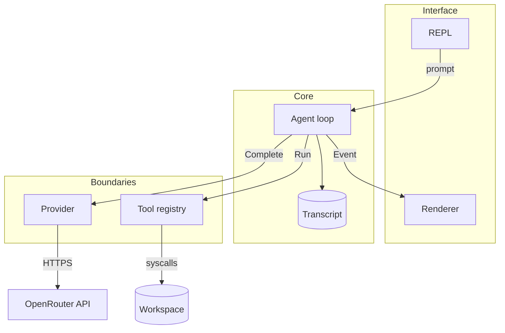

# Micro Neo Architecture

A coding agent in one Go file. This document is the build spec. It states what
each part is, why it is that way, and what must stay true.

For the general theory of coding agents, read
[architecture-guide.md](../resources/architecture-guide.md). This document is
narrower: it is the design of *this* program.

## 1. What We Are Building

A terminal program. You type a task. It reads files, edits them, runs commands,
and reports back.

```text
$ go run . --workspace testdata/demo
Micro Neo
model      moonshotai/kimi-k3
workspace  /path/to/testdata/demo

› Find and fix the failing test. Run the tests when you are done.

I'll look at the test file first.

→ read_file {"path": "calculator_test.go"}
✓ read_file 2ms
→ edit_file {"path": "calculator.go", ...}
✓ edit_file 1ms
→ run_command {"command": "go test ./..."}
✓ run_command 412ms

Fixed the sign error in Subtract. Tests pass.

✓ Done
```

That is the whole product. Everything below serves that transcript.

## 2. The Core Idea

An agent is a loop around a stateless model call.

```text
transcript = [user task]
forever:
    reply = model(transcript)          # the model is stateless
    transcript += reply
    if reply has no tool calls: stop
    for each tool call:
        transcript += run(tool call)   # results feed the next call
```

The model never remembers anything. The transcript is the memory, and we own
it. Every design decision follows from that.

## 3. Component Map



Five parts, each with one job:

| Part | Job | Knows about |
|------|-----|-------------|
| `Agent` | Runs the loop, owns the transcript | `Provider`, `Tool`, `Event` |
| `Provider` | Turns messages into a reply | HTTP, OpenRouter's JSON |
| `Tool` | Does one thing to the workspace | The filesystem |
| `Event` | Describes what just happened | Nothing |
| `Renderer` | Prints events | Terminal escape codes |

The important negative: `Agent` does not know about HTTP, the terminal, or the
filesystem. It knows three interfaces. That is what makes it testable with a
fake provider and no network.

## 4. Data Model

Four types carry everything.

```go
// A turn in the conversation. Mirrors the OpenAI/OpenRouter wire format,
// which is why it has both Content and ToolCalls.
type Message struct {
    Role       string     // "system" | "user" | "assistant" | "tool"
    Content    string
    ToolCalls  []ToolCall // set when the assistant wants to act
    ToolCallID string     // set on role "tool", matches ToolCall.ID
    Reasoning  string     // some models expose their thinking
    StopReason string     // why the model stopped; not sent back
}

// A capability we hand the model.
type Tool struct {
    Name        string
    Description string                // the model reads this to decide
    Parameters  map[string]any        // JSON Schema
    Run         func(context.Context, json.RawMessage) (string, error)
}

// The only thing the agent needs from a model vendor.
type Provider interface {
    Complete(context.Context, string, []Message, []ToolDefinition) (Message, error)
}

// What the agent emits so the UI can render without being called into.
type Event struct {
    Kind      string // assistant_text | tool_start | tool_finish | done | error
    Text      string
    ToolName  string
    Arguments string
    Result    string
    Duration  time.Duration
    ToolError bool
    Err       error
}
```

Design notes worth saying out loud:

- **`Tool.Run` returns `(string, error)`, and the string is used even on
  error.** A failed tool is not a failed turn. The model gets the error text as
  a normal tool result and tries something else. This single decision is what
  makes the agent recover instead of dying.
- **`StopReason` has a `json:"-"` tag.** It comes back from the API on the
  choice, not the message, and must never be sent back up. Getting this wrong
  causes 400s that are painful to debug.
- **`Event` has no methods and no pointers to anything.** It is a value. The
  agent can emit into a test slice, a terminal, or a log with no changes.

## 5. The Agent Loop

```go
func (a *Agent) Run(ctx context.Context, prompt string) (string, error) {
    a.transcript = append(a.transcript, Message{Role: "user", Content: prompt})

    for turn := 0; turn < a.maxTurns; turn++ {
        response, err := a.provider.Complete(ctx, a.system, a.transcript, a.toolDefinitions())
        if err != nil { return "", err }          // hard stop, network is broken
        a.transcript = append(a.transcript, response)

        if response.Content != "" {
            a.emit(Event{Kind: "assistant_text", Text: response.Content})
        }
        if len(response.ToolCalls) == 0 {
            return response.Content, nil          // the model is done talking
        }
        for _, call := range response.ToolCalls {
            result := a.runTool(ctx, call)        // never returns fatally
            a.transcript = append(a.transcript, Message{
                Role: "tool", ToolCallID: call.ID, Content: result,
            })
        }
    }
    return "", ErrMaxTurns
}
```

Roughly forty lines. Note what it does *not* do: no streaming, no parallel tool
execution, no planning step, no sub-agents. Those are all real techniques, and
none of them are needed to make the demo work.

### Loop invariants

These must hold after every iteration. They are the things to write tests for.

1. **Every `ToolCall` gets exactly one `tool` message with a matching
   `ToolCallID`.** If the model asks for three tools and you return two
   results, the next API call fails. This holds even when a tool errors,
   panics, or is cancelled.
2. **The transcript is always in a valid state to send.** Never append an
   assistant message with tool calls and then bail before appending the
   results. A user pressing Ctrl-C mid-tool must still leave a sendable
   transcript.
3. **The loop terminates.** Either the model stops asking for tools, or
   `maxTurns` cuts it off, or the context is cancelled.
4. **A tool panic becomes a tool result, not a crash.** `runTool` recovers and
   returns `"error: tool panicked: ..."`.

### Why serial, not parallel

`parallel_tool_calls: false` is sent on every request. Two reasons. Concurrent
edits to the same file corrupt it, and a serial trace is legible on video. If
you want parallelism later, the contract you need is: results must be appended
in the order the calls arrived, regardless of completion order.

## 6. The Provider

One method, one vendor, swappable by string.

**Why OpenRouter.** One endpoint and one JSON shape for every model. Changing
from Claude to Kimi to GPT is a flag, not a rewrite. The cost is that you
inherit the OpenAI message format, including its quirks.

### Request and response

`POST https://openrouter.ai/api/v1/chat/completions`

```json
{
  "model": "moonshotai/kimi-k3",
  "messages": [{"role": "system", "content": "..."}, ...],
  "tools": [{"type": "function", "function": {"name": "read_file", ...}}],
  "parallel_tool_calls": false
}
```

The system prompt is prepended at request time and is not stored in the
transcript. That keeps the transcript a pure record of the conversation.

Tool definitions are sorted by name before sending. Go map iteration is random,
and an unstable tool order silently breaks prompt caching.

### Timeouts: the part everyone gets wrong

Do **not** do this:

```go
client := &http.Client{Timeout: 2 * time.Minute}   // wrong
```

`http.Client.Timeout` is a hard wall-clock deadline that covers reading the
response body. A reasoning model with a long transcript will blow through two
minutes on a single completion, and the client kills the connection mid-body.
The error is `context deadline exceeded (Client.Timeout or context cancellation
while reading body)`, and it looks like a network fault when it is a
self-inflicted wound.

The design instead:

```go
var defaultHTTPClient = &http.Client{
    Transport: &http.Transport{
        TLSHandshakeTimeout:   30 * time.Second,
        ResponseHeaderTimeout: 5 * time.Minute,  // time to first byte
        IdleConnTimeout:       90 * time.Second,
    },
    // no Client.Timeout on purpose
}
```

Per-attempt deadlines come from a context, default 10 minutes, set with
`-timeout`. `ResponseHeaderTimeout` catches a genuinely dead server quickly
while letting a slow generation finish.

### Retries

Wrap the attempt in a retry loop. Classify failures:

| Condition | Retry? |
|-----------|--------|
| Connection reset, TLS failure, attempt deadline | Yes |
| 408, 429, any 5xx | Yes |
| 400, 401, 403, 404 | No, it will fail identically |
| Caller cancelled (Ctrl-C) | No, never |

Backoff doubles from 2s and is capped at 30s, and the sleep must be
interruptible by the context. Two retries by default.

The cancellation case deserves care. Check `ctx.Err()` before deciding to
retry, because a cancelled request produces a transport error that looks
transient. Retrying after Ctrl-C is how you build a program nobody can quit.

## 7. Tools

Three tools. That is a deliberate ceiling, not a starting point.

| Tool | Parameters | Returns |
|------|-----------|---------|
| `read_file` | `path` | File contents, capped at 64 KB |
| `edit_file` | `path`, `old_text`, `new_text` | `"updated <path>"` |
| `run_command` | `command` | Combined stdout and stderr, capped at 32 KB |

`run_command` is the escape hatch. Anything not built as a tool (grep, ls, git,
the test runner) is reachable through it. This is why three tools is enough.

### edit_file must match exactly once

```go
if count := strings.Count(content, args.OldText); count != 1 {
    return "", fmt.Errorf("old_text must match once, found %d matches", count)
}
```

Zero matches means the model guessed at the file contents. Two matches means it
would edit the wrong one. Both are errors, and both are recoverable: the model
reads the file and retries with more context. Line-number-based editing was
rejected because line numbers drift after the first edit.

### Every tool call is decoded strictly

```go
decoder.DisallowUnknownFields()
```

If the model sends `{"path": "x", "recursive": true}` and you ignore
`recursive`, it believes the flag worked. A loud error is better than a silent
lie.

## 8. Safety Boundaries

Prompts express policy. Code enforces guarantees. Never rely on the system
prompt to keep the agent inside the workspace.

### Path containment

```go
func workspacePath(root, requested string) (string, error) {
    if requested == "" || filepath.IsAbs(requested) {
        return "", errors.New("path must be relative to the workspace")
    }
    resolved, err := filepath.EvalSymlinks(filepath.Join(root, filepath.Clean(requested)))
    if err != nil { return "", err }
    relative, err := filepath.Rel(root, resolved)
    if err != nil || relative == ".." || strings.HasPrefix(relative, ".."+string(filepath.Separator)) {
        return "", errors.New("path escapes the workspace")
    }
    return resolved, nil
}
```

`EvalSymlinks` is the load-bearing call, and it runs on both the root and the
requested path. Without it, a symlink inside the workspace pointing at `/etc`
defeats the whole check. `filepath.Clean` alone is not enough.

Test it with `../../../etc/passwd` and with a real symlink. Both must be
rejected.

### Output bounds

Three caps, all enforced in code:

- 64 KB per file read
- 32 KB per tool result
- 10 MB per HTTP response body

An unbounded `cat` of a large file does not just cost money, it blows the
context window and destroys the agent's memory of the task. Truncation appends
a visible marker so the model knows it did not see everything, and cuts at a
rune boundary so the transcript stays valid UTF-8.

`run_command` output is written into a bounded buffer that keeps counting after
it stops storing, so the truncation marker can report the true size. That
buffer is mutex-guarded because stdout and stderr are two writers.

### What is deliberately not here

No command allowlist, no approval prompt, no container. `run_command` runs
arbitrary shell. This is a teaching agent pointed at a scratch workspace, and
saying so plainly is more honest than a filter that gives false comfort. In
production, this is the layer where you add approvals.

## 9. Events and the Interface

The agent never prints. It calls `onEvent(Event)`.

```go
agent := NewAgent(provider, tools, renderer.Handle)
```

Swap `renderer.Handle` for `func(e Event) { events = append(events, e) }` and
the same agent is testable with no terminal. Swap it for a websocket write and
it is a web app. The interface is a subscriber, not a dependency.

### The REPL

Reading stdin blocks, and Ctrl-C must be responsive, so input runs on its own
goroutine feeding a channel:

```go
select {
case <-ctx.Done():        // signal, shut down
case line, ok := <-lines: // input, or EOF
}
```

The context comes from `signal.NotifyContext` and threads all the way down into
`run_command`, so Ctrl-C kills a running test suite, not just the prompt.

## 10. Configuration

| Flag | Env | Default | Why |
|------|-----|---------|-----|
| `-model` | `OPENROUTER_MODEL` | `moonshotai/kimi-k3` | Swap models live on camera |
| `-workspace` | | `.` | The blast radius |
| `-timeout` | `OPENROUTER_TIMEOUT` | `10m` | Slow reasoning models |
| `-retries` | | `2` | Transient API failures |
| `-max-turns` | | `50` | Runaway loop backstop |
| | `OPENROUTER_API_KEY` | required | Never a flag, it would land in shell history |

## 11. Build Order

Each stage compiles and does something visible. Do not start the next one until
the current one runs.

| Stage | Build | Done when |
|-------|-------|-----------|
| 1 | `Message`, `ToolCall`, `Tool`, `Provider` types | It compiles |
| 2 | `OpenRouter.Complete`, hardcoded prompt | It prints a model reply |
| 3 | The agent loop, zero tools | Multi-turn chat works |
| 4 | `read_file` and the path sandbox | "What is in main.go?" works, `../../etc/passwd` is refused |
| 5 | `edit_file` with the match-once rule | It fixes a bug in `testdata/demo` |
| 6 | `run_command` with bounded output | It runs the tests and reads the failure |
| 7 | `Event`, `Renderer`, the REPL | It looks like the transcript in section 1 |
| 8 | Timeouts, retries, `maxTurns`, Ctrl-C | A slow model no longer kills the run |

Stage 8 is the best segment to record. Hit the two-minute timeout live, read
the error, find the cause, fix it. That teaches debugging rather than typing.

## 12. Tests Worth Writing

Behaviour, not lines. Ten tests cover this program:

**Loop**
- A tool call produces a `tool` message with the matching `ToolCallID`
- A tool that errors keeps the loop running
- A tool that panics becomes an error result, not a crash
- `maxTurns` returns `ErrMaxTurns` with a valid transcript

**Provider**
- Request shape: system message first, `parallel_tool_calls` false, auth header
- A 5xx retries and then succeeds
- A 401 does not retry
- A stalled server hits the attempt deadline and the error names `-timeout`
- A cancelled context stops retrying immediately

**Tools**
- `../../etc/passwd` and a symlink escape are both refused
- `edit_file` refuses zero matches and refuses two matches

The provider tests use `httptest.NewServer`. The loop tests use a fake
`Provider` returning scripted messages. Neither touches the network.

## 13. The Teaching Point

The loop is about forty lines. The model call is about eighty. The tools are
about a hundred. Everything else, roughly two thirds of the file, is
boundaries: path containment, output caps, timeouts, retries, cancellation,
strict argument decoding.

That ratio is the lesson. Making an agent work is a weekend. Making one you can
point at a real directory is the other 90%.
