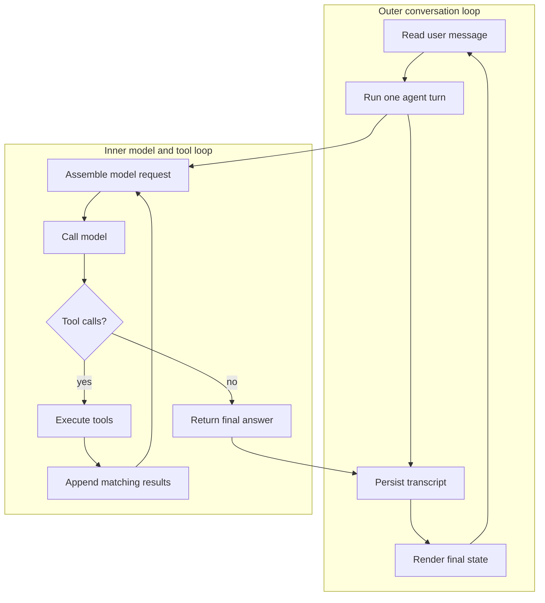
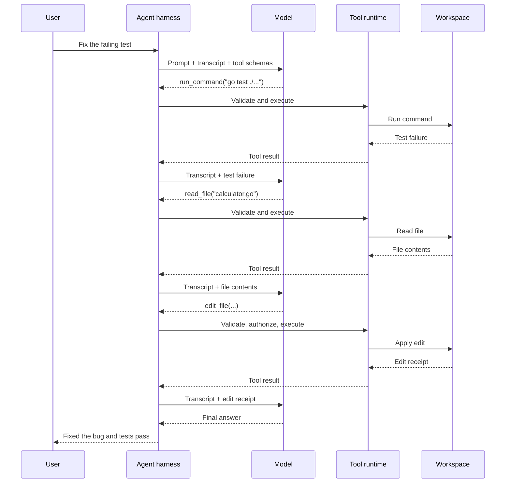
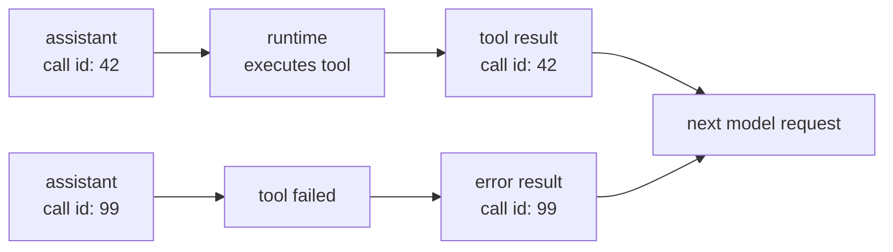
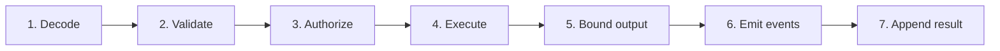
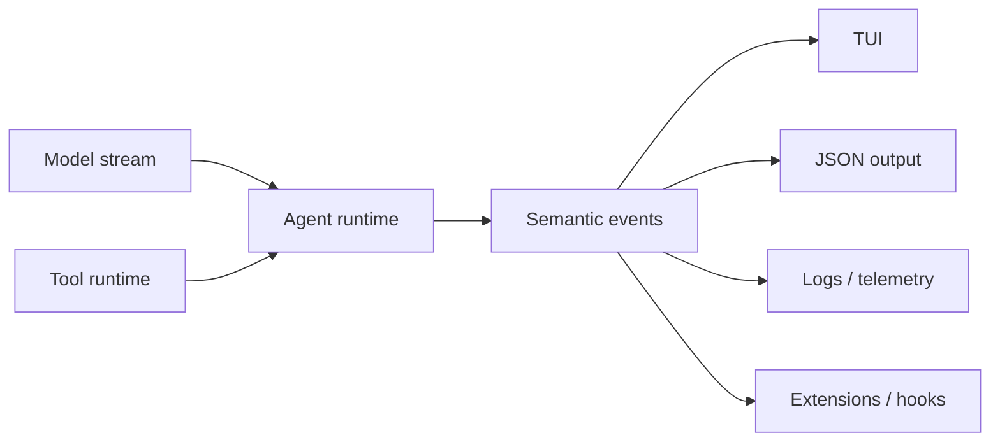
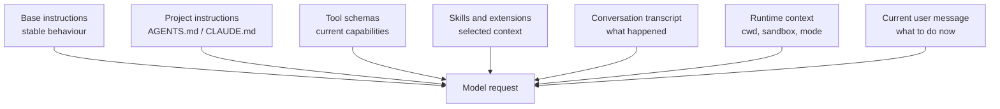
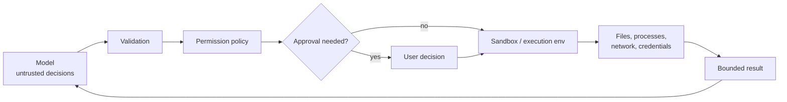
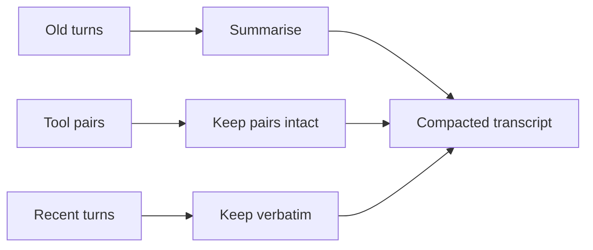
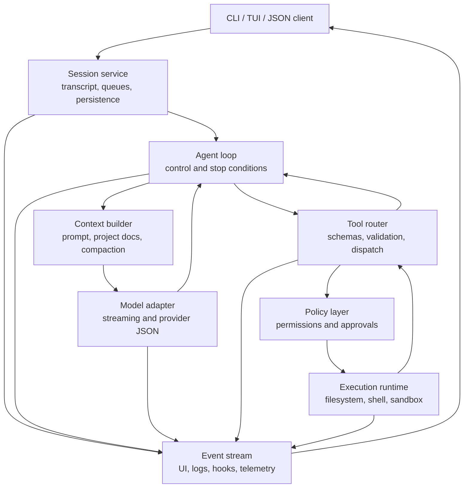

# How Coding Agents Work

This is a source-grounded architecture guide to the machinery behind a coding
agent.

It uses four systems as evidence:

- [OpenAI Codex](https://github.com/openai/codex)
- [Neo](https://github.com/owainlewis/neo)
- [Pi](https://github.com/earendil-works/pi/tree/main/packages/coding-agent)
- [Claude Code's public documentation](https://code.claude.com/docs/en/overview)

The useful lesson is not that these products contain the same files or use the
same language. They do not.

The useful lesson is that they solve the same small set of problems.

> Opinion [high]: teach the agent as a small inner loop inside a larger
> software harness. This is the clearest model supported by all three open
> source implementations.
>
> This changes if the lesson is about one product's extension API rather than
> the general architecture of coding agents.

## The Short Version

A coding agent is a model that can repeatedly observe a software project, take
an action, inspect the result, and decide what to do next.

```text
coding agent =
    model
  + transcript
  + agent loop
  + tools
  + runtime policy
  + user interface
```

The model provides judgment. The harness provides control.

The model can request that a command should run. The harness decides whether
the command is valid, whether it is allowed, where it runs, how long it may
run, how much output is retained, and how the result returns to the model.

That distinction explains most of the architecture.

## The Two Loops

There are really two loops in an interactive coding agent.



The outer loop makes the program an interactive product. It accepts another
message after the current task finishes and keeps the session alive.

The inner loop makes the program an agent. It keeps calling the model while
the model is asking for tools.

Micro Neo shows both loops in one Go file. Mature products split them across
session, runtime, protocol, and interface layers.

## One Agent Turn

Suppose the user asks the agent to fix a failing test.



Each model request contains the current view of the world. Each tool result
becomes a new observation. The loop ends when the model returns a final answer
without another tool call.

## The Core Agent Loop

This is the mechanism in language-neutral pseudocode:

```text
append(user_message)

for turn in 1..max_turns:
    compact_context_if_needed()

    response = model.complete(
        prompt,
        transcript,
        tool_schemas
    )

    append(response)
    emit(response_events)

    if response.failed:
        return error

    if response.has_no_tool_calls:
        return response.final_text

    results = []

    for call in response.tool_calls:
        result = execute_tool_safely(call)
        results.append(result)

    append_all(results)
```

Codex describes the same loop in `run_turn`: a sampling request returns either
function calls or an assistant message. Function calls are executed and their
outputs feed the next sampling request.

Pi implements an explicit inner loop for tool calls and steering messages, plus
an outer loop for queued follow-up messages.

Neo keeps the mechanism compact. It calls the provider, processes response
content, appends matching tool results, and continues until the provider ends
the turn or the maximum-turn fuse is reached.

## The Transcript Is the Agent's Working Memory

The transcript is not just a chat log. It is the state that lets the next model
call understand what has happened.

It contains:

- user instructions
- assistant text
- model reasoning or commentary when the provider exposes it
- tool calls
- tool results
- injected project context
- summaries created by compaction

The most important transcript rule is:

> Every tool call must receive one matching tool result before the transcript
> is sent back to the model.



Failure is still a result.

Unknown tool names, invalid JSON, rejected permissions, timeouts, cancellation,
and runtime errors should normally become structured tool results. That gives
the model a chance to recover and preserves transcript shape.

Neo goes further and prepares the assistant message and all matching results
before committing the pair to its transcript. Pi preserves tool-result order
even when safe tools execute in parallel. Codex normalises history and tracks
the exact tool plan used for a sampling step.

## Tools Are Capability Boundaries

A tool has two faces.

The model-facing side is a contract:

```json
{
  "name": "read_file",
  "description": "Read a UTF-8 text file in the workspace",
  "parameters": {
    "type": "object",
    "properties": {
      "path": {
        "type": "string",
        "description": "Workspace-relative file path"
      }
    },
    "required": ["path"],
    "additionalProperties": false
  }
}
```

The runtime-facing side is code:

```go
type Tool struct {
    Name        string
    Description string
    Parameters  map[string]any
    Run         func(context.Context, json.RawMessage) (string, error)
}
```

The model sees the name, description, and schema. It never receives the
function.

The harness owns the full lifecycle:



### Decode

Parse the provider's tool-call representation into your own internal type.
Keep provider-specific JSON at the adapter boundary.

### Validate

Reject malformed or unexpected arguments. Use strict schemas. Do not silently
guess what a broken call meant.

### Authorize

Apply tool, path, command, network, and approval policy before execution. The
model's request is untrusted input.

### Execute

Run the tool with a deadline and cancellation signal. Use the selected
workspace and execution environment.

### Bound output

Limit bytes, lines, images, and duration before the result enters the
transcript. One huge command can consume the next model request.

### Emit events

Tell interfaces and extensions that execution started, updated, ended, failed,
or was denied.

### Append the result

Return a result with the original call identifier. Preserve source order even
if execution was parallel.

## Parallel Tools Need an Explicit Contract

Parallel execution is not just `Promise.all` or a goroutine per call.

Some tools are safe to run together:

- read two unrelated files
- search several patterns
- inspect independent directories

Some tools should form a serial barrier:

- edit the same file
- run an approval prompt
- change shared configuration
- start or stop a process that another call depends on

Pi prepares calls serially, executes allowed calls concurrently, and emits
tool-result messages later in assistant source order.

Neo groups adjacent parallel-safe calls but breaks the group around calls that
need approval.

Codex uses a read/write gate. Parallel-safe calls take a shared read lock while
serial calls take the write lock.

The teaching rule is simple:

> Start serial. Add parallelism only after each tool declares whether it is
> safe and you can preserve deterministic result ordering.

## Events Separate the Agent From the Interface

The agent should report what happened without deciding how it looks.

A useful minimal event set is:

```text
agent_start
message_start
message_delta
message_end
tool_start
tool_update
tool_end
turn_end
agent_end
error
```



This is event-driven design, but it does not have to be event sourcing.

- The transcript and session store are durable state.
- Events are live facts about work in progress.
- The interface reduces events into view state.

That distinction prevents a common design mistake where the terminal's current
widgets accidentally become the only record of what happened.

## The TUI Is a State Machine

A terminal interface has a simple job:

```text
new_view_state = reduce(old_view_state, event)
render(new_view_state)
```

For example:

| Event | TUI state change |
| --- | --- |
| `agent_start` | Show working indicator |
| `message_delta` | Append streamed text |
| `tool_start` | Add an active tool row |
| `tool_update` | Update partial command output |
| `tool_end` | Mark the row complete or failed |
| `agent_end` | Clear the working indicator |

Pi's interactive mode subscribes to agent-session events and creates or updates
message and tool components. Neo sends agent events into Bubble Tea and maps
them to text, commentary, parallel groups, tool receipts, errors, and workflow
blocks. Codex uses a much larger typed event protocol so its core can serve a
TUI, app server, and other clients.

The interface may choose to hide routine output, combine parallel calls, show
elapsed time, or render a detailed diff. None of those choices should change
tool execution or transcript correctness.

## Prompts Are Context Assembly

A production prompt is rarely one string written in one file.

It is an ordered context stack:



Each layer has a different lifetime.

| Layer | Typical lifetime | Design concern |
| --- | --- | --- |
| Base instructions | model or product version | stable and cacheable |
| Project instructions | workspace or directory | scoped and refreshable |
| Tool schemas | one sampling step | must match executable tools |
| Skills | selected task | load only what is relevant |
| Transcript | session | ordered and compactable |
| Runtime context | turn or step | accurate at execution time |
| User message | current turn | highest local specificity |

Neo explicitly separates a stable cacheable base prompt from an uncached
project-context tail.

Pi builds its prompt from selected tools, guidelines, project context files,
skills, and the current working directory.

Codex captures a step context so the history, advertised tools, environment,
and tool execution use the same request-scoped view.

Claude Code documents a similar layered model. Managed, user, project, and
local `CLAUDE.md` instructions are loaded in order, while nested instructions
can load when the agent enters a subdirectory.

## Prompts Express Policy, Code Enforces Guarantees

This is one of the most important ideas in the whole system.

| Put in the prompt | Enforce in code |
| --- | --- |
| Prefer small edits | Reject ambiguous edit operations |
| Inspect before editing | Expose read tools and useful errors |
| Stay in the workspace | Contain file paths and sandbox processes |
| Run relevant tests | Apply timeouts and capture exit status |
| Be concise | Cap tool output and model turns |
| Ask before risky work | Run a real permission check |

A prompt influences model behaviour. It is not a security boundary.

Claude Code's documentation makes the distinction explicit: `CLAUDE.md`
shapes behaviour, while client settings, permission rules, and sandboxing are
enforced independently of the model.

## Safety Is a Runtime Property

The security boundary sits between the model and the outside world.



A dependable agent should consider:

- workspace path containment
- filesystem read and write policy
- network access
- available credentials
- command timeout
- process-tree cleanup
- maximum tool output
- approval policy
- cancellation
- audit events

Approvals and sandboxing solve different problems.

- Approval asks whether an action should happen.
- Sandboxing limits what the action can reach if it does happen.

Codex carries approval and sandbox policy in turn context and routes calls
through tool runtimes that respect cancellation.

Claude Code documents permissions and OS-level Bash sandboxing as
complementary layers.

Neo deliberately treats interactive tool approvals as interface friction, not
as its hard security boundary. Its documentation places the real boundary in
the surrounding VM or sandbox.

## Cancellation Must Preserve a Valid Transcript

Cancellation can arrive while:

- the model is streaming
- a command is running
- several tools are in flight
- an approval dialog is open
- results are being persisted

The easy implementation is to return immediately. That can leave orphaned
tool calls in history or child processes running.

A safer sequence is:

```text
1. Signal cancellation.
2. Stop or drain active model and tool work.
3. Produce error results for calls that will not run.
4. Preserve valid call/result pairing.
5. Emit terminal lifecycle events.
6. Persist a resumable state.
```

The cancellation token should be created near the turn boundary and passed
through provider calls, approvals, tool execution, hooks, and persistence.

## Context Windows Require Compaction

An in-memory transcript grows until it no longer fits the model.

Compaction replaces older detail with a shorter representation while
preserving recent work and structural correctness.



Important rules:

- never split a tool call from its result
- keep the current task and recent evidence
- preserve durable project instructions
- record that compaction happened
- avoid repeated compaction with no meaningful progress

Neo compacts before provider calls and keeps recent safe turns verbatim.
Codex can compact before sampling and during a long-running turn when another
follow-up would cross the token limit. Pi exposes context transforms and adds
session-level compaction around its low-level loop.

## Hooks Are Lifecycle Subscribers With Control

An event says what happened. A hook is configured work that runs at a known
lifecycle point.

Useful hook points include:

```text
session_start
user_prompt_submit
pre_tool_use
permission_request
post_tool_use
pre_compact
post_compact
stop
session_end
```

A hook may:

- observe
- add context
- rewrite a result
- deny a tool
- request another turn
- send a notification
- record telemetry

Pi exposes `beforeToolCall`, `afterToolCall`, turn preparation, context
transforms, and a wider extension event system.

Codex has typed hook lifecycle events in its protocol and invokes hooks around
turn input, tool use, compaction, and stop decisions.

Claude Code documents deterministic hooks as commands tied to lifecycle
events. A `PreToolUse` hook can block execution, while a `PostToolUse` hook can
only report on work that already happened.

The implementation pattern is straightforward:

```text
for hook in matching_hooks(event):
    outcome = hook.run(payload, cancellation)
    apply(outcome)
```

The hard part is defining exact semantics. Decide whether hooks are ordered or
parallel, whether failures block, how long they may run, what they may mutate,
and how their output enters the transcript.

## Sessions Turn a Loop Into a Product

A session normally owns:

- transcript
- provider and model
- working directory
- active tools
- prompt and project context
- usage
- compaction state
- queued steering and follow-ups
- persistence identity

The session boundary lets an agent resume after a process restart, fork an
earlier state, change model, or render the same work in another client.

Persist complete messages and typed lifecycle facts. Do not try to recreate a
session from terminal text.

## A Clean Architecture

This is a useful target architecture for a small but serious coding agent:



The dependency direction matters:

- the loop depends on interfaces, not terminal widgets
- the provider adapter does not execute tools
- the TUI does not mutate the transcript directly
- policy runs before side effects
- execution returns bounded structured results
- persistence consumes durable messages, not rendered output

## What The Repositories Emphasise

| System | Strongest architecture lesson |
| --- | --- |
| Micro Neo | The complete mechanism fits in one teachable file |
| Neo | A policy-light core can stay small while events drive a capable TUI |
| Pi | Lifecycle events and extension points can be explicit without hiding the loop |
| Codex | Typed protocols, request-scoped context, tool routing, safety, and multiple clients need strong boundaries |
| Claude Code | Behavioural instructions, deterministic hooks, permissions, and sandboxing are separate control layers |

### Neo

Neo is the clearest bridge between a tutorial agent and a product. Its core
agent owns transcript state, provider calls, tool execution, compaction, and
semantic events. Bubble Tea owns rendering. The prompt builder separates stable
and dynamic context.

### Pi

Pi has a deliberately reusable low-level agent package. The coding-agent layer
adds persistence, compaction, retries, extensions, and a rich interactive
interface. The event vocabulary flows from the core loop through the session
and into UI components.

### Codex

Codex shows what happens when the same core mechanism serves a mature product.
It captures request-scoped world state, builds an exact tool plan, streams typed
events, runs tools through safety-aware runtimes, supports mid-turn input and
compaction, persists rollouts, and serves clients through a protocol.

### Claude Code

Claude Code is not open source, so this guide does not make claims about its
private implementation. Its public documentation still provides useful
evidence about product boundaries: layered project instructions, tools,
permissions, Bash sandboxing, hooks, sessions, and isolated subagents.

## Build It In This Order

Do not start with a TUI framework, subagents, or a large plugin system.

### Stage 1: Model call

Build an interactive loop that sends text to a model and prints text back.

Proof:

```text
user -> model -> answer
```

### Stage 2: One read tool

Send one schema. Decode the model's requested function. Execute it in your
program.

Proof:

```text
model requests read_file -> program returns contents
```

### Stage 3: The agent loop

Append the tool result and call the model again.

Proof:

```text
user -> model -> tool -> model -> final answer
```

### Stage 4: Coding tools

Add exact edit and shell tools. Keep execution serial.

Proof:

```text
inspect -> edit -> test -> report
```

### Stage 5: Events and TUI

Replace direct printing inside the loop with semantic events. Build a reducer
that renders those events.

Proof:

```text
same agent loop -> plain output or TUI
```

### Stage 6: Runtime boundaries

Add strict argument decoding, workspace containment, timeouts, cancellation,
bounded output, and maximum turns.

Proof:

```text
invalid and dangerous requests fail predictably
```

### Stage 7: Sessions and compaction

Persist complete messages. Resume them. Compact safely near the context limit.

Proof:

```text
restart process -> resume valid transcript
```

### Stage 8: Extensibility

Add hooks, skills, dynamic tools, or subagents only when their contracts are
clear.

Proof:

```text
extension adds behaviour without changing the core loop
```

## The Invariants Worth Testing

A strong test suite focuses on boundaries:

1. Every tool call receives a matching result.
2. Tool results preserve assistant source order.
3. Invalid arguments never reach tool code.
4. A denied or failed tool still produces a model-readable result.
5. Serial tools do not overlap.
6. Cancellation stops work and leaves a valid transcript.
7. Tool output is bounded before entering context.
8. The turn fuse stops an endless tool loop.
9. Compaction does not split tool pairs.
10. Session persistence round-trips without changing message meaning.
11. TUI event handling does not alter agent semantics.
12. The tools advertised to the model are exactly the tools executable for that
    sampling step.

## The Main Teaching Point

The basic loop is easy.

The engineering work is in preserving a few contracts as the product grows:

- a valid transcript
- exact tool boundaries
- a consistent request context
- typed lifecycle events
- cancellation and recovery
- real runtime enforcement

Once those contracts are clear, sessions, hooks, a TUI, compaction, multiple
models, and subagents become understandable additions around the same small
engine.

## Source Snapshot

The open source findings in this guide were checked against these exact
revisions on 30 July 2026:

| Repository | Revision |
| --- | --- |
| OpenAI Codex | `6256a7ccc7948231befc33d7d61b369041e6eb16` |
| Neo | `b0b4c3d5444771a9331e1075e3c072ffef46bffe` |
| Pi | `c13ffe1877c3a47ce9f2fc98d9880447d64a0e87` |

Primary code paths:

- [Codex turn loop](https://github.com/openai/codex/blob/6256a7ccc7948231befc33d7d61b369041e6eb16/codex-rs/core/src/session/turn.rs#L140-L500)
- [Codex tool runtime](https://github.com/openai/codex/blob/6256a7ccc7948231befc33d7d61b369041e6eb16/codex-rs/core/src/tools/parallel.rs#L41-L220)
- [Codex event protocol](https://github.com/openai/codex/blob/6256a7ccc7948231befc33d7d61b369041e6eb16/codex-rs/protocol/src/protocol.rs#L1275-L1478)
- [Pi agent loop](https://github.com/earendil-works/pi/blob/c13ffe1877c3a47ce9f2fc98d9880447d64a0e87/packages/agent/src/agent-loop.ts#L152-L360)
- [Pi event and tool contracts](https://github.com/earendil-works/pi/blob/c13ffe1877c3a47ce9f2fc98d9880447d64a0e87/packages/agent/src/types.ts)
- [Pi system prompt builder](https://github.com/earendil-works/pi/blob/c13ffe1877c3a47ce9f2fc98d9880447d64a0e87/packages/coding-agent/src/core/system-prompt.ts)
- [Pi interactive event handler](https://github.com/earendil-works/pi/blob/c13ffe1877c3a47ce9f2fc98d9880447d64a0e87/packages/coding-agent/src/modes/interactive/interactive-mode.ts#L2875-L3090)
- [Neo agent loop](https://github.com/owainlewis/neo/blob/b0b4c3d5444771a9331e1075e3c072ffef46bffe/internal/agent/agent.go#L312-L398)
- [Neo event-driven TUI](https://github.com/owainlewis/neo/blob/b0b4c3d5444771a9331e1075e3c072ffef46bffe/internal/tui/model.go#L1046-L1145)
- [Neo prompt assembly](https://github.com/owainlewis/neo/blob/b0b4c3d5444771a9331e1075e3c072ffef46bffe/cmd/neo/main.go#L166-L192)

Claude Code evidence comes from its public documentation:

- [How Claude remembers a project](https://code.claude.com/docs/en/memory)
- [Hooks guide](https://code.claude.com/docs/en/hooks-guide)
- [Hooks reference](https://code.claude.com/docs/en/hooks)
- [Permissions](https://code.claude.com/docs/en/permissions)
- [Sandboxing](https://code.claude.com/docs/en/sandboxing)
- [Subagents](https://code.claude.com/docs/en/sub-agents)
