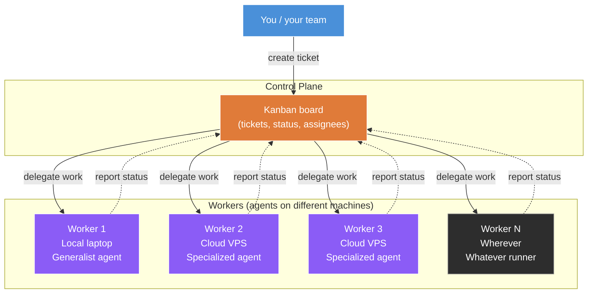
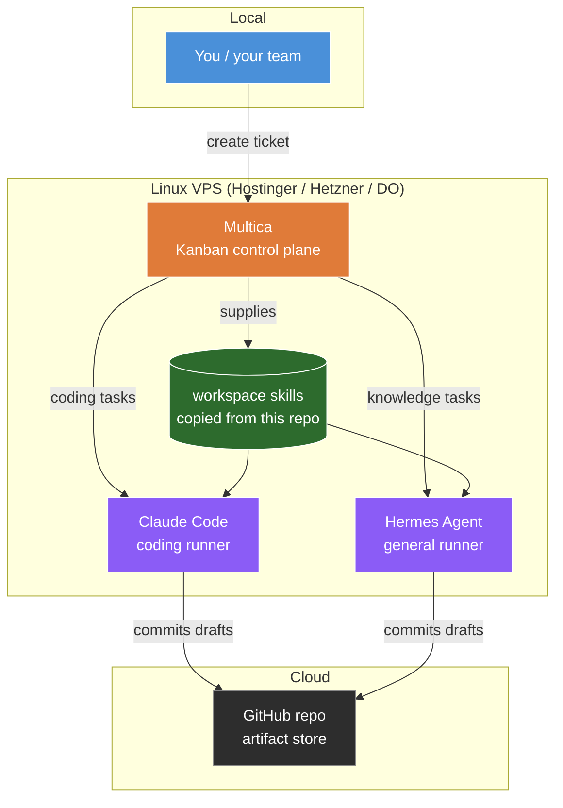
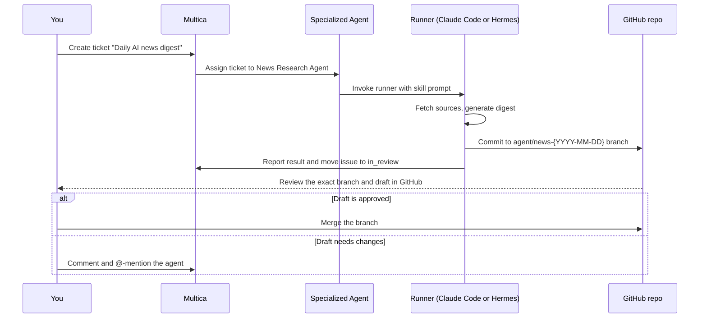

# Multica Turns Claude Code Into a Remote Teammate

This lesson explains the control-plane and worker pattern for running specialized remote agents with Multica. The checked-in runbooks cover VPS setup, two runners, Multica, Git access, and team access.

The checked-in examples define three jobs: AI news research, LinkedIn post repurposing, and YouTube description writing. Start with one of those jobs and add another only after you can verify the first one.

## What this is

Most people use AI agents one chat at a time on their laptop. That isn't an AI team. It's a fancier search bar.

A real AI team is **specialized automations** with narrow scopes, running where your business runs (the cloud), accessible to anyone on your team, doing actual work in parallel. You delegate to them like to a contractor with a clear brief, not chat with them like an employee with a personality.

This guide builds that system end to end.

## What The Runbooks Cover

- A small Linux VPS running [Multica (external)](https://multica.ai/) as the agent control plane
- [Claude Code documentation (external)](https://code.claude.com/docs/en/overview) for the coding-focused runner
- [Hermes Agent documentation (external)](https://hermes-agent.nousresearch.com/docs/) for the general-purpose runner
- Workspace skills copied from the three checked-in `SKILL.md` files and bound to agents
- A path for tested team access through the authentication you configure

## The pattern: control plane and workers

Before the specific tools, here's the abstract pattern this whole setup implements.

A **control plane** is a centralized place where you create and assign work. **Workers** are the things that actually do the work. Workers can run on many different machines (your laptop, a VPS, multiple VPSs) but they all connect back to the same control plane. You delegate work through the control plane. The right worker picks it up, does the job, and reports back.

This is the same pattern as Kubernetes (control plane + worker nodes), CI runners (GitHub Actions central + runner machines), and most distributed work systems. We're applying it to AI agents.



Key properties of this pattern:

- **One control plane, many workers.** Workers can be added or removed without changing how you delegate.
- **Workers can be different.** Some are generalist agents on your laptop. Others are specialized agents on cloud VPSs. The control plane treats them uniformly.
- **The control plane is the abstraction.** You don't think about which machine a worker runs on. You think about what job the worker does.
- **Specialization happens at the worker, not the control plane.** Each worker has its own job description, its own tools, its own workflow. The control plane just routes tickets.

In this tutorial, the control plane is **Multica** and the workers use Claude Code or Hermes Agent. Check the [external Multica provider documentation](https://multica.ai/docs/providers) before selecting the model provider for a runtime.

## The architecture (concrete implementation)



The VPS is the durable home for the agents. The control plane is Multica. The actual LLM execution happens in Claude Code or Hermes, depending on the task.

All three checked-in skills write files and commit them to a Git branch. Review the branch in GitHub or pull it into your editor. This tutorial does not include a gist or Notion output workflow.

## The thesis: what to delegate, what to keep

The biggest mistake people make with AI agents is delegating the wrong work. The skill is knowing what NOT to send to an agent.

Two-axis filter:

| Axis | Delegate when... | Keep yourself when... |
|---|---|---|
| **Verifiability** | Output is mechanical, checkable, has a right answer | Output is judgment-laden, ambiguous, "it depends" |
| **Iteration cost** | One-shot or near-one-shot is enough | Heavy back-and-forth review is required |

Concrete map:

| Do delegate | Don't delegate |
|---|---|
| Deployment pipelines | Original creative writing (essays, opinion pieces) |
| Research digests and monitoring | Architecture decisions |
| Content repurposing (your idea -> new format) | Strategic thinking |
| YouTube descriptions, chapters, metadata | Anything you'd review every paragraph of |
| Small bug fixes (bounded scope) | Large refactors and complex bug fixes |
| Report generation and changelogs | Customer-facing communication where tone matters |

The rule: **if you'll iterate, you'll waste time. If it's mechanical and verifiable, you'll save time.**

The honest beat: don't use AI agents for creative writing. The "AI slop" problem comes from people delegating creative work that needs human thinking. Repurposing (mechanical transformation of your existing ideas) is fine. Original creation is not.

## Why Multica specifically

Some runners include their own task interface. This tutorial keeps the control plane separate from the worker so you can choose a runner for each job. Check Multica's current documentation before assuming a runner is supported.

The aim is to reduce runner lock-in by keeping the task interface separate from the worker.

## The checked-in skills

The repo contains three skill definitions under [`resources/05-skills-and-agents/skills/`](./resources/05-skills-and-agents/skills/). These are the only ready-to-copy jobs included with this tutorial.

Each one has one job and one skill file. Do not combine them.

| Agent | Suggested runner | Checked-in skill | Output contract |
|---|---|---|---|
| News Research | Hermes or Claude Code | [`ai-news-research`](./resources/05-skills-and-agents/skills/ai-news-research/) | Dated digest on `agent/news-{YYYY-MM-DD}` |
| LinkedIn Post Writer | Hermes | [`linkedin-post`](./resources/05-skills-and-agents/skills/linkedin-post/) | `content/linkedin/{slug}.md` on `agent/linkedin-{slug}` |
| YouTube Description Writer | Claude Code | [`youtube-description`](./resources/05-skills-and-agents/skills/youtube-description/) | `description.md` and `chapters.md` on `agent/description-{slug}` |

The principle to take away: **specialized agents with structured workflows are easier to verify than generalist agents prompted ad hoc.** Build one specialized agent first. Add more only when you can define another narrow, checkable job.

### Copy A Checked-In Skill Into Multica

Choose one checked-in skill:

```text
tutorials/multi-agent-teams/resources/05-skills-and-agents/skills/ai-news-research/SKILL.md
tutorials/multi-agent-teams/resources/05-skills-and-agents/skills/linkedin-post/SKILL.md
tutorials/multi-agent-teams/resources/05-skills-and-agents/skills/youtube-description/SKILL.md
```

In Multica, open the workspace Skills page, choose **New skill**, then **Create manually**. Copy the chosen `SKILL.md` into the workspace skill. For AI news research, also add `references/sources.md` as a supporting file. Multica does not automatically register a skill because it exists in this repository.

Create an agent with a connected runtime, attach the workspace skill from the agent's Skills tab, and keep Access set to **Only me** for the first run. The detailed flow is in [05 - Configure specialized agents](./resources/05-skills-and-agents/). The [external Multica skills guide](https://multica.ai/docs/skills) explains the current import and binding model.

## How it actually runs (the flow)



Use the current Multica states: `backlog`, `todo`, `in_progress`, `in_review`, `done`, `blocked`, and `cancelled`. A normal run starts from `todo`, moves to `in_progress`, and should reach `in_review` when the agent delivers. Mark it `done` only after you inspect the branch. For changes, leave a concrete comment and @-mention the agent from the editor suggestions. The mention creates a follow-up task. See the [external Multica comments guide](https://multica.ai/docs/comments).

## Minimum End-To-End Setup

This is the shortest complete path. The linked runbooks explain each step and its failure cases.

1. Provision a Linux VPS and install one authenticated runner, either Claude Code or Hermes Agent.
2. Start Multica with the current self-host path:

   ```bash
   git clone --depth 1 https://github.com/multica-ai/multica.git
   cd multica
   make selfhost
   docker compose -f docker-compose.selfhost.yml ps
   curl -fsS http://localhost:8080/readyz
   ```

3. From your local machine, create a temporary SSH tunnel to the VPS:

   ```bash
   ssh -N -L 3000:127.0.0.1:3000 USER@VPS_HOST
   ```

   Keep that terminal open, visit `http://localhost:3000`, and request a sign-in code. On a new instance without email delivery, retrieve the code from another VPS session:

   ```bash
   cd multica
   docker compose -f docker-compose.selfhost.yml logs backend \
     | grep "Verification code"
   ```

   Enter the code and create the workspace. Use the external remote-access guide linked below to configure HTTPS before inviting other users.

4. Install and connect the Multica CLI on the runner machine:

   ```bash
   curl -fsSL https://raw.githubusercontent.com/multica-ai/multica/main/scripts/install.sh | bash
   multica setup self-host
   multica daemon status
   ```

5. Connect the output repository to the Multica workspace and add it to a project as a GitHub repository resource. Authenticate `gh` on the runtime with a fine-grained token limited to that repository and the permissions the job needs.
6. Open Multica's workspace Skills page. Create a skill manually from one checked-in `SKILL.md`. Add its supporting files when present.
7. Create a blank agent. Select the connected runtime, write its narrow responsibility, attach the workspace skill, and leave Access as **Only me**.
8. Create a `todo` issue and assign it to the agent. Confirm the issue reaches `in_review`, then inspect the exact Git branch and files named by the skill.
9. Configure HTTPS, production email delivery, signup restrictions, member roles, and agent Access before inviting another user. Test the same issue flow with a second account.

Do not schedule a job until this manual run passes. Current product details are in the [external Multica self-host guide](https://multica.ai/docs/self-host-quickstart), [external skills guide](https://multica.ai/docs/skills), and [external agent configuration guide](https://multica.ai/docs/agents-create).

## Detailed Runbooks

Read these in order. Each one builds on the previous.

1. [01 - Provision a VPS](./resources/01-vps-setup/) - Hostinger, base tooling, hardening
2. [02 - Install Claude Code](./resources/02-claude-code/) - npm install, API key, the headless OAuth dance
3. [03 - Install Hermes Agent](./resources/03-hermes-agent/) - install + configure
4. [04 - Install Multica](./resources/04-multica/) - self-host, reverse proxy, first-run config
5. [05 - Configure specialized agents](./resources/05-skills-and-agents/) - use one of the three checked-in skill files
6. [06 - Connect Multica to Git](./resources/06-git-access/) - fine-grained PAT, gh CLI, manual PR test
7. [07 - Add team access](./resources/07-team-access/) - Multica auth, multi-user, the verification test

The runbooks add hardening, failure checks, Git setup, and team access around the minimum path above.

## When this is NOT the right pattern

The system is overkill if:

- You're a solo operator and never plan to share with a team - Claude Code on your laptop is fine
- Your "delegation" is really iterative collaboration - pair-program with Claude Code in your terminal instead
- You don't have any genuinely mechanical, verifiable work to delegate - solve that first; don't build infrastructure for nothing

The system is wrong if:

- You're trying to delegate creative writing - it'll produce slop
- You're trying to delegate architecture decisions - agents can't carry the context for these
- The cost of one bad output is catastrophic (legal docs, customer emails at scale, anything you can't easily reverse) - keep a human in every loop

## Things to watch out for

- **Token cost.** Concurrent runs increase provider usage. Check actual usage before scaling the number of agents.
- **OAuth on a server is a manual step.** Headless servers don't have browsers. The first time you authenticate Claude Code or any OAuth-based MCP, you'll copy a URL out of your terminal into your local browser, complete auth, then paste a code back. See [02 - Install Claude Code](./resources/02-claude-code/) for the dance.
- **Same-file edits.** Two agents editing the same file can conflict. Specialize each agent so they own different output paths.
- **Token rotation.** Choose an expiry for each fine-grained GitHub PAT and rotate it before that date. An organization or enterprise policy may impose a maximum lifetime.
- **Provider lock-in is sneaky.** It's tempting to consolidate on one vendor's tools as they ship more features. Resist if you can. The vendor-neutral setup outlives any one provider's product cycle.

## License

Licensed under the [MIT License](../../LICENSE).
