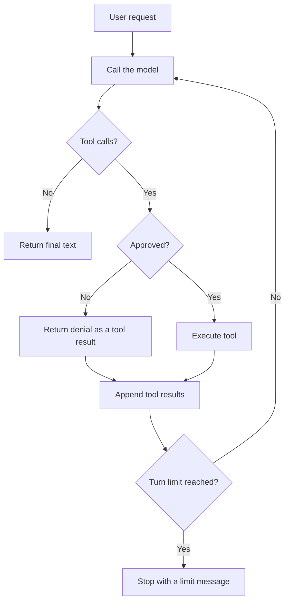

# Nano Agent

Nano Agent is a small terminal coding agent written in Python. It is designed to make the core agent loop easy to inspect.

The runnable project uses the Anthropic API, seven tools, an explicit tool registry, approval events, and a configurable turn limit. It is a teaching project, not a production sandbox.

## Run the project

You need Python 3.12 or newer, `uv`, and an Anthropic API key.

From this tutorial folder:

```bash
cd code
uv sync
cp nano-agent.example.yml nano-agent.yml
export ANTHROPIC_API_KEY="sk-ant-..."
uv run nano-agent
```

The agent starts a terminal prompt. Ask it to inspect a file or make a small change. It will ask before each tool call unless `skip_approval` is enabled in the config file.

Run the full credential-free test suite from `code/`:

```bash
uv run pytest
```

Reset generated local files from `code/`:

```bash
rm -f nano-agent.yml nano-agent.log nano-agent.log.*
```

## The basic loop

A coding agent is a model inside a loop:

1. Add the user's request to the message history.
2. Send the history, system prompt, and tool schemas to the model.
3. Execute approved tool calls and append their results.
4. Ask the model what to do next.
5. Stop when the model returns text without another tool call, or when the turn limit is reached.



The implementation is in [`code/src/nano_agent/agent.py`](./code/src/nano_agent/agent.py). It keeps conversation history, calls the provider, dispatches tools, and emits events. Terminal rendering and approval prompts live outside the loop.

## Message history is the agent's memory

The model does not remember earlier API calls. Nano Agent sends the full in-memory message history on every model call.

A tool exchange has three parts:

```python
messages = [
    {"role": "user", "content": "Read hello.py"},
    {
        "role": "assistant",
        "content": [
            {
                "type": "tool_use",
                "id": "toolu_01ABC",
                "name": "read_file",
                "input": {"file_path": "hello.py"},
            }
        ],
    },
    {
        "role": "user",
        "content": [
            {
                "type": "tool_result",
                "tool_use_id": "toolu_01ABC",
                "content": "print('hello')",
            }
        ],
    },
]
```

The `tool_result` must refer to the matching `tool_use_id`. Nano Agent does not compact or persist this history, so long sessions can eventually exceed the model's context window.

## Seven tools in one explicit registry

Each tool module exports an async function and an Anthropic-compatible schema. [`code/src/nano_agent/tools/__init__.py`](./code/src/nano_agent/tools/__init__.py) imports those values and builds a plain dictionary:

```python
def get_tools() -> dict:
    return {
        "read_file": {"function": read_file, "schema": READ_FILE_SCHEMA},
        "edit_file": {"function": edit_file, "schema": EDIT_FILE_SCHEMA},
        "write_file": {"function": write_file, "schema": WRITE_FILE_SCHEMA},
        "find_files": {"function": find_files, "schema": FIND_FILES_SCHEMA},
        "list_directory": {
            "function": list_directory,
            "schema": LIST_DIRECTORY_SCHEMA,
        },
        "run_bash": {"function": run_bash, "schema": RUN_BASH_SCHEMA},
        "spawn_agent": {"function": None, "schema": SPAWN_AGENT_SCHEMA},
    }
```

There are no registration decorators or hidden discovery rules.

| Tool | Purpose |
| --- | --- |
| `read_file` | Read a text file. |
| `edit_file` | Replace one exact string in a file. |
| `write_file` | Create or overwrite a file. |
| `find_files` | Find paths with a glob pattern. |
| `list_directory` | List files and folders. |
| `run_bash` | Run a shell command with a configurable timeout. |
| `spawn_agent` | Run one or more independent child tasks. |

`spawn_agent` has no normal function because the loop handles it specially. That lets multiple child tasks run concurrently and prevents children from receiving the `spawn_agent` tool themselves.

## The turn limit is a safety boundary

An agent can keep requesting tools without producing a final answer. Nano Agent limits the number of model calls for each user request:

```python
for _turn in range(self.max_turns):
    response = await self.provider.send(
        self.history,
        tool_schemas,
        self.system_prompt,
    )
    # Process text or tool calls.

return "Maximum agent turns reached."
```

The default is 20. The same limit is passed to child agents. Set it in `nano-agent.yml`:

```yaml
max_turns: 20
```

Or override it for one run:

```bash
uv run nano-agent --max-turns 8
```

This bounds model calls. Shell commands have a configurable 30-second default timeout, but they still run without a sandbox.

## Events keep presentation out of the loop

The loop emits small dataclass events. Listeners decide how to display or record them.

| Event | Meaning |
| --- | --- |
| `Thinking` | The provider returned a thinking summary. |
| `PreToolUse` | A tool is waiting for approval. |
| `PostToolUse` | A tool finished or was denied. |
| `Stop` | The request finished or reached its turn limit. |
| `SubagentStart` | A child agent started. |
| `SubagentStop` | A child agent finished. |

The Rich terminal UI and rotating file logger subscribe to these events. The approval listener handles `PreToolUse` separately and returns `True` or `False`.

By default, every parent tool call requires approval, including `spawn_agent`. A child agent auto-approves its own tools after the parent approves that spawn request. This is a broad permission grant, so inspect the task before approving it.

## Thinking is configurable

The Anthropic provider supports three modes:

| Mode | Request shape | When to use it |
| --- | --- | --- |
| `adaptive` | `{"type": "adaptive"}` | Default for the bundled Claude Sonnet 4.6 setting. |
| `enabled` | `{"type": "enabled", "budget_tokens": N}` | Manual extended thinking for models that support token budgets. |
| `disabled` | `{"type": "disabled"}` | Do not request thinking blocks. |

The default config is:

```yaml
model: claude-sonnet-4-6
max_tokens: 16000
thinking_mode: adaptive
```

Disable thinking for one run:

```bash
uv run nano-agent --thinking-mode disabled
```

Manual thinking needs a budget of at least 1,024 tokens and the budget must be smaller than `max_tokens`:

```bash
uv run nano-agent \
  --thinking-mode enabled \
  --thinking-budget-tokens 8000
```

Manual `budget_tokens` thinking is deprecated on Claude 4.6 and is unsupported by later models. Use the [Anthropic thinking documentation](https://platform.claude.com/docs/en/build-with-claude/extended-thinking) when changing models.

Thinking modes are model-specific. Some newer always-thinking models also reject `disabled`, so change the model and thinking mode together.

When the API returns thinking or redacted-thinking blocks, Nano Agent preserves every block, signature, and position in message history for later tool calls. It also emits each readable summary to the terminal and log listeners.

## What this project leaves out

Nano Agent keeps the teaching surface small. It does not include:

- streaming responses
- context compaction
- saved sessions
- retries
- command sandboxing or resource isolation
- token or cost tracking
- MCP servers or plugins

The approval prompt and turn limit reduce accidental autonomy, but they do not make arbitrary shell execution safe. Run the project only in a directory where you are comfortable allowing file and command access.

## References

- [Architecture](./resources/architecture.md)
- [Requirements and boundaries](./resources/requirements.md)
- [Example configuration](./code/nano-agent.example.yml)

## Summary

- The one thing to remember: a coding agent is a message history, a tool registry, and a bounded model loop.
- The honest limitation: approvals and turn limits are controls, not a sandbox.
- What to try next: run the tests, disable thinking, lower `max_turns`, and inspect how the provider calls change.
