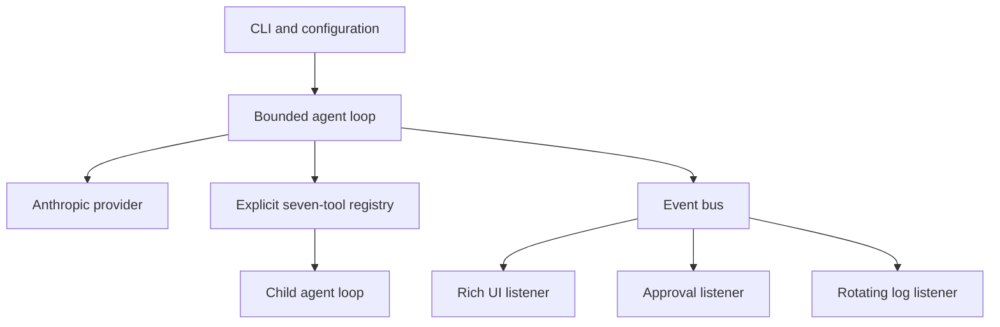

# Nano Agent Architecture

This reference describes the code under [`../code/`](../code/). The lesson remains the main teaching document.

## System shape



Nano Agent is one async Python process. It has no server, database, worker queue, or persistent session store.

## Components

### CLI and configuration

`main.py` loads YAML configuration, applies environment and CLI overrides, creates the provider and event listeners, then starts the REPL.

Configuration precedence is:

1. CLI flags
2. `NANO_AGENT_MODEL` for the model only
3. YAML config
4. defaults in `AgentConfig`

The current settings are:

| Setting | Default |
| --- | --- |
| `model` | `claude-sonnet-4-6` |
| `max_tokens` | `16000` |
| `max_turns` | `20` |
| `thinking_mode` | `adaptive` |
| `thinking_budget_tokens` | unset |
| `skip_approval` | `false` |

### Agent loop

`agent.py` owns in-memory conversation history. For each user request it makes at most `max_turns` provider calls. Each response either ends the request or asks for tools.

Regular tools run sequentially. Multiple approved `spawn_agent` calls from the same model response run concurrently with `asyncio.gather()`.

Each child receives:

- a new message history
- a new event bus
- the parent's provider and system prompt
- the parent's `max_turns`
- all normal tools except `spawn_agent`

The parent asks for approval before starting each child. Once started, child tool calls auto-approve. Children cannot create more children.

### Provider

`providers/base.py` defines one async `send()` interface and normalized text, tool-use, and thinking blocks.

`providers/anthropic.py` maps that interface to the Anthropic Messages API. Thinking can be `adaptive`, manual `enabled`, or `disabled`. API failures become `ProviderError` so the REPL can display the error and continue.

### Tool registry

`tools/__init__.py` imports each tool function and schema, then returns a plain dictionary. The seven registered names are:

1. `read_file`
2. `edit_file`
3. `write_file`
4. `find_files`
5. `list_directory`
6. `run_bash`
7. `spawn_agent`

There are no decorators, plugins, or automatic module scans.

### Events and listeners

`events.py` defines the event bus and the `Thinking`, `PreToolUse`, `PostToolUse`, `Stop`, `SubagentStart`, and `SubagentStop` events.

Listeners provide three effects:

- `ui.py` renders terminal output
- `approval.py` approves or denies parent tool calls
- `logging.py` writes a rotating local event log

The loop emits events but does not import Rich or Python logging.

## Safety boundaries

The implemented controls are:

- approval before every parent tool call
- no recursive subagent spawning
- a positive, configurable model-call limit for parent and child requests
- a configurable shell-command timeout, which defaults to 30 seconds
- truncated file-read and shell-command output

The controls do not provide:

- a filesystem boundary
- a shell sandbox
- network isolation
- persistent audit storage
- context compaction

`run_bash` can execute any command allowed by the current operating-system user. Approving `spawn_agent` lets that child use its normal tools without more prompts.

## Verification

All automated tests are credential-free. They mock the Anthropic client and cover the loop, turn limit, approval paths, child behavior, config validation, provider request mapping, tools, events, and listeners.

From [`../code/`](../code/):

```bash
uv run pytest
```
