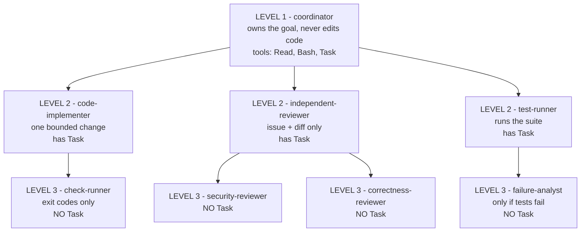
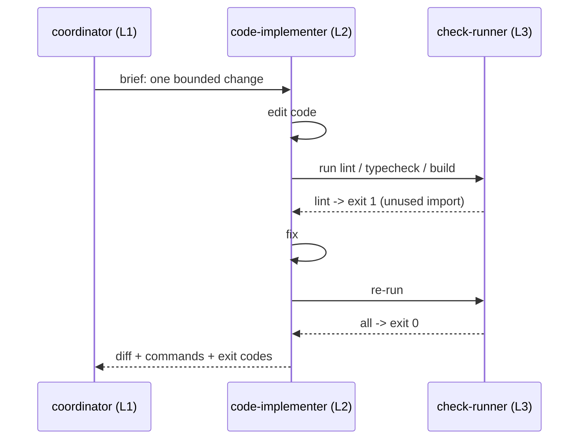
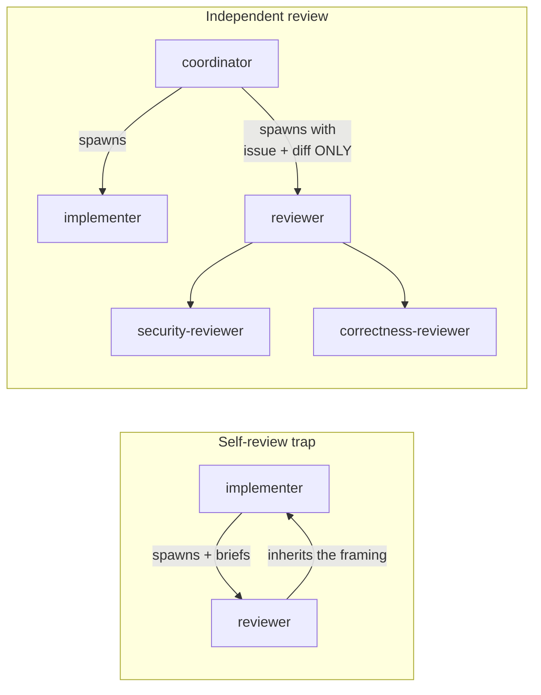
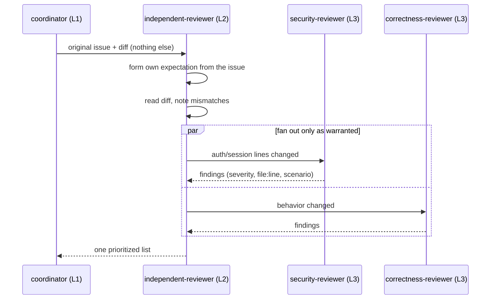
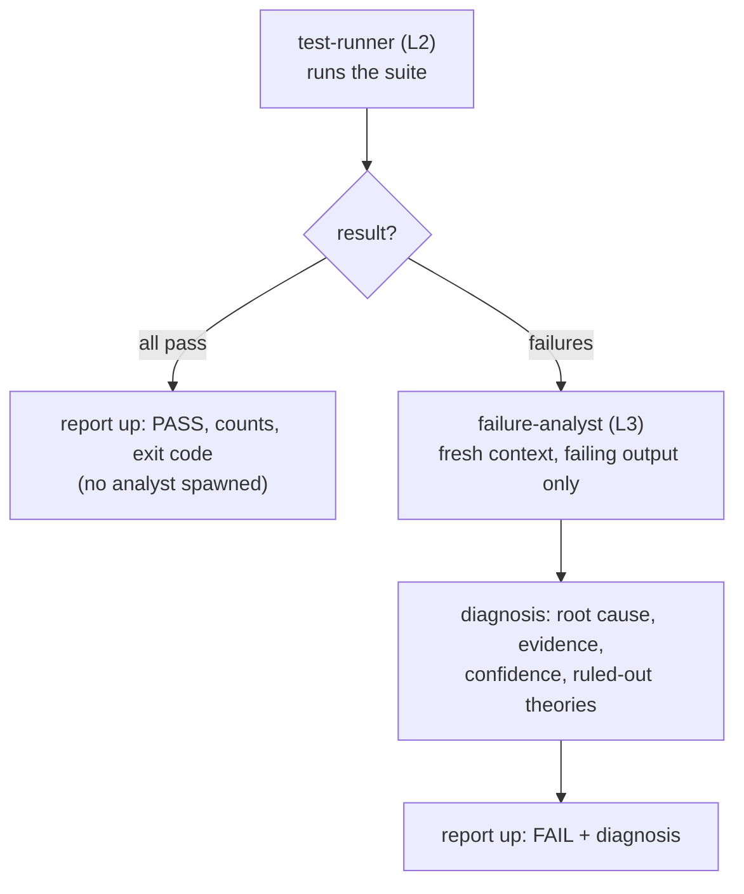
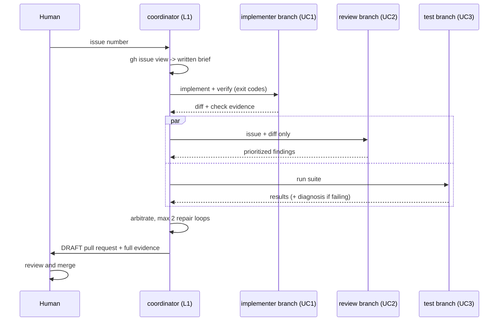
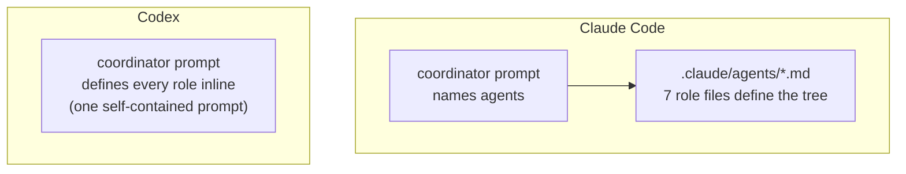

# Nested subagents in Claude Code: one agent, one concern

If you have run long Claude Code sessions, you have probably noticed two things. First, the session that wrote the code is a poor reviewer of that code. It agrees with itself, because it carries all the assumptions that produced the change. Second, by the time you are debugging a failing test, the context window is full of implementation detail that has nothing to do with the failure, and answers get worse.

Claude Code now lets subagents spawn their own subagents, up to five levels deep. This lesson covers what actually changed, the one pattern that makes it useful, and three concrete use cases. Each use case has a diagram and a prompt you can paste into a project today. By the end you will have a pipeline that takes a GitHub issue to a reviewed, tested draft pull request, plus the same pipeline ported to Codex as one self-contained prompt.

All prompts assume the six agent files from the companion repo are installed in your project's `.claude/agents/` directory: `code-implementer`, `check-runner`, `independent-reviewer`, `security-reviewer`, `correctness-reviewer`, `test-runner`, plus `failure-analyst`.

## What actually changed

The change is one tool in one list. Agents in Claude Code spawn other agents with the Task tool. Until now, the Task tool was stripped out of every subagent's toolset, so a subagent could never delegate. That was the recursion blocker. Now a subagent can have the Task tool. If `Task` is in its tools list, it can spawn subagents. If it is not, it cannot.

Boris Cherny, who leads Claude Code at Anthropic, shipped this on June 9th with a cap of five levels. His stated reason matters: context management, not parallelism. Each subagent gets a fresh context window, does its work, and returns only a summary to its parent. The parent never sees the noise.

```markdown
---
name: my-subagent
tools: Read, Grep, Glob, Task   # can delegate
---
```

```markdown
---
name: my-leaf-agent
tools: Read, Grep, Glob         # cannot delegate, ever
---
```

That tools line is the entire feature, and it is also the entire safety model. You decide which agents can spawn, in config, before Claude ever enforces its cap.

## The pattern: three levels, evidence flows up

The valuable part of nesting is not recursion. It is this: each agent owns one clean concern, and evidence flows upward.

An agent does its best work when everything in its context is relevant to the one thing it is doing. A reviewer that only reviews. A debugger chasing one theory. Same model, better output, because the context is clean. Nesting lets you build that focus at every level of a tree.

Three levels is enough. Five looks theatrical and costs more.



| Level | Role | Job |
|---|---|---|
| 1 | Coordinator | Manage the overall work: sequence, arbitrate, escalate |
| 2 | Workers | Do the actual work: implement, review, test |
| 3 | Leaves | One narrow subtask each. No Task tool, so they cannot spawn |

Two rules keep the tree honest:

1. **Leaves cannot spawn.** Level 3 agents do not get the Task tool. A leaf that can spawn turns your tree into a bush and your token bill into a surprise.
2. **Evidence, not opinions, moves up.** Exit codes, diffs, findings with file and line numbers, pass and fail counts. "Looks good" is not evidence.

The three use cases below are the three branches of this tree. Each one is useful on its own.

## Use case 1: nested verification

The point: the implementer never gets to say "done" on its own authority. It delegates deterministic checks to a leaf agent and reports exit codes.

Here is the flow on a real change. The implementer edits a pagination function. Before reporting back, it spawns the check-runner, which runs lint, typecheck, and build. Lint exits 1 because of an unused import. The implementer fixes it and spawns the check-runner again. Everything exits 0. Only now does the implementer report: the diff, the files touched, and the exact commands with their exit codes.



The check-runner is deliberately dumb. It runs commands and reports exit codes. It does not fix, interpret, or improve anything. That is what makes its report trustworthy: pass or fail is decided by the shell, not by a model's opinion. The principle carries over from scripted workflows: agents decide, scripts verify.

> **Prompt - nested verification**

```text
Spawn the code-implementer subagent with this brief:

<describe ONE bounded change, e.g. "Fix the off-by-one in
src/pagination.ts so the last page is included. Out of scope:
anything else in that file.">

The implementer must run lint, typecheck, and build via the
check-runner subagent before reporting back, and its report must
include the exact commands and exit codes. Do not accept "checks
passed" without exit codes.
```

## Use case 2: independent review with specialist fan-out

The point: the reviewer is spawned by the coordinator, not by the implementer, and it is briefed with only the issue and the diff. Never the implementer's notes.

Why this matters: a reviewer briefed by the thing it is auditing inherits its assumptions. It catches typos and misses wrong approaches. Independence is the property you are paying extra tokens for. The most convincing run is a small PR where the reviewer finds something the implementer missed; that is when the cost stops looking like ceremony.



The fan-out is the nested part. The reviewer reads the diff and decides which specialists it actually warrants. Say the issue asks for a "remember me" checkbox on login. The diff touches session handling and an input field, so the reviewer spawns the security-reviewer (auth changed) and the correctness-reviewer (behavior changed). It would not spawn either for a README fix. Each specialist gets a clean context and one narrow question, which beats one giant reviewer prompt trying to hold every concern in its head. The reviewer then merges its own findings with theirs into one prioritized list: severity, file and line, evidence.



> **Prompt - independent review**

```text
I have a diff ready for review. Spawn the independent-reviewer
subagent and brief it with ONLY these two inputs:

1. The original issue text (pasted below).
2. The output of `git diff main`.

Do not pass it any implementation notes or reasoning. The reviewer
should decide which specialist subagents (security-reviewer,
correctness-reviewer) the diff actually warrants, spawn only those,
and return one prioritized list of findings with severity
(CRITICAL / WARN / NIT), file:line, and evidence.

Issue:
<paste issue text>
```

## Use case 3: test triage that only pays for failure

The point: the test-runner spawns its specialist conditionally. Tests pass, no analyst, no extra cost. Tests fail, a fresh-context debugger chases the root cause.

This is the use case that shows nesting is a decision, not a structure. Walk through a failing run: the test-runner executes the suite and gets 2 failures out of 148. It spawns the failure-analyst with just the failing test names and output. The analyst, starting clean, forms two or three theories (code bug, test bug, environment), reads the code under test, and reports the most likely root cause with its confidence and the theories it ruled out. The test-runner passes that diagnosis up. It does not fix anything, and it does not re-run flaky tests until they pass and call the suite green.



> **Prompt - test triage**

```text
Spawn the test-runner subagent to run the full test suite.

Rules:
- Report the runner command, exit code, and pass/fail counts.
- If anything fails, spawn the failure-analyst subagent with the
  failing test names and output, and include its root-cause
  diagnosis, confidence level, and ruled-out theories in the report.
- Do not fix anything. One retry maximum for a suspected flake, and
  say that you retried.
```

## Putting it together: GitHub issue to draft PR

The three use cases are branches of one tree. The coordinator runs them in sequence: brief the implementer (use case 1), then run review and tests in parallel (use cases 2 and 3), then arbitrate. Critical findings go back to the implementer with evidence, for at most two repair loops. When everything is clean, the coordinator opens a draft PR. Draft, because merging stays with the human, and that gate is structural, not polite.



> **Prompt - full pipeline**

```text
You are coordinating an issue-to-PR pipeline. You manage the work,
you never edit code yourself. Use the project subagents by name.

1. BRIEF - Fetch GitHub issue #<N> with `gh issue view <N>`. Write a
   short implementation brief: goal, likely files, what is out of
   scope.

2. IMPLEMENT - Spawn the code-implementer subagent with the brief.
   It must verify via the check-runner before reporting back.

3. VERIFY (parallel, once the diff is ready):
   a. Spawn the independent-reviewer with ONLY the issue and the
      diff. Never the implementer's notes.
   b. Spawn the test-runner to run the suite.

4. ARBITRATE - Send any CRITICAL finding (with evidence) back to the
   code-implementer, then re-verify. Maximum 2 repair loops, then
   stop and escalate to me.

5. SHIP - When clean, open a DRAFT pull request with
   `gh pr create --draft`. Include what changed, the review findings
   (resolved ones too), and the test results. Never merge.

Hard rule: stop and ask me before touching auth, billing,
permissions, deployments, or migrations.
```

Notice what flows up at every step: the implementer returns a diff plus exit codes, the specialists return narrow findings, the test-runner returns counts and a diagnosis, and the coordinator arbitrates on evidence. Nothing above a node needs to see the work below it, only the proof.

## The same pipeline in Codex

The point: the pattern is portable because it never depended on Claude Code. It depended on three ideas (nested verification, independent review, conditional triage), and those travel in a single prompt.

The difference is where the tree is defined. In Claude Code, each role lives in its own file under `.claude/agents/`, and the coordinator prompt just names them. In Codex, there are no installed agent files: the coordinator prompt carries the whole tree, describing each role inline and telling the coordinator when to spawn it.



Three deliberate differences from the Claude Code version, all visible in the prompt:

1. **One repair loop, not two.** Tighter budget; if it is still failing after one round of fixes, a human should look.
2. **No PR at the end.** The pipeline ends in a final report (what changed, the subagent tree used, findings, exit codes, remaining risks, ready-or-not). Opening the PR is a separate, explicit instruction.
3. **A hard stop if nesting is blocked.** If Codex's configuration does not allow a subagent to spawn, the coordinator must report the exact boundary instead of silently flattening the tree into one big session. A flattened tree quietly loses the independence you were paying for, so a loud failure beats a quiet downgrade.

> **Prompt - full pipeline in Codex**

```text
You are the coordinator for an issue-to-PR workflow.

I will give you a ticket below. Your job is to coordinate the work
using nested subagents. You should not do the implementation yourself
unless subagents are unavailable.

TICKET:
<paste ticket here>

Workflow:

1. BRIEF
Read the ticket and inspect the repository enough to write a short
implementation brief:
- goal
- likely files/modules involved
- explicit non-goals
- risks or unknowns

2. IMPLEMENT
Spawn one implementation subagent.

The implementer should:
- read the brief
- inspect the relevant code
- make the smallest complete change
- run deterministic checks if available: lint, typecheck, build,
  relevant tests
- report files changed, commands run, exit codes, and any uncertainty

3. INDEPENDENT REVIEW
After the implementer reports back, get the diff.

Spawn one independent reviewer subagent.

Important: brief the reviewer with ONLY:
- the original ticket
- the implementation diff

Do not include the implementer's notes, reasoning, or summary.

The independent reviewer must itself fan out to fine-grained nested
reviewers as needed:
- security reviewer: auth, permissions, secrets, injection, unsafe
  input
- correctness reviewer: logic bugs, edge cases, broken contracts,
  regressions
- test coverage reviewer: missing or weak tests, untested behavior

The independent reviewer should spawn only the specialist reviewers
that are relevant to the diff, wait for them, then synthesize their
findings.

4. TEST
Spawn a separate test-runner subagent to run the relevant test suite.

If tests fail, the test-runner may spawn a nested failure-analyst
subagent to diagnose the likely root cause. The failure-analyst must
not edit code.

5. ARBITRATE
Collect:
- implementer summary
- independent reviewer findings
- nested specialist reviewer findings
- test results

If there are CRITICAL findings or failing tests:
- send the concrete findings back to the implementer
- allow one repair loop
- rerun review/tests afterward

Maximum repair loops: 1.

6. FINAL REPORT
Do not open or merge a PR unless I explicitly ask.

Return:
- what changed
- files touched
- subagent tree used
- nested agents spawned
- review findings
- test/check results with commands and exit codes
- remaining risks
- whether this is ready for a PR

Hard stops:
- If the change touches auth, billing, permissions, secrets,
  migrations, or deployment config, stop and ask me before editing.
- If nested subagent spawning is blocked by configuration, stop and
  report the exact boundary instead of silently flattening the
  workflow.
```

One addition worth noticing: this version asks the reviewer to consider a third specialist, a test coverage reviewer, for missing or weak tests. The fan-out list is yours to extend; the rule stays the same, spawn only what the diff warrants.

## When this is not worth it

The obvious wrong conclusion from all of this is "more agents means better results." It does not, and naive nesting mostly buys you a bigger token bill.

- Small task, short session: a flat agent is fine. Keep your money.
- Vague goal ("improve this codebase"): no tree saves you. Narrow the question first.
- Parallel work on the same repo without collisions: that is not a nesting problem, that is git worktrees.

The tree earns its cost when the work has genuinely separable concerns (implementation, independent review, testing) and when being wrong is expensive. The goal was never cost per token. It is cost per reliable change.

## Try it

Ten minutes, two steps, in a clean Claude Code session:

1. Verify the depth cap yourself before trusting it:

```text
I want to test the nested subagent depth limit empirically.

Spawn a subagent with this exact instruction, passing DEPTH=1:

"You are at depth DEPTH. Report 'alive at depth DEPTH'. Then attempt
to spawn one subagent with this same instruction, passing DEPTH+1.
If spawning fails or is blocked, report exactly what error you
observed, then stop."

Afterwards, report the maximum depth reached and what happened at
the boundary. Do not do anything else.
```

2. Copy the agent files into `.claude/agents/`, pick a small real issue, and run the use case 2 prompt against an existing diff. Then run `/usage` and look at what the review cost you.

You came in with a session that reviews its own work and debugs with a polluted context. You now have three patterns that fix that, one tree that combines them, and a number that tells you whether it was worth it.
