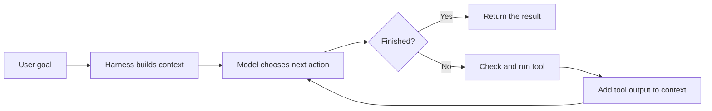
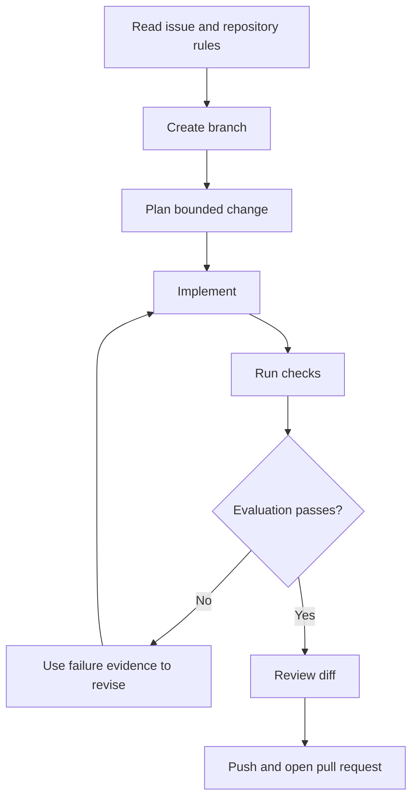

# Harness Engineering: Building a Custom Pi Agent Workflow

A model can suggest the next action. A harness turns that suggestion into work.

In this lesson we will build that mental model from a small Python example,
then use it to design a reliable workflow for Pi. The goal is not to build a
complete coding agent. It is to understand the parts you need, why they exist,
and how to add them in the right order.

## The opening

Coding agents can look complicated because production tools contain years of
accumulated features. Strip those features away and the centre is small:

> A coding agent is a model inside a loop with tools, context, and rules.

This repository includes a working teaching example in
[`code/nano-harness.py`](./code/nano-harness.py). It is about 300 lines, uses
three tools, and exposes the main control flow without hiding it behind a
framework.

## Model and harness

The model and the harness have different jobs.

| Part | Responsibility |
| --- | --- |
| Model | Read the current context and decide what should happen next. |
| Harness | Provide context, execute tools, enforce rules, and return results. |

The model does not edit a file or run a command by itself. It returns a
structured request. The harness decides whether that request is allowed,
executes it, and records the result.



That loop is the foundation. Context management, subagents, permissions, and
user interfaces sit around it.

## Read the sample in this order

Open [`code/nano-harness.py`](./code/nano-harness.py) and follow its labelled
sections from top to bottom.

### 1. The system prompt

The system prompt tells the model what role it has, where it is working, which
tools exist, and how those tools should be used.

The sample includes the current working directory, platform, shell, and a few
tool rules. A production harness normally adds project instructions, Git state,
recent files, and session policy dynamically.

The useful rule is simple: include context that changes the next decision. Do
not add text just because it is available.

### 2. Tool definitions

The sample exposes three tools:

- `bash` runs a shell command.
- `read_file` returns numbered lines from a file.
- `edit_file` performs one exact text replacement.

Each definition is a JSON schema. The model sees the tool name, description,
and accepted arguments. The Python function `run_tool()` maps a model request
to real code.

The structured read and edit tools are deliberately narrow. They give the
model clearer feedback and give the harness an action it can inspect before it
runs. A real coding harness often adds search, file creation, browser tools,
and tools loaded from MCP servers.

### 3. Events and hooks

The sample emits events before and after important actions. Listeners can
display output, record telemetry, or reject a tool call.

The approval listener is a hook because it can veto a `pre_tool` event. The
agent loop does not need to know how approval works. It only asks the event
system whether execution may continue.

This separation matters when the same loop needs to run in a terminal, a test,
or another interface.

### 4. Prompt caching

The request marks stable system and tool content as cacheable. On supported
model APIs this can avoid processing the same prefix again on later turns.

Caching depends on the provider, model, request shape, and cache policy. Treat
it as an optimisation to measure, not a guaranteed saving. Correct behaviour
must not depend on a cache hit.

### 5. The agent loop

The control flow can be written as eight steps:

1. Send the current messages to the model.
2. Store the assistant response.
3. Display any text blocks.
4. Return when the model reports `end_turn`.
5. Inspect each requested tool call.
6. Ask pre-tool listeners whether it is allowed.
7. Run the tool and record its result.
8. Add all tool results to the messages and repeat.

The important detail is the feedback step. Without the tool result, the model
does not know what changed and cannot make a grounded next decision.

### 6. The REPL

The final loop accepts another user goal while keeping the existing message
history. That gives the session short-term memory. Press Ctrl-C to exit.

## Run the nano harness

You need Python 3.12 or newer, `uv`, and an Anthropic API key.

From the repository root:

```bash
cd tutorials/pi-agent-workflow/code
cp .env.example .env
```

Edit `.env` and replace the placeholder key. You may also change
`ANTHROPIC_MODEL` to a model available to your account.

Run the harness:

```bash
uv run nano-harness.py
```

Try a contained goal first:

```text
Read README.md and explain the three tools in this harness.
```

The harness asks for approval before every tool call. Read the command or file
operation before entering `y`.

Run the offline tests without installing the model SDK:

```bash
python3 -m unittest discover -s tests -v
```

Reset the local configuration:

```bash
rm .env
```

The `.env` file is ignored by Git. Never commit a real API key.

## What the sample leaves out

The sample is useful because its boundaries are visible. It does not provide:

- context compaction for long sessions
- durable session storage
- retry and rate-limit handling
- a sandbox or a detailed permission policy
- automatic Git branch management
- subagents with isolated context
- model-provider abstraction
- evaluation, tracing, or token accounting

These are not details to hide. They are the next design decisions.

## Work backward from behaviour

Do not begin by copying every feature from a mature agent. Start with the
behaviour you want and add the smallest control that produces it.

| Desired behaviour | Harness feature |
| --- | --- |
| The agent follows repository rules | Load project instructions into context. |
| Dangerous commands require consent | Add a pre-tool approval hook. |
| Long tasks keep the main context focused | Delegate bounded work to subagents. |
| Work stops when verification fails | Add a test gate before delivery. |
| Failures are explainable | Record events and tool results. |
| Repeated work stays consistent | Package the workflow as an extension or skill. |

This keeps the harness small enough to understand. Every component has a job
you can observe and test.

## Turn the loop into a Pi workflow

The video workflow takes a GitHub issue through implementation and evaluation.
The Pi extension lives in the
[`pbe-harness` directory](https://github.com/owainlewis/pi-extensions/tree/main/extensions/pbe-harness).

The workflow is a larger state machine around the same agent loop:



Each transition should have an observable result. A branch exists. A check
returns an exit code. A review reports findings. A pull request has a URL.

### Configure the workflow

Before running an extension like this, decide:

1. Which repository instructions it must load.
2. Which commands prove the change works.
3. Which tools require approval.
4. How many repair attempts are allowed.
5. What evidence must appear in the pull request.

Those choices are part of the harness. Leaving them implicit makes the result
harder to repeat and harder to debug.

### Keep evaluation separate

Implementation and evaluation have different goals. The implementer tries to
make the change work. The evaluator tries to find evidence that it does not.

A useful evaluation gate checks:

- the issue acceptance criteria
- relevant automated tests
- formatting and static checks
- unintended changes in the diff
- missing setup or reset instructions

When the gate fails, pass the exact evidence back into the next loop. Do not
replace a failing test with a vague request to try again.

## Common failure modes

### The agent repeats itself

Check whether tool results are being appended to the next model request. Also
check that errors contain enough detail for the model to choose a different
action.

### The agent edits the wrong file

Include the working directory and repository layout in context. Use explicit
paths in instructions and make file tools return the path they changed.

### Approval becomes noise

Classify actions instead of treating every action equally. Read-only commands
can often run automatically. Destructive or external actions need stronger
gates.

### The context grows without limit

Persist the full event history outside the model context. Summarise older
turns, keep recent tool results verbatim, and retain decisions that affect the
remaining task.

### The workflow says it is done too early

Make completion a harness decision. Require the documented checks, a clean
diff review, and the expected delivery artifact before the workflow can end.

## What to try next

1. Run the offline tests and read the four behaviours they cover.
2. Run the harness with a safe reading task.
3. Add one event listener that records tool names to a list.
4. Add one test for that listener.
5. Write down the acceptance gate for a real repository task before automating
   it in Pi.

For deeper background, use the optional
[`harness engineering reference`](./resources/docs/harness-engineering-reference.md)
and the [browser slide deck](./resources/slides/index.html). The lesson above
contains the complete path needed to understand and run the sample.

## License

The tutorial and sample code are licensed under the [MIT License](../../LICENSE).
