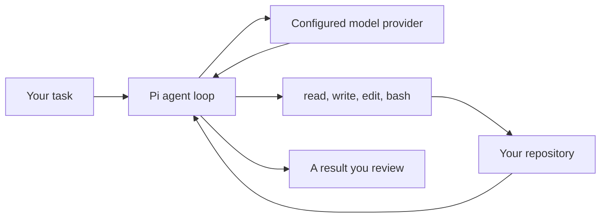
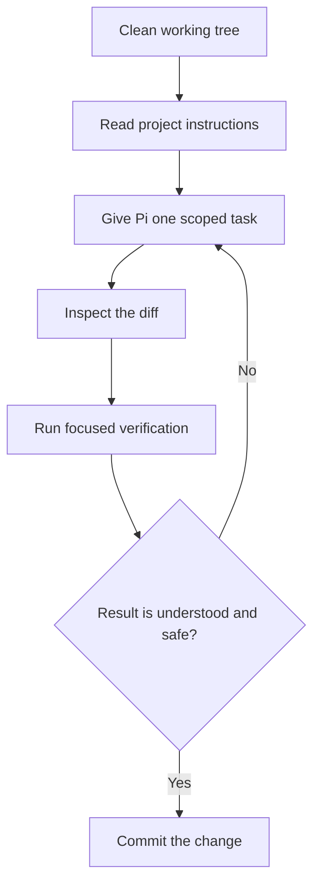

# Pi Coding Agent (Full Course)

Source check: 4 August 2026. The commands in this lesson were checked against
Pi 0.83.0 and the upstream documentation at commit
[`588915e`](https://github.com/earendil-works/pi/commit/588915ec71714688cee8b7153339e8bdebb3e82e).
Pi changes quickly, so use the linked upstream docs when a provider, model, or
command behaves differently.

## Opening Script

This video is a full course on the Pi coding agent. By the end, you will know
how Pi works, how to use it on a real project, and how to decide whether it
belongs in your coding workflow. Pi is deliberately small. It gives the model
four file and shell tools, then lets you add the rest through context files,
skills, prompt templates, extensions, and packages. That control is useful, but
it also means you need to understand the safety and cost boundaries yourself.
We will install Pi, configure one provider, use the core workflow, then add only
the customisation that solves a real problem. The lesson and examples are
linked for free in the description below. So, let's get into it.

## Before You Install Pi

Pi is a terminal coding agent. You start it inside a repository, give it a
task, and let the model inspect files, run commands, and edit code.

The useful distinction is between the agent loop and the model:



Pi coordinates the conversation, tools, session history, and user interface.
The provider runs the model and controls authentication, quotas, billing, model
availability, and some usage accounting. Changing model does not change Pi's
tools. Changing provider can change model behaviour, context limits, caching,
and how costs are reported.

Pi is a good fit when you want a small open source base and are willing to
configure the workflow yourself. It is a weaker fit when you want a highly
managed product with the same permissions and integrations on every project.

## Install It Once

This lesson uses one setup path: npm for installation and Pi's interactive
login flow for provider configuration.

Pi 0.83.0 requires Node.js 22.19.0 or newer. Check your current version:

```bash
node --version
npm --version
```

Install the current Pi release:

```bash
npm install -g --ignore-scripts @earendil-works/pi-coding-agent
```

The package moved from the `@mariozechner` scope to `@earendil-works`. Old
tutorials and extensions may still show the former name. Use the current name.

Confirm the CLI is available without sending code to a model:

```bash
pi --version
pi --help
```

The expected result is a version followed by the CLI help. The version can be
newer than the one used for this source check.

## Configure One Provider

Start Pi inside a repository you are happy for an agent to inspect:

```bash
cd /path/to/your/project
pi
```

Inside Pi, run:

```text
/login
```

Choose a provider you already use and follow its authentication flow. Then run:

```text
/model
```

Choose a model available to that account. This keeps the model choice
configurable rather than baking a model ID into a file that will age.

Provider support is not uniform. Some providers accept a subscription login.
Others use an API key or cloud credentials. Provider terms and supported login
methods can change. The current list and exact environment variables live in
Pi's [provider documentation](https://github.com/earendil-works/pi/blob/main/packages/coding-agent/docs/providers.md).

Do not put an API key in `AGENTS.md`, a prompt, a settings file committed to the
repository, or one of these tutorial examples.

## Run a Small First Task

Start with a read-only request that proves Pi has the right context:

```text
Explain this repository's purpose, its main entry points, and the commands used
to test it. Read the project instructions before answering. Do not edit files.
```

Check the response against the repository. A coding agent can sound confident
while reading the wrong file or guessing a command.

Then give it one small change:

```text
Add one focused test for <behaviour>. Run the smallest relevant test command.
Show me the diff and explain any remaining uncertainty.
```

The basic workflow is:

1. Start in a clean Git working tree.
2. Give Pi one bounded task.
3. Let it inspect before it edits.
4. Read the diff.
5. Run the relevant checks yourself.
6. Commit only the change you understand.

Pi can execute `bash`. That means it can run any command available to your user.
The model is not a security boundary. Use a container, virtual machine, or
restricted account when the repository or commands are untrusted.

## The Core Interface

You do not need to memorise every command. These cover the normal workflow:

| Command or key | What it does |
| --- | --- |
| `/model` | Choose an available provider and model. |
| `/session` | Inspect session metadata, tokens, and reported cost. |
| `/tree` | Move to an earlier point in the session tree. |
| `/compact` | Summarise older context when the session is too large. |
| `/new` | Start a fresh session. |
| `/reload` | Reload project instructions and custom resources. |
| `/hotkeys` | Show the shortcuts supported by the installed version. |
| `@` | Find and attach a project file. |
| `!command` | Run a shell command and include its output in context. |
| `Escape` | Stop the current agent operation. |

Use `/hotkeys` as the source of truth for keyboard shortcuts. Shortcut mappings
have changed between Pi releases, so this lesson avoids duplicating the full
list.

## Give Pi Project Context

Pi loads `AGENTS.md` or `CLAUDE.md` while walking from the current directory up
through its parents. Use these files for facts the agent needs on most tasks:

- project purpose and important boundaries
- install, test, lint, and build commands
- naming and style rules
- files that are generated or must not be edited
- safety rules specific to the repository

Keep instructions concrete. This is useful:

```md
# Project instructions

- Run `npm test` after changing application code.
- Never edit files under `generated/`.
- Keep API handlers under `src/http/`.
- Ask before running a database migration.
```

This is not useful:

```md
Write excellent, production-ready code using best practices.
```

The repository includes an optional
[`AGENTS.md` example](./resources/pi/AGENTS.md). Copy the ideas that match your
project. Do not copy rules you cannot enforce or commands that do not exist.

## Add Customisation in the Right Order

The weak default is to install a large extension bundle before you know what
problem it solves. Start with Pi's built-in tools. Add one layer when repeated
work shows a real gap.

| Need | Use | Why |
| --- | --- | --- |
| Stable project facts | `AGENTS.md` | Loaded as project context. |
| A reusable prompt | Prompt template | Expands into a normal user request. |
| A repeatable method | Skill | Loads instructions when relevant. |
| New behaviour or a tool | Extension | Runs TypeScript with full user access. |
| A custom or local model endpoint | `models.json` | Describes the provider API and models. |

### Append Rules Without Replacing the Defaults

Pi reads project-level additions from `.pi/APPEND_SYSTEM.md`. From this tutorial
directory, inspect the optional example at
[`resources/02-configuration/APPEND_SYSTEM.md`](./resources/02-configuration/APPEND_SYSTEM.md).

To try it in another project:

```bash
cd /path/to/your/project
mkdir -p .pi
cp /path/to/youtube-tutorials/tutorials/pi-coding-agent-guide/resources/02-configuration/APPEND_SYSTEM.md .pi/APPEND_SYSTEM.md
pi
```

Use `APPEND_SYSTEM.md` for a small set of rules. Replacing the complete system
prompt is a larger change because you become responsible for behaviour the
default prompt previously supplied.

### Use a Skill for a Repeatable Method

The example skill lives at
[`resources/04-skills/code-review/SKILL.md`](./resources/04-skills/code-review/SKILL.md).
Try it without installing anything globally:

```bash
cd /path/to/your/project
pi --skill /path/to/youtube-tutorials/tutorials/pi-coding-agent-guide/resources/04-skills/code-review
```

Inside Pi, invoke it explicitly:

```text
/skill:code-review
```

Skills are instructions, not a sandbox. A malicious skill can still persuade
the model to run harmful commands through Pi's tools. Review a skill before use.

### Use an Extension for Behaviour

Extensions are TypeScript modules. They can register commands, tools, event
handlers, and user-interface elements. They run with your operating system
permissions.

Try the permission-gate example from this tutorial's root:

```bash
cd /path/to/youtube-tutorials/tutorials/pi-coding-agent-guide
pi --extension resources/03-extensions/permission-gate.ts
```

The extension blocks a small set of dangerous command patterns and asks before
allowing them in the interactive interface. It is a teaching example, not a
complete command parser or sandbox. Commands can be written in ways its regular
expressions do not recognise.

Read the [extension examples](./resources/03-extensions/) before copying one
into a global Pi directory.

## Models and Providers Without Configuration Drift

Pi maintains built-in provider catalogs. Use `/model` to choose from the catalog
available in your installed release and `/scoped-models` to control which models
appear during cycling. This is more maintainable than committing today's model
IDs to a shared settings file.

Use `~/.pi/agent/models.json` only when you need a custom endpoint such as a
local OpenAI-compatible server or an internal proxy. The optional
[`models.json` example](./resources/02-configuration/models.json) uses a
placeholder model ID on purpose. Replace it with a model actually installed on
your server.

Custom providers differ in important ways:

- API shape can be OpenAI Completions, OpenAI Responses, Anthropic Messages, or
  another supported protocol.
- Some endpoints do not support every role, tool schema, image type, or
  reasoning option.
- Context and output limits must match the server, not a model name copied from
  another provider.
- Local servers can keep inference local, but extensions and shell tools can
  still access the network and filesystem.

Use Pi's [custom model documentation](https://github.com/earendil-works/pi/blob/main/packages/coding-agent/docs/models.md)
for the installed schema.

## What Pi's Cost Display Can and Cannot Tell You

Pi shows token usage and cost in the footer and under `/session`. Treat these as
session estimates, not an invoice.

The values depend on information from two places:

1. The provider reports token and cache usage.
2. Pi's model metadata supplies the rates used for cost calculation.

That creates real limits:

- Providers report cached input, reasoning tokens, failed requests, and nested
  calls differently.
- A subscription may use plan quota, paid extra usage, or provider credits.
  A dollar estimate cannot explain which allowance was charged.
- Gateways can add fees or apply different rates from the upstream model.
- A custom model with missing or stale cost metadata can show zero or the wrong
  estimate.
- Provider price changes can land before a local model catalog refresh.

For billing, use the provider's own usage and billing dashboard. For engineering
decisions, use Pi's display as a directional view of this session. The optional
[`provider and cost notes`](./resources/00-pricing/) record the sources and the
date checked without copying a price table that will drift.

## A Practical Daily Workflow

Here is the full workflow I would use on a normal repository:



The model is replaceable. The engineering loop is the durable part. Good
context, small scope, visible diffs, and independent verification matter with
every provider.

## Verify This Tutorial Without Credentials

From the repository root, run:

```bash
node tutorials/pi-coding-agent-guide/code/verify.mjs
```

Expected output:

```text
Pi tutorial resource checks passed.
```

The check parses the example JSON, verifies current package references, and
guards against embedded price tables and old package names. It does not call a
model or provider.

To prove the current CLI can install and start without changing this repository,
use a temporary npm prefix:

```bash
PI_TUTORIAL_TMP="$(mktemp -d)"
npm install --prefix "$PI_TUTORIAL_TMP" --ignore-scripts @earendil-works/pi-coding-agent
"$PI_TUTORIAL_TMP/node_modules/.bin/pi" --version
"$PI_TUTORIAL_TMP/node_modules/.bin/pi" --help
```

Remove that temporary directory when finished:

```bash
rm -r "$PI_TUTORIAL_TMP"
unset PI_TUTORIAL_TMP
```

## Reset the Main Setup

Log out inside Pi if you no longer want it to use a saved provider credential:

```text
/logout
```

Then uninstall the global CLI:

```bash
npm uninstall -g @earendil-works/pi-coding-agent
```

Project files under `.pi/` belong to the project. Review them before removing
anything. Session and authentication files under `~/.pi/agent/` may contain
useful history or credentials, so this tutorial does not delete that directory.

## References

- [Pi repository and main guide](https://github.com/earendil-works/pi/tree/main/packages/coding-agent)
- [Provider authentication](https://github.com/earendil-works/pi/blob/main/packages/coding-agent/docs/providers.md)
- [Settings reference](https://github.com/earendil-works/pi/blob/main/packages/coding-agent/docs/settings.md)
- [Custom model schema](https://github.com/earendil-works/pi/blob/main/packages/coding-agent/docs/models.md)
- [Extension API](https://github.com/earendil-works/pi/blob/main/packages/coding-agent/docs/extensions.md)
- [Skill format](https://github.com/earendil-works/pi/blob/main/packages/coding-agent/docs/skills.md)

## Summary

- Pi is a small coding-agent loop around model providers and four core tools.
- Start with the default workflow and one provider before adding customisation.
- Treat extensions as executable code with your full user permissions.
- Choose models through the live catalog instead of committing volatile IDs.
- Treat displayed cost as an estimate and use the provider dashboard for billing.
- Keep tasks small, inspect the diff, and verify the result independently.

This tutorial and its examples are licensed under the repository's
[MIT License](../../LICENSE).
