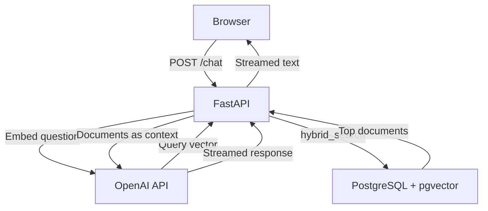

# PostgreSQL for RAG

Build a production RAG chatbot on PostgreSQL with pgvector - vector search, full-text search, and hybrid search using a database you already know and trust.

## What You'll Learn

- Set up PostgreSQL with pgvector using Docker
- Store and query embeddings with cosine distance and HNSW indexes
- Add full-text search with tsvector generated columns and GIN indexes
- Combine both into hybrid search using Reciprocal Rank Fusion (RRF)
- Build a streaming RAG chatbot with FastAPI, OpenAI, and PostgreSQL
- Understand when PostgreSQL is enough and when it is not

## Setup

```bash
git clone https://github.com/owainlewis/youtube-tutorials.git
cd youtube-tutorials/tutorials/postgresql-only-database-ai/code
uv sync
```

Copy `.env-sample` to `.env` and add your OpenAI API key:

```bash
cp .env-sample .env
```

Start PostgreSQL with pgvector:

```bash
docker compose up -d
```

Seed the database with sample documents:

```bash
uv run src/seed.py
```

Run the chatbot:

```bash
uv run fastapi dev src/main.py
```

Open [http://localhost:8000](http://localhost:8000).

## Chapters

1. [Why PostgreSQL for RAG](resources/docs/01-why-postgresql-for-ai.md) - A database you already know, trust, and run, and it handles the full RAG stack.
2. [Setup](resources/docs/02-setup.md) - Docker, pgvector extension, documents table, HNSW index.
3. [Vector Search](resources/docs/03-vector-search.md) - Cosine distance operator, similarity queries, metadata filtering.
4. [Full-Text Search](resources/docs/04-full-text-search.md) - tsvector generated columns, GIN indexes, websearch_to_tsquery.
5. [Hybrid Search](resources/docs/05-hybrid-search.md) - Reciprocal Rank Fusion function combining vector and full-text results.
6. [RAG Chatbot](resources/docs/06-rag-chatbot.md) - FastAPI backend, streaming responses, minimal chat UI.
7. [When to Use a Dedicated Vector DB](resources/docs/07-when-to-use-dedicated-vector-db.md) - Honest tradeoffs and decision framework.

## Project Files

| File | Description |
|------|-------------|
| `code/docker-compose.yml` | PostgreSQL 18 with pgvector, auto-runs SQL on first boot |
| `code/pyproject.toml` | Python project with FastAPI, psycopg, psycopg-pool, OpenAI dependencies |
| `code/.env-sample` | Template for OpenAI API key and database URL |
| `code/sql/01_setup.sql` | CREATE EXTENSION vector, documents table with fts column, HNSW + GIN indexes |
| `code/sql/02_vector_search.sql` | Reference: vector similarity query with cosine distance |
| `code/sql/03_full_text_search.sql` | Reference: full-text search query examples |
| `code/sql/04_hybrid_search.sql` | hybrid_search function with Reciprocal Rank Fusion |
| `code/sql/05_seed_data.sql` | Sample documents. Use `code/src/seed.py` for real embeddings. |
| `code/src/main.py` | FastAPI RAG chatbot. |
| `code/src/seed.py` | Embed and insert sample documents with OpenAI. |
| `code/src/static/index.html` | Minimal chat UI with streaming response display. |

## Architecture



## Prerequisites

- Python 3.12+ and [uv](https://docs.astral.sh/uv/)
- Docker (for PostgreSQL with pgvector)
- OpenAI API key (for embeddings and chat completions)
- Basic SQL knowledge (SELECT, WHERE, ORDER BY)

## License

MIT
