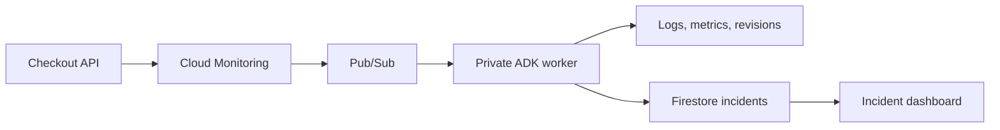

# OpenAI’s Agentic Software Factory

An agent can write a change quickly. Someone still has to decide whether it should merge, observe what happens after deployment, and investigate failures. This tutorial builds two small parts of that system: a PR review prompt and an incident triage service.

The examples are inspired by [The Pragmatic Engineer’s reporting](https://newsletter.pragmaticengineer.com/p/openai-software-factory). They are teaching implementations, not OpenAI’s internal tools.

## Decide which changes can merge

Use the [Assembler prompt](resources/prompts.md) in a Codex task attached to your Assembler checkout. It starts in dry-run mode. It reads open PRs, checks the current commit and CI, and explains which changes meet a deliberately narrow policy. Switch to live mode only when you want it to label and merge eligible PRs.

A risk label is a display of an assessment, not permanent permission. A new commit needs a new assessment. Passing tests and low risk are separate conditions. Authentication, database, infrastructure and deployment changes need human review in this example.

Talk through one documentation PR that qualifies, one application change that needs review, and one change with failing checks. The useful outcome is less routine review work while preserving a clear explanation of each decision.

## Investigate an alert

The second example is a synthetic checkout REST API on Cloud Run. It never takes a payment or stores an order. A revision-level configuration switch simulates a bad release that breaks checkout.



Cloud Monitoring sends open and closed incident notifications to Pub/Sub. An authenticated push invokes the private worker. The ADK agent uses Gemini through Vertex AI and calls three read-only tools. A second model pass formats the findings into a validated report. It has no shell, deployment or rollback tools.

The dashboard shows active incidents, likely cause, impact, evidence links, a recommended action and uncertainty. It records which evidence tools ran. Monitoring decides whether the incident recovered; the model does not decide that its recommendation worked.

All three services require Cloud Run IAM authentication. Only synthetic demo traffic belongs here. The dashboard exposes the demo investigation and evidence excerpts to its authorized viewers. Its evidence queries are restricted to the demo service; its project-level viewer permissions are broader than those queries. Use a dedicated project for adapting this to real workloads.

## Install and run locally

Prerequisites: Python 3.12+, uv, gcloud, a Google Cloud project with billing, and permission to create Cloud Run services and service accounts. From this tutorial’s directory:

```bash
uv venv /tmp/software-factory-venv --python 3.12
uv pip install --python /tmp/software-factory-venv/bin/python -r code/requirements.txt httpx pytest
cd code
/tmp/software-factory-venv/bin/python -m uvicorn app:app --port 8080
```

In another terminal:

```bash
curl http://localhost:8080/api/products
curl -X POST http://localhost:8080/api/checkout -H 'Content-Type: application/json' -d '{"product_id":"course","quantity":1}'
```

Expect a product list and an accepted synthetic checkout. To reproduce the failure locally, stop the server and restart it with `DEMO_FAILURE=true` before the same command. Checkout then returns HTTP 500. Health checks remain healthy because the process is still running.

## Deploy to Google Cloud

From `code/`, authenticate and deploy. Replace the project argument with your own billing-enabled project when following this tutorial.

```bash
gcloud auth login
python3 deploy.py --project personal-infrastructure-505708
```

The script creates three Cloud Run services in `europe-west2`, dedicated service identities, a named Firestore database, a Pub/Sub notification channel and subscription, an Artifact Registry repository and a metric alert policy. It prints the API and dashboard URLs. It uses existing gcloud authentication; there is no committed key or model API key. Gemini defaults to `gemini-2.5-flash`; use `--model` to choose an available Vertex model.

Deployments, builds, model calls, stored logs and Firestore operations can incur charges. Cloud Run scales to zero and each service is capped at two instances. The scripts do not change a project’s billing account or disable unrelated resources.

## Record the incident demo

Open the private dashboard through an authenticated proxy. Run this in a separate terminal and open http://localhost:8769:

```bash
gcloud run services proxy software-factory-dashboard --project personal-infrastructure-505708 --region europe-west2 --port 8769
```

Your signed-in identity needs Cloud Run invoker permission (the project owner already has it). The traffic script uses your gcloud identity token. From `code/`, establish a healthy baseline:

```bash
python3 demo.py traffic --project personal-infrastructure-505708 --seconds 90
```

Introduce the bad revision and keep requests flowing:

```bash
python3 demo.py break --project personal-infrastructure-505708
python3 demo.py traffic --project personal-infrastructure-505708 --seconds 300
```

Watch the error responses, the real Monitoring alert, and then the dashboard. It moves from Investigating to Triaged as the agent reads evidence. Metrics and alert delivery are not instant; allow several minutes. The alert counts server errors rather than estimating an error-rate percentage. The agent can compute impact only from the returned request counts and must state missing evidence.

Recovery is a human action. This command deploys the healthy configuration and routes traffic to it:

```bash
python3 demo.py recover --project personal-infrastructure-505708
python3 demo.py traffic --project personal-infrastructure-505708 --seconds 300
```

Alternatively restore traffic to a known healthy revision in the Cloud Run console. Keep traffic running to give Monitoring fresh data. Closed notifications move incidents into history. The policy treats missing error samples as inactive after its evaluation window, so closure can lag recovery by several minutes. Closed means the error alert cleared, not proof that every endpoint works; verify the successful checkout responses too. The dashboard stays open until Monitoring sends closure.

The fault is a controlled simulation, not a naturally discovered regression. Show the configuration change explicitly. Measure actual alert-to-report time during your recording rather than promising a fixed latency.

Talking points:

- The alert says a threshold was crossed. The agent gathers evidence for the response.
- Deployment correlation supports a hypothesis; it does not prove a root cause.
- The agent recommends an action. A human applies it.
- The model has no remediation tools. Permissions reinforce that boundary.
- Tests, observability and recovery procedures still need engineering work.

## Test without credentials

From `code/`:

```bash
python3 -m unittest discover -s tests -p 'test_domain.py' -v
/tmp/software-factory-venv/bin/python -m pytest tests -q
```

The standard-library suite verifies incident lifecycle behavior without packages or credentials. The full suite checks API requests, fault behavior, event validation, retries and recovery ordering using fake cloud and model boundaries. Live deployment is a separate check; offline tests do not prove IAM, model access or alert delivery.

## Reset and remove resources

Use `demo.py recover` to restore the API between recordings. Keep incident history for comparison. To remove this demo’s resources from `code/`:

```bash
python3 cleanup.py --project personal-infrastructure-505708 --confirm
```

Cleanup removes only the resources named by this tutorial, including stored incident history and container images. It does not disable APIs or delete the project. Stop any local traffic process and local server with Ctrl-C. Remove the temporary environment with `rm -rf /tmp/software-factory-venv` when no longer needed.

## Limits

This is a small demo, not an on-call replacement. Worker retries last up to the subscription’s one-hour retention. A failed investigation stays visible and deliveries retry; there is no paging escalation or dead-letter queue. Each investigation has a three-minute deadline and bounded model calls. In-memory ADK sessions are per investigation; durable incident state is stored in Firestore.

The next useful experiment is a different failure with the same interface: keep the tools unchanged and check whether the agent reaches a different explanation from different evidence.

## References

- [Google ADK Python](https://google.github.io/adk-docs/get-started/python/)
- [Monitoring notification channels](https://docs.cloud.google.com/monitoring/support/notification-options)
- [Codex scheduled tasks](https://developers.openai.com/codex/app/automations)

If you want to go deeper on building real software with AI agents, that is what I am building inside [AI Engineer](https://aiengineer.co).
