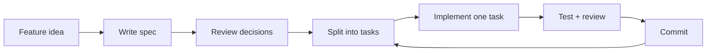

# Spec-Driven Development

Spec-driven development means you plan the work before you ask an AI agent to write code.

The spec is not a heavy process document.

It is a short, practical contract that tells the agent:

- what to build
- what not to build
- what constraints matter
- which files and patterns to follow
- how the work should be verified

The goal is simple:

> Make the decisions before the agent starts guessing.

## The Problem

You ask an agent to add authentication.

A minute later, you have code.

But it is not the code you wanted.

- It chose OAuth when you needed email and password.
- It installed a library you did not ask for.
- It put files in the wrong place.
- It added password reset, email verification, and role management.
- It changed unrelated routes.

Now you are reviewing decisions you never made.

That is the real failure mode.

The agent did not ignore you.

It filled in the gaps.

## The Basic Idea

Without a spec, the agent has to infer intent from a short prompt.

With a spec, the agent can follow explicit decisions.

Bad prompt:

```text
Add authentication to the app.
```

Better spec excerpt:

```text
Email and password auth using the existing user table.
JWT tokens stored in httpOnly cookies.
Login and signup pages only.
No password reset for v1.
Do not add OAuth.
Do not install new dependencies.
```

That small difference changes the job.

The agent is no longer inventing the feature.

It is implementing the feature you defined.

## Where Specs Fit

A spec is not the same thing as a PRD.

Different documents serve different jobs.

| Document | Audience | Job |
| --- | --- | --- |
| PRD | Product and stakeholders | Define the product value. |
| Design doc | Engineers | Define architecture and tradeoffs. |
| AI spec | Coding agent and reviewer | Define boundaries, tasks, and verification. |

The AI spec can include some product context and some technical context.

But its main job is action.

It should make the implementation small enough to execute and clear enough to review.

## The Workflow

The workflow is:



In practice:

1. Generate a first spec from a template.
2. Review it yourself.
3. Correct the scope, constraints, and tasks.
4. Run one task in a fresh agent session.
5. Verify the task.
6. Commit it.
7. Repeat.

The loop is:

```text
Spec -> Task -> Review -> Commit
```

Clean context matters.

When every task runs in a fresh session, the agent starts with the spec and the current repo instead of a long conversation full of stale assumptions.

## A Useful Spec Template

Use this as a starting point:

```markdown
# Feature Name

## Why

[1-2 sentences explaining the problem and why it matters now.]

## What

[Concrete deliverable.
Specific enough to verify when done.]

## Constraints

### Must

- [Required patterns, libraries, conventions]

### Must Not

- [No new dependencies unless specified]
- [Do not modify unrelated code]

### Out of Scope

- [Adjacent features we are explicitly not building]

## Current State

[What exists now.
This saves the agent from exploring blindly.]

- Relevant files: `path/to/file.ts`
- Existing patterns to follow

## Tasks

### T1: [Title]

What: [What to build]
Files: `path/to/file`, `path/to/test`
Verify: `command to run` or manual check

### T2: [Title]

What: ...
Files: ...
Verify: ...

## Validation

- `command to verify the full feature works`
- `npm test` or equivalent
- Manual check: [what to verify in UI/API]
```

The template is deliberately plain.

It is there to force decisions, not to create paperwork.

## Task Design

Good tasks are small, concrete, and verifiable.

Use this checklist:

| Rule | Why it matters |
| --- | --- |
| One task per session | Reduces context drift. |
| Small diff | Makes review possible. |
| Clear files | Keeps the agent from wandering. |
| Verification command | Gives the agent and reviewer proof. |
| Explicit out-of-scope list | Stops the agent adding adjacent features. |

If a task touches more than a few files, split it.

If a task has no verification step, improve the task before implementation.

## Example Spec

Here is a shortened spec for JWT authentication.

```markdown
# JWT Authentication

## Why

Users currently share a demo account.
We need individual accounts for billing.

## What

Register, login, and refresh token endpoints with JWT authentication.

## Constraints

### Must

- Use the existing Express structure.
- Use the existing user table.
- Store tokens in httpOnly cookies.
- Add tests for happy path and invalid credentials.

### Must Not

- Do not add OAuth.
- Do not add password reset.
- Do not change unrelated routes.
- Do not install new dependencies without approval.

### Out of Scope

- Email verification.
- Roles and permissions.
- User profile editing.

## Current State

- `src/routes/index.ts` registers API routes.
- `src/db/schema.ts` defines the user table.
- `src/lib/errors.ts` contains API error helpers.

## Tasks

### T1: Add password hashing helpers

What: Add helper functions for hashing and verifying passwords.
Files: `src/lib/password.ts`, `src/lib/password.test.ts`
Verify: `npm test -- password`

### T2: Create register endpoint

What: Add `POST /auth/register`.
Files: `src/routes/auth.ts`, `src/routes/auth.test.ts`
Verify: `npm test -- auth`

### T3: Create login endpoint

What: Add `POST /auth/login` and set the auth cookie.
Files: `src/routes/auth.ts`, `src/routes/auth.test.ts`
Verify: `npm test -- auth`

## Validation

- `npm test`
- Manual check: register, log in, refresh token, access protected route.
```

Notice what the spec does.

It does not tell the agent to "build auth".

It defines the first slice, the boundaries, and the proof.

## Planning Mode Is Not Enough

Many tools have planning mode.

That is useful, but it is not a replacement for a spec file.

A file has a few advantages:

- It can be reviewed before implementation.
- It can be committed with the code.
- It can be reused across fresh sessions.
- It can be attached to issues or PRs.
- It survives after the chat disappears.

Planning mode is a conversation.

A spec is an artifact.

You can use both.

Use planning mode to draft the spec, then save the final version as a file.

## This Is Not Waterfall

Spec-driven development does not mean writing a giant plan and refusing to change it.

It means writing down the current best decisions before code starts.

When the agent discovers something new, update the spec.

The spec is useful because it creates a clear place to change the plan.

Without it, the plan is scattered across chat messages, diffs, and guesses.

## When You Need More

A simple feature needs a simple spec.

A bigger feature may need more structure:

- architecture notes
- API contracts
- database migrations
- UI states
- error states
- rollout plan
- test matrix

Add those only when the work needs them.

The mistake is starting with complexity.

Start with the smallest spec that prevents the agent from guessing.

## Resources

This tutorial includes reusable command prompts and examples:

- [commands/spec.md](./commands/spec.md)
- [commands/task.md](./commands/task.md)
- [commands/review.md](./commands/review.md)
- [commands/commit.md](./commands/commit.md)
- [examples/jwt-authentication.md](./examples/jwt-authentication.md)
- [examples/hybrid-search.md](./examples/hybrid-search.md)
- [examples/streaming-chat.md](./examples/streaming-chat.md)
- [examples/youtube.md](./examples/youtube.md)

## Summary

The one thing to remember:

The spec is the context the agent would otherwise invent.

The honest limitation:

A bad spec creates bad work faster.

What to try next:

Before your next agent task, write a one-page spec with `Why`, `What`, `Must`, `Must Not`, `Tasks`, and `Validation`.
