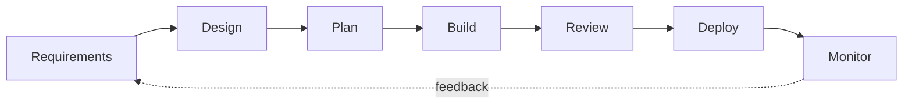

# Stop Vibe Coding: A Practical AI Development Workflow

AI coding tools can help across the software lifecycle. They can draft requirements, explore designs, break down work, write code, review changes, prepare deployment configuration, and analyse failures.

The tool does not own the engineering decision. You still need clear scope, verification, review, and approval at the points where mistakes become expensive.

This lesson shows a seven-stage workflow you can adapt to the risk of the change.

## The seven stages



The stages are not a promise that every project will be safe or successful. They are places to make decisions and collect evidence.

## 1. Requirements: what are we building?

Before writing code, get clear on the outcome, audience, constraints, and what is out of scope.

A short requirements document can be enough:

```text
What: User authentication system
Why: Users need accounts to save preferences
Who: End users of the web app
In scope: Email and password login, signup page
Out of scope: OAuth, password reset in v1, admin roles
Success checks: Documented login flow, tested failure cases,
and review against the project's security requirements
```

AI can help draft this document and point out unanswered questions. Treat its output as a proposal. The product owner still decides what should be built.

Small throwaway prototypes can help you test an interaction or technical assumption. Keep them separate from production code until you have reviewed what should carry forward.

## 2. Technical design: how are we building it?

Requirements describe what and why. Technical design describes how.

Decide the important constraints before implementation:

- database choice and data model
- application boundaries and deployment shape
- authentication and authorization approach
- failure handling and observability
- privacy, security, and compliance requirements
- tradeoffs that would be costly to reverse

Ask the agent to compare options and identify risks. Do not let it silently choose consequential architecture or security controls. Record the decision and the reason a person approved it.

## 3. Task breakdown: plan the work

Break the design into small, bounded tasks that can be implemented and reviewed independently.

Avoid a prompt such as:

```text
Build the whole application.
```

Prefer a task with concrete context and checks:

```text
Task: Add the login endpoint described in docs/auth-design.md.

Context:
- Follow the existing route pattern in app/routers/health.py.
- Use the project's existing session and authorization helpers.
- Do not change session semantics or add a new auth scheme.

Checks:
- Add tests for valid credentials, invalid credentials, locked users,
  and missing input.
- Run the focused auth tests and the repository's standard checks.
- Report any security decision that is not covered by the design.
```

Specific context reduces guessing. It does not guarantee a correct result, so keep the review and test steps.

You can also ask an agent to propose the work breakdown:

```text
Read the spec in .ai/specs/auth.md.

Propose independent work items that can be completed and reviewed
one at a time. Give each item a title, scope, dependencies,
acceptance criteria, and verification commands.

Do not create or update tracker items yet. Show the proposed plan
and wait for human approval.
```

## 4. Build: write the code

Give the agent:

- the approved requirements and technical design
- one specific task
- relevant files and existing patterns
- constraints and forbidden changes
- acceptance criteria and verification commands

The agent will still make implementation choices. Keep the change small enough that a reviewer can understand those choices.

## 5. Review: check the result

Review is a set of different checks, not one prompt.

### Agent self-review

Ask the implementation agent to inspect its own diff:

```text
Review the current diff against the task and technical design.
Look for incorrect behaviour, missing failure cases, unsafe data handling,
security-sensitive changes, and tests that do not prove their claim.

Report findings first. Do not edit until I approve the findings.
```

Self-review may find issues. It is not independent evidence because the same system produced the code.

### Independent review

Use a separate reviewer, automated analysis, or both. Ask for findings tied to exact files and lines. Verify each finding before changing code.

### Human review

A person should review the full diff and understand its effect before approval. Security-sensitive, data, billing, infrastructure, and destructive changes need extra care from someone qualified to assess them.

### Automated checks

Run the repository's tests, linters, type checks, security checks, and build. A passing check proves only the property that check covers.

## 6. Deploy: prepare, approve, then ship

An agent can prepare deployment configuration and a rollout plan. Do not combine preparation and production deployment in one unattended prompt.

Use a review gate:

```text
Prepare this change for deployment.

1. Run the documented tests and build.
2. Show the exact diff and changed infrastructure.
3. Describe configuration and secret requirements.
4. Provide rollout, health-check, and rollback steps.
5. List unresolved risks or assumptions.

Do not commit, push, merge, or deploy. Stop and wait for explicit
human approval after the evidence is reviewed.
```

After approval, use the project's documented deployment command or pipeline. Keep production credentials out of the agent context where possible, use least-privilege access, and record who approved the release.

## 7. Monitor: check the production result

Deployment is not the final proof. Monitor the behaviour that matters to users and the failure modes identified in the design.

A baseline may include:

- error tracking with enough context to diagnose failures
- service health and availability checks
- alerts with an owner and a response path
- structured logs with sensitive data removed
- product or business signals that show whether the feature works as intended

Test alerts and rollback steps before relying on them. Tune thresholds using real system behaviour rather than copying generic values.

## Match the process to the risk

A typo fix and an authentication change should not need the same ceremony.

| Change | Useful process |
| --- | --- |
| Small, reversible docs change | Clear task, focused check, diff review |
| Isolated code change | Design note, tests, independent review, human merge |
| Security, user data, billing, or infrastructure | Written design, threat or failure analysis, specialist review, staged rollout, explicit approval, tested rollback |

The constant is not the number of documents. It is that the scope, evidence, and approval should match the possible impact.

## The presentation

The slide deck lives at [`resources/slides/presentation.html`](./resources/slides/presentation.html). Open it in a browser. It is a self-contained HTML file with keyboard navigation and no build step.

## Summary

- Use AI across the lifecycle when it helps, not only for code generation.
- Keep consequential product, architecture, security, merge, and deployment decisions with a person.
- Break work into changes that can be understood and verified.
- Treat self-review as one check, not proof.
- Require tests, review, and explicit approval before production deployment.

Repository tutorials and code samples are licensed under the [MIT License](../../LICENSE).
