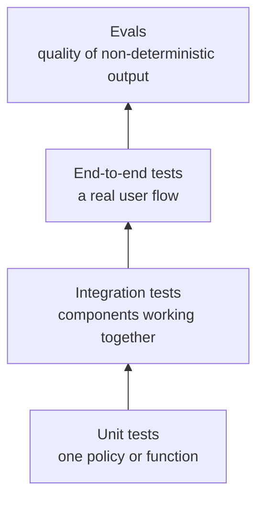
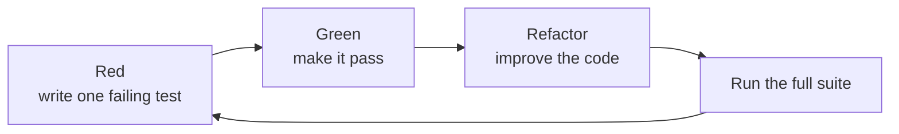

# How I Test AI-Generated Code

## Title Options

### Recommended

How I Test AI-Generated Code

Why: it is direct, searchable, and matches the practical workflow in this lesson.

### Options

1. Testing AI-Generated Code: A Practical Workflow
2. Test-Driven Development With AI Coding Agents
3. My Workflow for Testing AI-Generated Code
4. How I Use Tests to Keep AI Coding Agents on Track
5. Stop Shipping AI Code You Cannot Verify
6. How to Test AI Code Without Chasing Coverage
7. Better AI Code Starts With Better Feedback
8. AI Code Tests: Useful Signals vs False Confidence

## Opening Script

When an AI agent writes some of your code, the difficult part is knowing whether that code actually works. A passing test suite can help, but only when the tests prove the behavior you care about. An agent can also write a large number of weak tests that execute every line and still miss the important failure. In this video, I will show you how I choose what to test, how I use a red-green-refactor loop with an agent, and how to tell the difference between a useful test and false confidence. The runnable example and prompts are linked for free in the description below. So, let's get into it.

## The Basic Idea

Tests give a coding agent feedback it can act on.

```text
change code -> run a check -> inspect the result -> correct the code
```

Without a check, the agent can only explain why its change looks right. That is not proof. A useful test turns a requirement into an observable result.

There is an important limit. A green test only proves the assertion that was written. It does not prove that the whole feature is correct, secure, or ready for production.

## Start With Risk, Not Coverage

Coverage asks which lines ran. Risk asks what failure would matter.

Before asking an agent for tests, write down the behavior that must hold and the likely ways it could fail. For an authentication service, useful questions include:

- When does a session expire?
- Can the expiry duration be configured?
- What happens exactly at the expiry boundary?
- Can an invalid duration create a session?

Those questions describe decisions in our application. By contrast, a test that proves `datetime` can add two hours mostly repeats a standard library guarantee.

Use this filter for each proposed test:

| Question | Keep the test when | Drop or reshape it when |
| --- | --- | --- |
| What behavior does it prove? | The behavior is a requirement or important boundary. | The answer is only a function name. |
| What bug would make it fail? | A plausible change in our code would break it. | It only repeats documented framework or library behavior. |
| Does it survive refactoring? | Equivalent implementations still pass. | It asserts private calls or internal structure. |
| What remains unproved? | The limitation is clear. | The test is presented as proof of the whole system. |

## Choose the Right Test Boundary

Different checks answer different questions.



A unit test is useful for session expiry policy. It cannot prove that a browser can log in, a database stores the session, or a deployed service has the right configuration. Add broader checks when those boundaries carry meaningful risk.

For AI features, deterministic software checks and output evals have different jobs. Use normal tests for parsing, permissions, retries, state changes, and other deterministic behavior. Use evals for answers that can vary while still being acceptable.

## Use Red, Green, Refactor

The most useful test-first loop is small:



The red step matters. It shows that the new test can detect the missing or broken behavior. If a new test is green before the change, work out whether it describes existing behavior, misses the intended failure, or is unnecessary.

The full suite matters too. The focused test checks the new behavior. The existing suite checks that the change did not break behavior elsewhere.

## Give the Agent a Concrete Contract

Weak prompt:

```text
Write tests for the authentication service.
```

This names a component but gives no requirements. The agent must guess what matters.

Better prompt:

```text
The session policy has these requirements:

- the default duration is 120 minutes
- callers can choose a positive custom duration
- a session is expired when the current time reaches its expiry time
- zero or negative durations are invalid

Write one failing test for the first requirement.
Run it and show the failure. Do not change production code yet.
```

This gives the agent observable behavior and keeps the change small. [`resources/prompts.md`](./resources/prompts.md) provides reusable versions of this workflow.

## Runnable Example

The example under [`code/`](./code/) implements one small session policy with Python's standard library. It needs no credentials, services, package installation, or network access.

```text
code/
├── README.md
├── auth_service.py
└── tests/
    └── test_auth_service.py
```

From the repository root, run:

```bash
python3 -m unittest discover \
  -s tutorials/testing-ai-generated-code/code/tests \
  -v
```

Expected result:

```text
Ran 6 tests

OK
```

There is no install or reset step. The example uses only the Python standard library and does not persist state.

### What the tests prove

| Test | What it proves | What it does not prove |
| --- | --- | --- |
| Default expiry | The application adds its documented 120-minute default. | That a database stores the value correctly. |
| Custom expiry | A positive caller-supplied duration changes the result. | That every API caller validates its input. |
| Expiry boundary | A session is expired at the exact expiry time. | That clocks agree across deployed machines. |
| Future session | A session before its expiry time remains valid. | That its token belongs to the current user. |
| Invalid duration | Zero and negative durations are rejected. | That an HTTP endpoint maps the error correctly. |
| Timezone requirement | Naive datetimes are rejected rather than compared ambiguously. | That production time synchronization is healthy. |

The tests deliberately inject fixed times. That makes the policy deterministic and avoids waiting for a clock during the test.

## Copyable Examples Are Not a Test Suite

[`resources/examples/good-tests.py`](./resources/examples/good-tests.py) and [`resources/examples/bad-tests.py`](./resources/examples/bad-tests.py) are teaching snippets. They show test shapes from a larger application, so names such as `client`, `Candidate`, and `create_user` are intentionally undefined. Do not run those files as part of the example suite.

Use them to discuss a review question: does this assertion prove our behavior, or does it only mirror an implementation detail?

## Review AI-Written Tests

Review tests with the same care as production code.

1. Read the requirement without looking at the implementation.
2. Match each test to one observable behavior.
3. Confirm the test can fail for the intended reason.
4. Look for missing boundaries and failure paths.
5. Remove assertions that only duplicate library behavior.
6. Run the focused test and then the full suite.
7. State what the suite still does not cover.

Be careful when an agent changes a failing test. Sometimes the test is wrong. Sometimes changing it hides a real defect. Ask the agent to explain the mismatch before accepting either change.

## Common Failure Modes

### The suite is green before implementation

The test may describe behavior that already exists or assert the wrong thing. Reproduce the intended failure before changing production code.

### Tests only assert that mocks were called

A call assertion can be useful at a boundary, but it does not prove the external outcome. Add an integration check when persistence, delivery, or protocol compatibility matters.

### Tests depend on wall-clock timing

Inject a fixed time or clock. Tight timing windows can become flaky on slower machines.

### Coverage becomes the target

Coverage can reveal unexecuted code. It cannot decide whether the assertions are useful. Treat it as a map for investigation, not a quality score.

### The agent weakens the test

If production code fails a requirement, fix the code. Change the test only when the requirement or assertion is genuinely wrong, and record why.

## A Practical Workflow

For each small change:

1. Write the requirement as observable behavior.
2. Identify the highest-risk boundary.
3. Ask for one test.
4. Run it and confirm the expected failure.
5. Implement the smallest correct change.
6. Run the focused test.
7. Run the full suite and repository checks.
8. Review both the code and the tests.

This keeps the agent's feedback loop tight while leaving the important judgment with you.

## References

- [Runnable session-policy example](./code/)
- [Reusable testing prompts](./resources/prompts.md)
- [Copyable test review examples](./resources/examples/)
- [Video slides](./resources/slides/slides.html)

## Summary

- The one thing to remember: choose tests from requirements and risks, then use them as executable feedback for the agent.
- The honest limitation: a passing suite proves only the behavior it checks.
- What to try next: run the offline example, break one policy rule, and watch the relevant test fail.
